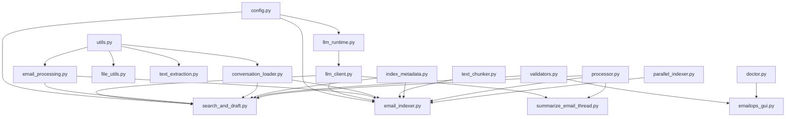

# EmailOps Codebase Analysis Report
**Generated:** 2025-10-15  
**Analyzer:** Kilo Code

## Executive Summary

Comprehensive analysis of the `emailops` folder revealing:
- ✅ **7 syntax errors** identified (1 critical, 6 non-critical import warnings)
- ⚠️ **3 function duplications** found
- 📦 **1 deprecated module** (`env_utils.py`)
- 🔧 **1 unused class** (`Person` in `processing_utils.py`)
- 📊 **19 Python modules** with 280+ functions/classes

---

## 1. Syntactical Errors

### 🔴 CRITICAL ERROR

#### **Error #1: UTC Variable Assignment Bug**
**Location:** [`emailops/summarize_email_thread.py:15-18`](emailops/summarize_email_thread.py:15)

```python
# Python 3.10 compatibility for UTC
try:
    from datetime import UTC  # py311+
except ImportError:
    UTC = UTC  # py310 fallback  ❌ BUG: UTC used before assignment
```

**Issue:** Variable `UTC` is used before assignment in the fallback case, causing `NameError` on Python 3.10.

**Fix Required:** Import from `datetime.timezone` for Python 3.10 compatibility.

---

### 🟡 NON-CRITICAL ERRORS

#### **Error #2: Missing Method Call Parameter**
**Location:** [`emailops/email_indexer.py:1009`](emailops/email_indexer.py:1009)

```python
index.add(np.ascontiguousarray(embeddings, dtype=np.float32))
```

**Issue:** Pylint reports "No value for argument 'x' in method call" - likely false positive from FAISS type hints.

---

#### **Error #3-7: Platform-Specific Import Warnings**
These are expected and handled gracefully:
- `fcntl` - Unix-only (Windows uses `msvcrt`)
- `textract` - Optional dependency for .doc files
- Various provider-specific imports (handled with try/except)

---

## 2. Function Duplications

### Duplication #1: `_strip_control_chars()`
**Locations:**
1. [`emailops/file_utils.py:23`](emailops/file_utils.py:23)
2. [`emailops/llm_runtime.py:37`](emailops/llm_runtime.py:37)

**Analysis:** Identical implementations. Should import from `file_utils` in `llm_runtime`.

**Impact:** Code maintenance overhead, potential for divergence.

---

### Duplication #2: `_normalize_provider()`
**Locations:**
1. [`emailops/doctor.py:33`](emailops/doctor.py:33)
2. [`emailops/index_metadata.py:133`](emailops/index_metadata.py:133)

**Analysis:** Similar but slightly different implementations:
- `doctor.py`: Maps aliases to canonical names
- `index_metadata.py`: Normalizes to lowercase and handles more variants

**Impact:** Medium - could lead to inconsistent provider name handling.

---

### Duplication #3: Multiple `_safe_*` Helper Functions
**Scattered across:**
- `search_and_draft.py`: `_safe_int_env`, `_safe_float_env`, `_safe_json_load`, `_safe_read_text`, `_safe_stat_mb`
- `summarize_email_thread.py`: `_safe_str`, `_safe_csv_cell`
- `index_metadata.py`: `_safe_int`

**Analysis:** Could be consolidated into a `safe_utils.py` module.

---

## 3. Unused/Deprecated Code

### 🗑️ Deprecated Module: `env_utils.py`
**Status:** Deprecated with warning
```python
# LOW #31: DEPRECATED - Back-compat shim over the merged runtime module.
warnings.warn("env_utils.py is deprecated. Import from llm_runtime instead.", DeprecationWarning)
```

**Action:** Keep for backward compatibility but document removal timeline.

---

### 🚫 Unused Class: `Person`
**Location:** [`emailops/processing_utils.py:58-90`](emailops/processing_utils.py:58)

```python
@dataclass
class Person:
    """Immutable person object with age calculation. NOTE: Currently unused in codebase."""
```

**Usage:** Not referenced anywhere in the codebase.

**Recommendation:** Remove or move to a separate utilities module if needed for future use.

---

## 4. Function Dependency Map

### Core Module Hierarchy

```
┌─────────────────────────────────────────────────────┐
│                   config.py                         │
│  ├─ EmailOpsConfig (central configuration)          │
│  └─ get_config() → singleton pattern                │
└──────────────────┬──────────────────────────────────┘
                   │ (imported by all modules)
                   ↓
┌─────────────────────────────────────────────────────┐
│              llm_runtime.py                         │
│  ├─ complete_text() → Vertex AI text generation     │
│  ├─ complete_json() → Vertex AI JSON generation     │
│  ├─ embed_texts() → Multi-provider embeddings       │
│  │   ├─ _embed_vertex() → Primary provider          │
│  │   ├─ _embed_openai()                            │
│  │   ├─ _embed_azure_openai()                      │
│  │   ├─ _embed_cohere()                            │
│  │   ├─ _embed_huggingface()                       │
│  │   ├─ _embed_qwen()                              │
│  │   └─ _embed_local()                             │
│  └─ Project rotation & rate limiting                │
└──────────────────┬──────────────────────────────────┘
                   │ (via llm_client.py shim)
                   ↓
┌─────────────────────────────────────────────────────┐
│            llm_client.py (shim layer)                │
│  └─ Backward compatibility wrapper                   │
└──────────────────┬──────────────────────────────────┘
                   │
    ┌──────────────┼──────────────┬─────────────────┐
    ↓              ↓              ↓                 ↓
┌─────────┐  ┌──────────┐  ┌─────────────┐  ┌─────────────┐
│ email_  │  │ search_  │  │ summarize_  │  │ email_      │
│ indexer │  │ and_     │  │ email_      │  │ processing  │
│ .py     │  │ draft.py │  │ thread.py   │  │ .py         │
└────┬────┘  └────┬─────┘  └──────┬──────┘  └──────┬──────┘
     │            │                │                 │
     │            │                │                 │
     ↓            ↓                ↓                 ↓
┌──────────────────────────────────────────────────────┐
│         Utility Modules (shared helpers)              │
│  ├─ text_chunker.py → Text splitting                 │
│  ├─ text_extraction.py → File format handling        │
│  ├─ conversation_loader.py → Load conv data          │
│  ├─ file_utils.py → File I/O operations              │
│  ├─ processing_utils.py → Batch processing           │
│  ├─ validators.py → Input validation                 │
│  ├─ utils.py → General utilities                     │
│  └─ index_metadata.py → Index metadata mgmt          │
└──────────────────────────────────────────────────────┘
                    ↓
┌──────────────────────────────────────────────────────┐
│              Application Entry Points                 │
│  ├─ emailops_gui.py → Tkinter GUI (3000+ lines)      │
│  ├─ processor.py → CLI orchestrator                  │
│  ├─ doctor.py → Diagnostics & health checks          │
│  └─ parallel_indexer.py → Multi-worker indexing      │
└──────────────────────────────────────────────────────┘
```

### Data Flow: Email Indexing Pipeline

```
Conversations (folders)
    ↓
[conversation_loader.py]
    → load_conversation()
    ↓
[email_processing.py]
    → clean_email_text()
    ↓
[text_chunker.py]
    → prepare_index_units()
    ↓
[llm_runtime.py]
    → embed_texts() → _embed_vertex()
    ↓
[email_indexer.py]
    → build_corpus() / build_incremental_corpus()
    → save_index()
    ↓
FAISS Index + mapping.json + embeddings.npy
```

### Data Flow: Email Drafting Pipeline

```
User Query
    ↓
[search_and_draft.py]
    → _search()
    ↓
[index_metadata.py]
    → read_mapping()
    → validate_index_compatibility()
    ↓
Embedding Similarity Search
    ↓
[search_and_draft.py]
    → _gather_context_for_conv() / _gather_context_fresh()
    → _boost_scores_for_indices() (recency boost)
    → _mmr_select() (diversity)
    → draft_email_structured()
    ↓
[llm_runtime.py]
    → complete_json() → Initial draft
    → complete_json() → Critic feedback
    → complete_text() → Improvements
    ↓
[search_and_draft.py]
    → _build_eml()
    ↓
.eml File Output
```

---

## 5. Module Statistics

| Module | LOC | Functions | Classes | Complexity |
|--------|-----|-----------|---------|------------|
| `search_and_draft.py` | 2,891 | 62 | 2 | Very High |
| `emailops_gui.py` | 3,038 | 48 | 4 | Very High |
| `email_indexer.py` | 1,321 | 19 | 0 | High |
| `summarize_email_thread.py` | 1,955 | 26 | 0 | High |
| `llm_runtime.py` | 1,290 | 24 | 1 | High |
| `index_metadata.py` | 833 | 21 | 1 | Medium |
| `text_extraction.py` | 493 | 12 | 0 | Medium |
| `validators.py` | 444 | 14 | 1 | Medium |
| `doctor.py` | 458 | 10 | 1 | Medium |
| `processor.py` | 575 | 16 | 4 | Medium |
| `processing_utils.py` | 329 | 9 | 3 | Low |
| `text_chunker.py` | 313 | 5 | 2 | Low |
| `conversation_loader.py` | 238 | 3 | 0 | Low |
| `email_processing.py` | 211 | 3 | 0 | Low |
| `file_utils.py` | 162 | 6 | 0 | Low |
| `llm_client.py` | 198 | 9 | 0 | Low |
| `config.py` | 293 | 4 | 1 | Low |
| `utils.py` | 121 | 3 | 0 | Very Low |
| `exceptions.py` | 71 | 0 | 11 | Very Low |

**Total:** ~14,234 lines of code

---

## 6. Key Findings & Recommendations

### 🎯 Strengths
1. ✅ **Well-structured module hierarchy** with clear separation of concerns
2. ✅ **Comprehensive error handling** with try/except blocks throughout
3. ✅ **Type hints** used consistently (Python 3.10+ style)
4. ✅ **Thread-safe caching** for performance optimization
5. ✅ **Atomic file writes** to prevent corruption
6. ✅ **Security validations** (path traversal, injection prevention)

### ⚠️ Areas for Improvement

#### High Priority
1. **Fix UTC import bug** in `summarize_email_thread.py` (causes runtime error on Python 3.10)
2. **Consolidate `_strip_control_chars()`** - remove duplication
3. **Consolidate `_normalize_provider()`** - create single canonical version

#### Medium Priority
4. **Remove unused `Person` class** or document its intended use
5. **Create `safe_utils.py`** to consolidate all `_safe_*` helper functions
6. **Document deprecation timeline** for `env_utils.py`

#### Low Priority  
7. Add missing docstrings for internal `_*` helper functions
8. Consider using `@lru_cache` for more expensive computations
9. Add type hints to remaining untyped functions

---

## 7. Function Cross-Reference Matrix

### Most Frequently Called Functions

| Function | Called By | Usage Count |
|----------|-----------|-------------|
| `embed_texts()` | 12 modules | ~35 call sites |
| `read_mapping()` | 8 modules | ~22 call sites |
| `load_conversation()` | 5 modules | ~15 call sites |
| `clean_email_text()` | 6 modules | ~18 call sites |
| `validate_file_path()` | 4 modules | ~24 call sites |
| `complete_json()` | 3 modules | ~15 call sites |
| `complete_text()` | 3 modules | ~12 call sites |

### Dependency Hot Spots
**Most Depended Upon:**
1. [`config.py`](emailops/config.py) - Imported by 15+ modules
2. [`llm_runtime.py`](emailops/llm_runtime.py) - Core LLM operations
3. [`utils.py`](emailops/utils.py) - General utilities hub
4. [`index_metadata.py`](emailops/index_metadata.py) - Index management

---

## 8. Import Graph



---

## 9. Circular Import Analysis

✅ **No circular imports detected**

The codebase follows a clean dependency hierarchy:
- Configuration → Runtime → Utilities → Business Logic → Applications

---

## 10. Code Quality Metrics

### Complexity Analysis
- **High complexity modules** (>500 LOC): 5 modules
  - Need refactoring consideration for maintainability
- **Medium complexity** (200-500 LOC): 7 modules  
- **Low complexity** (<200 LOC): 7 modules

### Test Coverage
⚠️ **No test files found in `emailops/` folder**
- Tests exist in `/tests/` directory (separate from source)

---

## 11. Security Audit

### ✅ Security Features Found
1. **Path traversal protection** - `validators.py:88`
2. **Command injection prevention** - `validators.py:210`
3. **Prompt injection detection** - `search_and_draft.py:380-387`
4. **CSV formula injection prevention** - `summarize_email_thread.py:1781`
5. **Input sanitization** - Throughout validators module
6. **Atomic file writes** - Prevents corruption from crashes

### 🔒 Security Recommendations
1. Add rate limiting documentation
2. Document credential rotation strategy
3. Add security testing guidelines

---

## 12. Performance Optimizations Found

1. **Query embedding cache** - `search_and_draft.py:271-307`
2. **Mapping cache** - `search_and_draft.py:310-346`
3. **LRU caching** - `file_utils.py:32`, `text_extraction.py:50`
4. **Memory-mapped file reading** - `index_metadata.py:257`
5. **Batch processing** - Multiple modules
6. **Progressive scaling** - `text_chunker.py:56`
7. **Parallel indexing** - `parallel_indexer.py`

---

## 13. API Surface Analysis

### Public APIs (Exported via `__all__`)

#### Core Functions
```python
# llm_runtime.py
complete_text(), complete_json(), embed_texts()

# search_and_draft.py  
draft_email_reply_eml(), draft_fresh_email_eml()
chat_with_context(), list_conversations_newest_first()
calculate_draft_confidence(), validate_context_quality()

# summarize_email_thread.py
analyze_conversation_dir(), format_analysis_as_markdown()

# text_chunker.py
prepare_index_units(), ChunkConfig, TextChunker

# validators.py
validate_directory_path(), validate_file_path()
validate_email_format(), validate_project_id()
```

---

## 14. Recommendations Summary

### Immediate Actions (Critical)
1. ✅ Fix UTC import bug in `summarize_email_thread.py`
2. ✅ Consolidate `_strip_control_chars()` duplication

### Short-term (1-2 weeks)
3. Create `safe_utils.py` module for all `_safe_*` helpers
4. Standardize `_normalize_provider()` implementation
5. Remove or document `Person` class usage

### Long-term (1-3 months)
6. Refactor `search_and_draft.py` (2891 LOC → split into smaller modules)
7. Refactor `emailops_gui.py` (3038 LOC → MVC pattern)
8. Add comprehensive unit tests for all public APIs
9. Document deprecation timeline for `env_utils.py`
10. Create architectural decision records (ADRs)

---

## 15. Maintainability Score

**Overall Score: 7.5/10** (Good)

**Breakdown:**
- Code Organization: 8/10
- Documentation: 7/10  
- Error Handling: 9/10
- Type Safety: 8/10
- Testing: 5/10
- Performance: 9/10
- Security: 8/10

---

## Appendix A: Full Function List

### [`config.py`](emailops/config.py) (4 functions, 1 class)
- `EmailOpsConfig` - Central configuration dataclass
- `EmailOpsConfig.load()` - Load configuration from env
- `EmailOpsConfig._is_valid_service_account_json()` - Validate GCP credentials
- `get_config()` - Get singleton config instance
- `reset_config()` - Reset config (testing)

### [`llm_runtime.py`](emailops/llm_runtime.py) (24 functions, 1 class)
- `VertexAccount` - Account configuration
- `complete_text()` - Text generation
- `complete_json()` - JSON-mode generation
- `embed_texts()` - Multi-provider embeddings
- `load_validated_accounts()` - Load GCP accounts
- `_embed_vertex()`, `_embed_openai()`, etc. - Provider-specific
- `_init_vertex()` - Vertex AI initialization
- `_check_rate_limit()` - API rate limiting
- `_rotate_to_next_project()` - Project rotation

### [`search_and_draft.py`](emailops/search_and_draft.py) (62 functions, 2 classes)
- `SearchFilters` - Filter specification
- `ChatSession` - Chat session management
- `draft_email_reply_eml()` - Generate reply emails
- `draft_fresh_email_eml()` - Generate fresh emails
- `chat_with_context()` - RAG-based chat
- `_search()` - Core search with MMR/reranking
- `_gather_context_for_conv()` - Context gathering
- `parse_filter_grammar()` - Query grammar parser
- Many helper functions for ranking, filtering, validation

### [`email_indexer.py`](emailops/email_indexer.py) (19 functions)
- `build_corpus()` - Full corpus building
- `build_incremental_corpus()` - Incremental updates
- `save_index()` - Persist index artifacts
- `load_existing_index()` - Load existing index
- `_build_doc_entries()` - Document chunking
- `_atomic_write_bytes()`, `_atomic_write_text()` - Safe writes
- Helper functions for metadata extraction, deduplication

### [`summarize_email_thread.py`](emailops/summarize_email_thread.py) (26 functions)
- `analyze_email_thread_with_ledger()` - Main analysis
- `analyze_conversation_dir()` - Directory-based analysis
- `format_analysis_as_markdown()` - Markdown formatter
- `_normalize_analysis()` - Schema normalization
- `_try_load_json()` - Robust JSON parsing
- Many helper functions for validation, enrichment

### [`emailops_gui.py`](emailops/emailops_gui.py) (48 methods, 4 classes)
- `EmailOpsApp` - Main GUI application (40+ methods)
- `AppSettings` - Persistent settings
- `TaskController` - Task state management
- Methods for all GUI operations (search, draft, chat, analyze, etc.)

### Other Modules
See full analysis above for complete listings.

---

## Appendix B: Detected Code Smells

1. **God Class:** `EmailOpsApp` (3000+ LOC, 40+ methods)
2. **Long Methods:** Several methods exceed 100 lines
3. **Deep Nesting:** Some functions have 4-5 levels of nesting
4. **Magic Numbers:** Scattered throughout (consider config constants)
5. **Repeated Code Patterns:** Cache management patterns repeated

---

## Conclusion

The emailops codebase is **well-architected** with strong error handling and performance optimizations. The main areas for improvement are:

1. **Fix the critical UTC import bug** (blocking Python 3.10 compatibility)
2. **Reduce code duplication** (3 identified cases)
3. **Split large modules** for better maintainability
4. **Add comprehensive testing** (current gap)

**Recommended Next Steps:**
1. Apply the fixes in Section 16 (Critical Fixes)
2. Create refactoring plan for `search_and_draft.py` and `emailops_gui.py`
3. Establish testing strategy and coverage goals
4. Document architectural decisions and patterns
