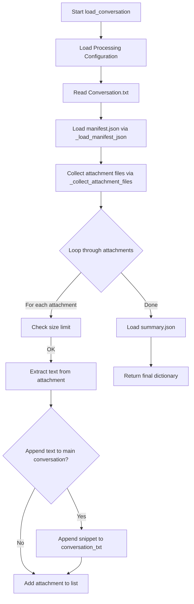

# `conversation_loader.py` - Conversation Loading Utilities

## 1. Overview

This module is responsible for loading all data related to a single email conversation from the filesystem. It handles reading the main conversation text, parsing associated JSON metadata files (`manifest.json`, `summary.json`), and extracting text from any attachments.

**Key Features:**
- **Robust File Loading**: Handles missing files and read errors gracefully.
- **Attachment Processing**: Extracts text from attachments and can optionally include it in the main conversation body.
- **Resilient JSON Parsing**: Implements a multi-stage fallback strategy for parsing potentially malformed `manifest.json` files.
- **Configuration Driven**: Uses settings from `processing_utils.get_processing_config()` for attachment handling.
- **Race Condition Mitigation**: Designed to be resilient against filesystem race conditions (TOCTOU).

---

## 2. Core Workflow: `load_conversation()`

This is the main public function of the module.

### 2.1. Function Signature

```python
def load_conversation(
    convo_dir: Path,
    include_attachment_text: bool = False,
    max_total_attachment_text: int | None = None,
    *,
    max_attachment_text_chars: int | None = None,
    skip_if_attachment_over_mb: float | None = None,
) -> dict[str, Any]:
```

### 2.2. Parameters

| Parameter | Type | Default | Description |
|---|---|---|---|
| `convo_dir` | `Path` | Required | The directory containing the conversation files. |
| `include_attachment_text` | `bool` | `False` | If `True`, appends attachment text to `conversation_txt`. |
| `max_total_attachment_text` | `int` | `None` | The maximum number of characters from all attachments to append. |
| `max_attachment_text_chars` | `int` | `None` | The maximum characters to extract from a single attachment. |
| `skip_if_attachment_over_mb`| `float`| `None` | Skips attachments larger than this size in megabytes. |

### 2.3. Return Structure

The function returns a dictionary with the following structure:

```python
{
    "path": str,              # Path to the conversation directory
    "conversation_txt": str,  # Content of Conversation.txt
    "attachments": [          # List of attachments
        {
            "path": str,      # Path to the attachment file
            "text": str       # Extracted text from the attachment
        }
    ],
    "summary": dict,          # Parsed content of summary.json
    "manifest": dict          # Parsed content of manifest.json
}
```

### 2.4. Workflow Diagram



---

## 3. Internal Helper Functions

### 3.1. `_load_manifest_json()`

This function implements a robust, multi-stage strategy to parse `manifest.json`, which can sometimes be malformed.

**Parsing Strategy:**
1.  **Read Bytes**: Reads the file as raw bytes to handle any encoding.
2.  **Decode**: Attempts to decode as `utf-8-sig` (to handle BOM), falling back to `latin-1`.
3.  **Sanitize**: Removes a wide range of control characters.
4.  **Strict JSON Parse**: Attempts a standard `json.loads()` on the sanitized text.
5.  **Backslash Repair**: If the strict parse fails, it repairs unescaped backslashes and retries `json.loads()`.
6.  **HJSON Fallback**: If all JSON parsing fails, it attempts to parse the repaired text using the `hjson` library, which is more lenient.
7.  **Final Fallback**: If `hjson` also fails, it returns an empty dictionary `{}`.

### 3.2. `_collect_attachment_files()`

This function collects all attachment files associated with a conversation, handling potential race conditions and ensuring a deterministic order.

**Collection Process:**
1.  **Attachments Subdirectory**: Recursively finds all files in the `Attachments/` subdirectory.
2.  **Root Conversation Directory**: Finds all files in the main `convo_dir`, excluding `Conversation.txt`, `manifest.json`, and `summary.json`.
3.  **Deduplication**: Resolves all file paths to their absolute form and removes any duplicates.
4.  **Sorting**: Sorts the unique files deterministically by path and name.

**Race Condition (TOCTOU) Mitigation:**
- The function is designed to handle `OSError` and `PermissionError` exceptions that can occur if a file is deleted or moved between the time it's listed and the time it's accessed.
- It immediately converts directory iterators to lists to minimize the time window for race conditions.

---

## 4. Dependencies

- **`file_utils.read_text_file`**: For robustly reading text files with encoding detection.
- **`processing_utils.get_processing_config`**: To get configuration for attachment handling.
- **`text_extraction.extract_text`**: For extracting text from various attachment file types.
- **`utils.scrub_json`**: To recursively clean the parsed JSON data.
- **`hjson`** (optional): For lenient JSON parsing as a fallback.
