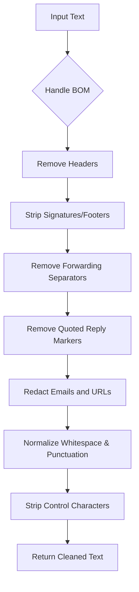

# `email_processing.py` - Email Cleaning and Structuring

## 1. Overview

This module provides a suite of utilities for processing raw email text. It is responsible for cleaning email bodies, extracting structured metadata from headers, and splitting email threads into individual messages. The cleaning functions are conservative, designed to remove noise while preserving substantive content.

**Key Features:**
- **Text Cleaning**: Removes headers, signatures, and other email artifacts.
- **PII Redaction**: Redacts email addresses and URLs.
- **Metadata Extraction**: Parses RFC-822 style headers into a structured dictionary.
- **Thread Splitting**: Splits a long email thread into a list of individual messages.
- **Performance**: Uses pre-compiled regular expressions for efficient processing.

---

## 2. Core Functions

### 2.1. `clean_email_text(text: str) -> str`

This function takes a raw email body and applies a series of cleaning steps to prepare it for indexing and analysis.

**Cleaning Workflow:**


**Detailed Cleaning Steps:**
1.  **BOM Handling**: Removes the UTF-8 Byte Order Mark (`\ufeff`) if present.
2.  **Header Removal**: Uses a list of pre-compiled regex patterns (`_HEADER_PATTERNS`) to remove common email headers like `From:`, `To:`, `Subject:`, etc.
3.  **Signature/Footer Stripping**: Examines the last 2000 characters of the text and removes common signature patterns (e.g., "Best regards," "Sent from my iPhone") defined in `_SIGNATURE_PATTERNS`.
4.  **Forwarding Separator Removal**: Removes lines like "--- Original Message ---" using `_FORWARDING_PATTERNS`.
5.  **Quoted Reply Removal**: Strips lines that start with `>` (quoted reply markers).
6.  **Redaction**:
    -   Replaces email addresses with `[email@domain]`.
    -   Replaces URLs with `[URL]`.
7.  **Normalization**:
    -   Collapses excessive punctuation (e.g., `...`, `!!!`, `???`).
    -   Reduces multiple spaces/tabs to a single space.
    -   Reduces three or more newlines to two.
    -   Removes blank lines.
8.  **Control Character Stripping**: Uses `_strip_control_chars` from `file_utils` to remove any remaining non-printable characters.

### 2.2. `extract_email_metadata(text: str) -> dict[str, Any]`

This function parses the header block of an email and extracts key metadata into a dictionary.

**Extraction Process:**
1.  Splits the text at the first double newline (`\n\n`) to isolate the header block.
2.  Unfolds folded header lines (lines starting with whitespace).
3.  Uses regex to find and extract the values for the following headers:
    -   `From`
    -   `To`
    -   `Cc`
    -   `Bcc`
    -   `Date` (or `Sent`)
    -   `Subject`

**Return Structure:**
```python
{
    "sender": str | None,
    "recipients": list[str],
    "date": str | None,
    "subject": str | None,
    "cc": list[str],
    "bcc": list[str],
}
```

### 2.3. `split_email_thread(text: str) -> list[str]`

This function splits a single block of text containing an entire email thread into a list of individual messages.

**Splitting Heuristics:**
1.  **Separators**: Splits the text based on common email reply/forward separators, such as:
    -   `--- Original Message ---`
    -   `--- Forwarded Message ---`
    -   `On ... wrote:`
    -   Long underscore lines (`__________`)
2.  **Chronological Sorting**:
    -   After splitting, it attempts to parse a `Date:` header from each part.
    -   If multiple parts have valid dates, the parts are sorted chronologically (oldest to newest).
    -   If dates cannot be reliably determined, the original order from the split is preserved.

---

## 3. Pre-compiled Regex Patterns

For performance, all regular expressions are pre-compiled at the module level.

-   **`_EMAIL_PATTERN`**: Matches email addresses.
-   **`_URL_PATTERN`**: Matches URLs.
-   **`_EXCESSIVE_EQUALS`, `_EXCESSIVE_DOTS`, etc.**: Match and normalize repeated punctuation.
-   **`_MULTIPLE_SPACES`, `_MULTIPLE_NEWLINES`, `_BLANK_LINES`**: For whitespace normalization.
-   **`_QUOTED_REPLY`**: Matches quoted reply lines.
-   **`_HEADER_PATTERNS`**: A list of patterns for matching various email headers.
-   **`_SIGNATURE_PATTERNS`**: A list of patterns for detecting common email signatures and footers.
-   **`_FORWARDING_PATTERNS`**: A list of patterns for identifying message forwarding separators.

---

## 4. Dependencies

-   **`file_utils._strip_control_chars`**: For the final sanitization step to remove control characters.
