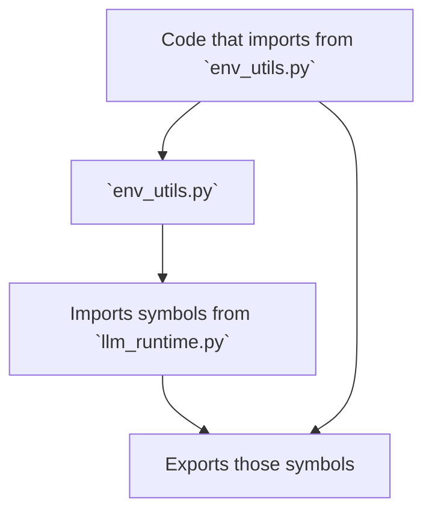

# `env_utils.py` - Compatibility Shim

## 1. Overview

This file serves as a **compatibility shim**. Its sole purpose is to maintain backward compatibility for older parts of the codebase that might still refer to it.

**It contains no original logic.**

Instead, it imports and re-exports selected functions and classes from the `emailops.llm_runtime` module. This is a common software engineering pattern used during refactoring to avoid breaking existing code.

## 2. Workflow: Redirection

The workflow of this module is a simple redirection. Any code that imports from `env_utils` is actually getting objects from `llm_runtime`.

## 3. Re-exported Symbols

The following symbols are re-exported from `llm_runtime.py`:

-   `LLMError`
-   `VertexAccount`
-   `load_validated_accounts`
-   `save_validated_accounts`
-   `validate_account`
-   `DEFAULT_ACCOUNTS`
-   `_init_vertex`
-   `reset_vertex_init`

## 4. Developer Guidance

If you need to understand or modify the logic for any of the functions or classes listed above, you should not edit `env_utils.py`.

**==> Look for the implementation in `emailops/llm_runtime.py`.**