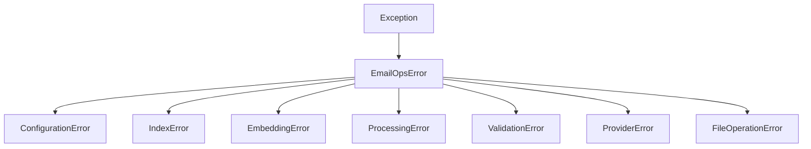

# `exceptions.py` - Centralized Exception Definitions

## 1. Overview

This module defines a hierarchy of custom exception classes for the EmailOps application. Using custom exceptions provides a consistent and maintainable way to handle errors throughout the codebase, making it easier to distinguish between different types of errors and handle them appropriately.

**Key Features:**
- **Hierarchical Structure**: All custom exceptions inherit from a common `EmailOpsError` base class.
- **Clarity and Specificity**: Each exception class represents a specific category of error.
- **Backward Compatibility**: Includes aliases for older exception names to ensure compatibility with existing code.

---

## 2. Exception Hierarchy

The exceptions are organized in a simple inheritance structure:



---

## 3. Exception Classes

### 3.1. `EmailOpsError`

-   **Inherits from**: `Exception`
-   **Purpose**: The base exception for all custom errors in the EmailOps application. Catching this exception will catch any of the more specific EmailOps errors.

### 3.2. `ConfigurationError`

-   **Inherits from**: `EmailOpsError`
-   **Purpose**: Raised when there is an issue with the application's configuration, such as a missing setting or an invalid value.

### 3.3. `IndexError`

-   **Inherits from**: `EmailOpsError`
-   **Purpose**: Raised for errors related to the search index, such as when the index is not found, corrupted, or there is a version mismatch.

### 3.4. `EmbeddingError`

-   **Inherits from**: `EmailOpsError`
-   **Purpose**: Raised when an operation related to text embedding fails. This can include issues with the embedding provider, dimension mismatches, or problems with the embedding model itself.

### 3.5. `ProcessingError`

-   **Inherits from**: `EmailOpsError`
-   **Purpose**: Raised during the processing of documents or text, such as failures in text extraction, cleaning, or chunking.

### 3.6. `ValidationError`

-   **Inherits from**: `EmailOpsError`
-   **Purpose**: Raised when input validation fails. This is used by the `validators.py` module to indicate that user-provided data (like a file path or command argument) is invalid or unsafe.

### 3.7. `ProviderError`

-   **Inherits from**: `EmailOpsError`
-   **Purpose**: Raised when an external provider, such as an LLM or embedding service, returns an error.

### 3.8. `FileOperationError`

-   **Inherits from**: `EmailOpsError`
-   **Purpose**: Raised when a file I/O operation (like reading, writing, or deleting a file) fails.

---

## 4. Backward Compatibility Aliases

To ensure that older parts of the codebase that use different exception names continue to work, the following aliases are provided:

-   `LLMError` = `ProviderError`
-   `ProcessorError` = `ProcessingError`
-   `CommandExecutionError` = `ProcessingError`
-   `IndexNotFoundError` = `IndexError`

---

## 5. Usage Example

Using these custom exceptions allows for more specific and readable error handling code.

```python
from emailops.exceptions import ConfigurationError, IndexError
from emailops.config import get_config
from emailops.email_indexer import build_index

try:
    # Attempt to get configuration
    config = get_config()
    
    # Attempt to build the index
    build_index(config)

except ConfigurationError as e:
    print(f"Configuration error: {e}")
    # Handle missing or invalid configuration

except IndexError as e:
    print(f"Index error: {e}")
    # Handle issues with the search index

except Exception as e:
    print(f"An unexpected error occurred: {e}")
    # Handle any other exceptions