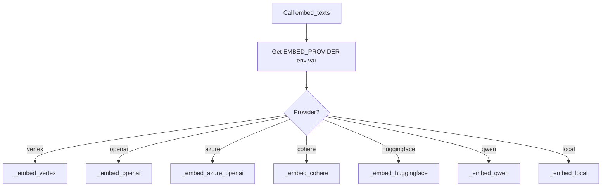
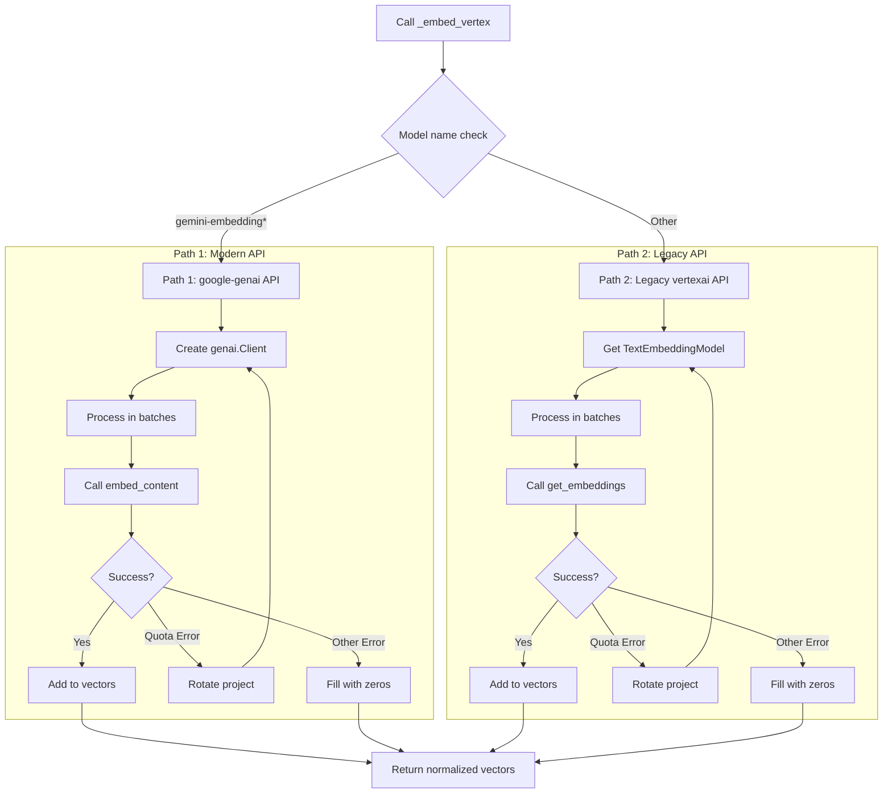

# `llm_runtime.py` - The Core LLM and Embedding Engine

## 1. Overview

This script is the heart of the EmailOps application's AI capabilities. It consolidates all the logic for interacting with various Language Model (LLM) providers, generating text and JSON, and creating embeddings. It replaces the older, split logic from `llm_client.py` and `env_utils.py` with a unified, robust, and resilient runtime.

Its key features include:
-   **Multi-provider support** for embeddings.
-   **Automatic project rotation** to handle API quota limits.
-   **Resilient API calls** with exponential backoff and retries.
-   **Robust JSON generation** with a text-based fallback.
-   **Intelligent account validation** and credential discovery.
-   **Thread-safe project rotation** with locking mechanisms.

---

## 2. Global State and Configuration

### 2.1. Global State Variables

The module maintains several global state variables for efficient operation:

```python
_validated_accounts: list[VertexAccount] | None = None  # Caches validated accounts
_vertex_initialized: bool = False                       # Tracks Vertex AI initialization
_PROJECT_ROTATION: dict[str, Any] = {                  # Project rotation state
    "projects": [],           # List of project configurations
    "current_index": 0,       # Current project index
    "consecutive_errors": 0,  # Error counter
    "_initialized": False,    # Initialization flag
}
_PROJECT_ROTATION_LOCK = threading.Lock()              # Thread-safe rotation
```

### 2.2. Constants and Configuration

- **`RETRYABLE_SUBSTRINGS`**: Tuple of error substrings that trigger retry logic
  - "quota exceeded", "resource_exhausted", "429", "temporarily unavailable"
  - "rate limit", "deadline exceeded", "unavailable", "internal error", "503"
- **Environment Loading**: Attempts to load `.env` file using `python-dotenv` if available
- **Google API Core**: Imports `google.api_core.exceptions` for better error classification

---

## 3. Account Management and Initialization

The runtime begins by ensuring it has valid Google Cloud credentials and that the Vertex AI SDK is correctly initialized.

### 3.1. Loading Validated Accounts

The `load_validated_accounts` function provides a robust way to find and verify GCP account credentials.

```mermaid
graph TD
    A[Start load_validated_accounts] --> B{Does validated_accounts.json exist?};
    B -- Yes --> C[Load accounts from JSON file];
    B -- No --> D{Are default_accounts provided?};
    D -- Yes --> E[Load hard-coded default accounts];
    D -- No --> F[Initialize with empty list];
    C --> G[Loop through each account];
    E --> G;
    F --> G;

    subgraph "For Each Account"
        G --> H{Is credential path absolute?};
        H -- No --> I[Check for credential file in multiple locations];
        I --> J{File found?};
        J -- Yes --> K[Update path to be absolute];
        J -- No --> L[Mark account as invalid, log warning];
        H -- Yes --> M{Does credential file exist?};
        M -- Yes --> N[Keep account];
        M -- No --> L;
    end

    L --> O[Continue to next account];
    K --> N;
    N --> O;
    O -- All accounts checked --> P{Any valid accounts found?};
    P -- Yes --> Q[Return list of valid accounts & cache in _validated_accounts];
    P -- No --> R[Raise LLMError: "No valid GCP accounts found"];
```

The function checks these locations for credential files:
1. Project root / credentials_path
2. Project root / secrets / filename
3. As given (relative path)

### 3.2. Initializing Vertex AI (`_init_vertex`)

This function, called before any Vertex AI operation, configures the connection. It's idempotent, meaning it only runs once until reset.

1.  **Check if Already Initialized**: If `_vertex_initialized` is True, return immediately
2.  **Find Project ID**: Searches environment variables in order:
    - `VERTEX_PROJECT`
    - `GCP_PROJECT` 
    - `GOOGLE_CLOUD_PROJECT`
3.  **Find Credentials**: Searches environment variables:
    - `VERTEX_SERVICE_ACCOUNT_JSON`
    - `GOOGLE_APPLICATION_CREDENTIALS`
4.  **Initialize `vertexai`**:
    - If credential file exists: Use service account credentials
    - If path set but file missing: Log warning, use Application Default Credentials
    - If no path: Use Application Default Credentials
5.  **Mark as Initialized**: Set `_vertex_initialized = True`

---

## 4. Resilience: Project Rotation and Retries

The runtime is built to withstand transient errors and API quota limits.

### 4.1. Automatic Project Rotation

This is a key feature for high-throughput use cases. When the application hits a quota limit on one GCP project, it automatically switches to another.

```mermaid
graph TD
    A[API call to Vertex AI] --> B[Sends request];
    B --> C{Receive API Error};
    C --> D{Is it a quota error via _should_rotate_on()?};
    D -- Yes --> E[_rotate_to_next_project() is called];
    E --> F[Acquire _PROJECT_ROTATION_LOCK];
    F --> G[Select next project from the list];
    G --> H[Update environment variables];
    H --> I[Reset Vertex AI initialization state];
    I --> J[Release lock];
    J --> K[Retry the original API call on the new project];
    D -- No --> L[Handle as a different error];
```

Key implementation details:
- **Thread-safe**: Uses `_PROJECT_ROTATION_LOCK` for concurrent access
- **Lazy loading**: Projects loaded on first rotation via `_ensure_projects_loaded()`
- **Environment updates**: Sets `GCP_PROJECT`, `GOOGLE_CLOUD_PROJECT`, `GOOGLE_APPLICATION_CREDENTIALS`

### 4.2. Retry with Exponential Backoff

For other transient errors (like "503 Service Unavailable"), the runtime will wait and try again.

1.  An API call is made
2.  If it fails, `_is_retryable_error()` checks:
     - Google API core exception types (if available)
     - Error message against `RETRYABLE_SUBSTRINGS`
3.  If retryable, `_sleep_with_backoff()` calculates delay:
     - Base delay * 2^(attempt-1)
     - Capped at max_delay
     - Plus 0-20% random jitter
4.  Retry up to `VERTEX_MAX_RETRIES` attempts (default: 5)

---

## 5. LLM Completion API

### 5.1. `complete_text`

Generates text from system and user prompts with full resilience logic.

**Workflow:**
1. Initialize Vertex if needed via `_init_vertex()`
2. Create model via `_vertex_model()` helper
3. Attempt generation with retry loop:
   - Success: Return stripped text
   - Quota error: Rotate project and retry
   - Retryable error: Sleep with backoff and retry
   - Other error: Raise `LLMError`

**Helper Functions:**
- `_vertex_model()`: Creates `GenerativeModel` instance with system instruction
- `_normalize_model_alias()`: Handles model name aliases

### 5.2. `complete_json` (Robust JSON Generation)

Designed to reliably return JSON, even if the model fails to adhere perfectly.

```mermaid
graph TD
    A[Call complete_json] --> B[Attempt Vertex AI JSON Mode];
    B --> C{Success?};
    C -- Yes --> D[Return JSON string];
    C -- No --> E{Retryable error?};
    E -- Yes --> F[Sleep & retry];
    F --> B;
    E -- No --> G[Log warning];
    G --> H[Fall back to complete_text()];
    H --> I[Get plain text output];
    I --> J[_extract_json_from_text()];
    J --> K[Return extracted JSON or '{}'];
```

**JSON Extraction (`_extract_json_from_text`):**
1. Look for markdown JSON code blocks (` ```json ... ``` `)
2. Check if entire response is valid JSON
3. Use regex to find JSON object anywhere in text
4. Return '{}' if no JSON found

---

## 6. Multi-Provider Embedding API

### 6.1. `embed_texts` Dispatcher

Single entry point for creating embeddings, routing to the correct provider.



**Common Features:**
- Returns `numpy.ndarray` of shape (N, D)
- All vectors are unit-normalized via `_normalize()` helper
- Empty input returns empty array: `np.zeros((0, 0), dtype="float32")`
- Batch processing for efficiency

### 6.2. Provider Implementations

| Provider | Required Environment Variables | Default Model | Batch Size |
|---|---|---|---|
| **vertex** | `GCP_PROJECT`, `GOOGLE_APPLICATION_CREDENTIALS` | `gemini-embedding-001` | 64 (max 250) |
| **openai** | `OPENAI_API_KEY` | `text-embedding-3-small` | 100 |
| **azure** | `AZURE_OPENAI_API_KEY`, `AZURE_OPENAI_ENDPOINT`, `AZURE_OPENAI_DEPLOYMENT` | (from env) | 100 |
| **cohere** | `COHERE_API_KEY` | `embed-english-v3.0` | 96 |
| **huggingface**| `HF_API_KEY` or `HUGGINGFACE_API_KEY` | `BAAI/bge-large-en-v1.5` | 1 |
| **qwen** | `QWEN_API_KEY`, `QWEN_BASE_URL` | `Qwen/Qwen3-Embedding-8B` | 50 |
| **local** | (None) | `sentence-transformers/all-MiniLM-L6-v2` | All at once |

### 6.3. Deep Dive: `_embed_vertex`

The most complex implementation, supporting two Google Cloud APIs with project rotation.



**Key Features:**
- Automatic fallback to zero vectors on persistent failures
- Per-batch project rotation for quota management
- Support for output dimensionality configuration (`VERTEX_EMBED_DIM`)
- Handles both paths with same resilience logic

---

## 7. Helper Functions

### 7.1. Vector Normalization
```python
def _normalize(vectors: list[list[float]]) -> np.ndarray:
    """Normalize vectors to unit length with numerical stability."""
    # Adds 1e-12 to prevent division by zero
    # Returns float32 array for memory efficiency
```

### 7.2. Model Management
- `_vertex_model()`: Creates GenerativeModel with optional system instruction
- `_normalize_model_alias()`: Maps deprecated names (e.g., "gemini-embedded-001" → "gemini-embedding-001")

### 7.3. Project Rotation Helpers
- `_ensure_projects_loaded()`: Thread-safe lazy loading of project list
- `_rotate_to_next_project()`: Cycles through available projects
- `reset_vertex_init()`: Clears initialization state for re-init

### 7.4. Error Classification
- `_is_retryable_error()`: Checks if error should trigger retry
- `_should_rotate_on()`: Checks if error indicates quota exhaustion
- `_sleep_with_backoff()`: Implements exponential backoff with jitter

---

## 8. Error Handling

### 8.1. Custom Exception
```python
class LLMError(Exception):
    """Custom exception for LLM- and embedding-related errors."""
```

### 8.2. Error Recovery Strategies
1. **Quota Errors**: Automatic project rotation
2. **Transient Errors**: Exponential backoff retry
3. **Persistent Errors**: 
   - Text generation: Raise `LLMError`
   - JSON generation: Fall back to text mode
   - Embeddings: Fill with zero vectors

---

## 9. Developer Notes

### Thread Safety
- Project rotation uses `threading.Lock` for concurrent access
- Global state variables protected by initialization checks

### Performance Optimizations
- Batch processing for embeddings (provider-specific limits)
- Singleton pattern for configuration loading
- Lazy initialization of projects and credentials

### External Dependencies
- **Required**: `numpy`, `google-cloud-aiplatform` (for Vertex)
- **Optional**: `python-dotenv`, `google.api_core.exceptions`
- **Provider-specific**: See provider table in section 6.2

### Environment Variables
Key environment variables used throughout:
- `VERTEX_MAX_RETRIES`: Max retry attempts (default: 5)
- `VERTEX_BACKOFF_INITIAL`: Initial backoff delay (default: 4)
- `VERTEX_BACKOFF_MAX`: Maximum backoff delay (default: 60)
- `VERTEX_MODEL`: Model name for text generation (default: "gemini-2.5-pro")
- `EMBED_BATCH`: Batch size for embeddings (provider-specific defaults)