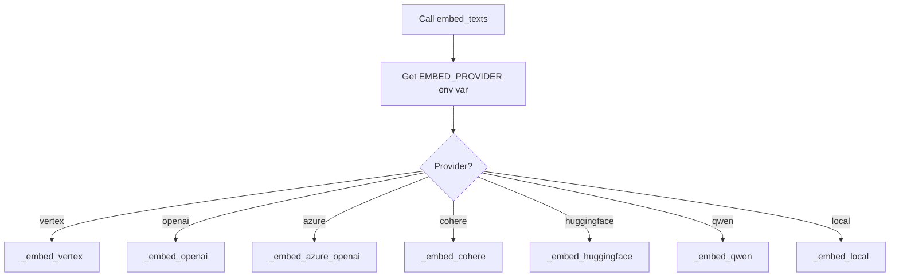
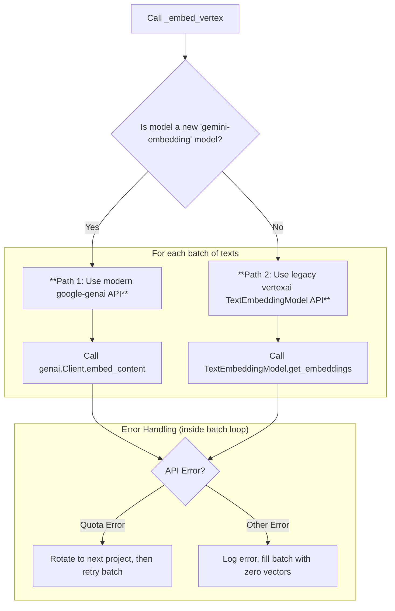

# `llm_runtime.py` - The Core LLM and Embedding Engine

## 1. Overview

This script is the heart of the EmailOps application's AI capabilities. It consolidates all the logic for interacting with various Language Model (LLM) providers, generating text and JSON, and creating embeddings. It replaces the older, split logic from `llm_client.py` and `env_utils.py` with a unified, robust, and resilient runtime.

Its key features include:
-   **Multi-provider support** for embeddings.
-   **Automatic project rotation** to handle API quota limits.
-   **Resilient API calls** with exponential backoff and retries.
-   **Robust JSON generation** with a text-based fallback.
-   **Intelligent account validation** and credential discovery.

---

## 2. Account Management and Initialization

The runtime begins by ensuring it has valid Google Cloud credentials and that the Vertex AI SDK is correctly initialized.

### 2.1. Loading Validated Accounts

The `load_validated_accounts` function provides a robust way to find and verify GCP account credentials.

```mermaid
graph TD
    A[Start load_validated_accounts] --> B{Does validated_accounts.json exist?};
    B -- Yes --> C[Load accounts from JSON file];
    B -- No --> D{Are default_accounts provided?};
    D -- Yes --> E[Load hard-coded default accounts];
    D -- No --> F[Initialize with empty list];
    C --> G[Loop through each account];
    E --> G;
    F --> G;

    subgraph "For Each Account"
        G --> H{Is credential path absolute?};
        H -- No --> I[Check for credential file in multiple locations (project root, secrets/ dir)];
        I --> J{File found?};
        J -- Yes --> K[Update path to be absolute];
        J -- No --> L[Mark account as invalid, log warning];
        H -- Yes --> M{Does credential file exist?};
        M -- Yes --> N[Keep account];
        M -- No --> L;
    end

    L --> O[Continue to next account];
    K --> N;
    N --> O;
    O -- All accounts checked --> P{Any valid accounts found?};
    P -- Yes --> Q[Return list of valid accounts];
    P -- No --> R[Raise LLMError: "No valid GCP accounts found"];
```

### 2.2. Initializing Vertex AI (`_init_vertex`)

This function, called before any Vertex AI operation, configures the connection. It's idempotent, meaning it only runs once.

1.  **Check if Already Initialized**: If so, do nothing.
2.  **Find Project ID**: Searches for the GCP Project ID in `os.getenv` using multiple common keys (`VERTEX_PROJECT`, `GCP_PROJECT`, etc.).
3.  **Find Credentials**: Searches for the service account JSON path in `os.getenv`.
4.  **Initialize `vertexai`**:
    - If a credential path is found and the file exists, it initializes the SDK using that service account.
    - If the path is set but the file is missing, it logs a warning and uses Application Default Credentials (ADC).
    - If no path is set, it uses ADC.
5.  **Mark as Initialized**.

---

## 3. Resilience: Project Rotation and Retries

The runtime is built to withstand transient errors and API quota limits.

### 3.1. Automatic Project Rotation

This is a key feature for high-throughput use cases. When the application hits a quota limit on one GCP project, it automatically switches to another.

```mermaid
graph TD
    A[API call to Vertex AI] --> B[Sends request];
    B --> C{Receive API Error};
    C --> D{Is it a quota error (e.g., 429, resource_exhausted)?};
    D -- Yes --> E[_rotate_to_next_project() is called];
    E --> F[Select next project from the list];
    F --> G[Update environment variables (GCP_PROJECT, GOOGLE_APPLICATION_CREDENTIALS)];
    G --> H[Reset Vertex AI initialization state];
    H --> I[Retry the original API call on the new project];
    D -- No --> J[Handle as a different error];
```

### 3.2. Retry with Exponential Backoff

For other transient errors (like "503 Service Unavailable"), the runtime will wait and try again.

1.  An API call is made.
2.  If it fails, `_is_retryable_error()` checks if the error is on a predefined list of transient issues.
3.  If it is, the system waits using `_sleep_with_backoff()`, which calculates a delay that increases with each failed attempt (plus some random jitter).
4.  The API call is retried, up to a maximum number of attempts.

---

## 4. LLM Completion API

### 4.1. `complete_text`

This function generates text from a system prompt and a user prompt. Its workflow incorporates the full resilience logic.

`Call complete_text` -> `_init_vertex` -> `model.generate_content` -> `Success?`
- **If Yes**: Return text.
- **If No (Error)**:
    - `_should_rotate_on(error)`? -> **Rotate Project** & Retry.
    - `_is_retryable_error(error)`? -> **Wait (Backoff)** & Retry.
    - **Neither?** -> Raise `LLMError`.

### 4.2. `complete_json` (Robust JSON Generation)

This function is designed to reliably return a JSON object, even if the model fails to adhere perfectly to instructions.

```mermaid
graph TD
    A[Call complete_json] --> B[Attempt to call Vertex AI in JSON Mode];
    B --> C{Did it succeed and return valid JSON?};
    C -- Yes --> D[Return the JSON string];
    C -- No (Error or invalid output) --> E[Log warning and fall back to text mode];
    E --> F[Call complete_text with the same prompts];
    F --> G[Get plain text output from the model];
    G --> H[_extract_json_from_text() finds JSON in the text];
    H --> I[Return the extracted JSON string (or '{}' if none found)];
```

The `_extract_json_from_text` helper is quite robust. It first looks for a markdown-style JSON code block (e.g., ```json ... ```), then checks if the entire response is a JSON object, and finally falls back to a general regular expression search.

---

## 5. Multi-Provider Embedding API

### 5.1. `embed_texts` Dispatcher

This is the single entry point for creating embeddings. It acts as a dispatcher, routing the request to the correct implementation based on the `EMBED_PROVIDER` environment variable. It also handles a minor model name alias, automatically converting `gemini-embedded-001` to the correct `gemini-embedding-001`.



All embedding functions return a `numpy.ndarray` of unit-normalized vectors.

### 5.2. Provider Implementations

| Provider | Required Environment Variables | Default Model |
|---|---|---|
| **vertex** | `GCP_PROJECT`, `GOOGLE_APPLICATION_CREDENTIALS` | `gemini-embedding-001` |
| **openai** | `OPENAI_API_KEY` | `text-embedding-3-small` |
| **azure** | `AZURE_OPENAI_API_KEY`, `AZURE_OPENAI_ENDPOINT`, `AZURE_OPENAI_DEPLOYMENT` | (from env) |
| **cohere** | `COHERE_API_KEY` | `embed-english-v3.0` |
| **huggingface**| `HF_API_KEY` or `HUGGINGFACE_API_KEY` | `BAAI/bge-large-en-v1.5` |
| **qwen** | `QWEN_API_KEY`, `QWEN_BASE_URL` | `Qwen/Qwen3-Embedding-8B` |
| **local** | (None) | `sentence-transformers/all-MiniLM-L6-v2` |

### 5.3. Deep Dive: `_embed_vertex`

The Vertex implementation is the most complex, as it supports two different Google Cloud APIs and integrates project rotation.



This function processes texts in batches. If a batch fails repeatedly, even after rotations and retries, it will fill the embeddings for that batch with zero vectors and move on to the next, preventing a single bad batch from halting the entire process.
