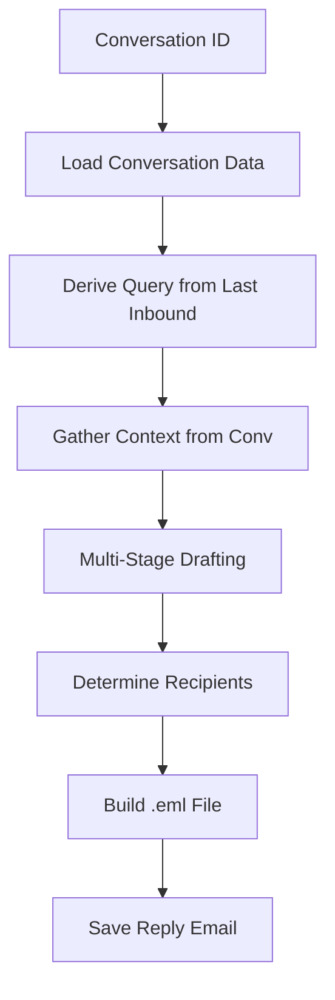
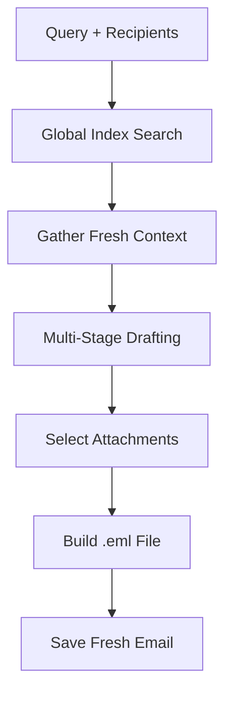
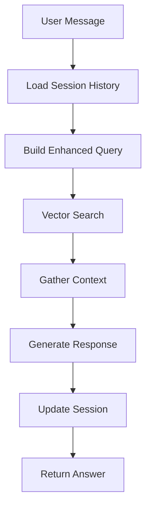
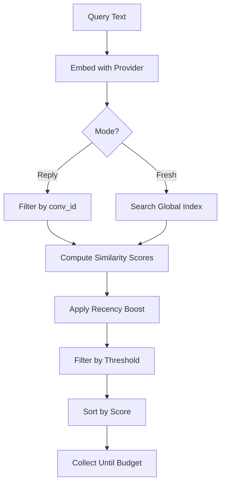
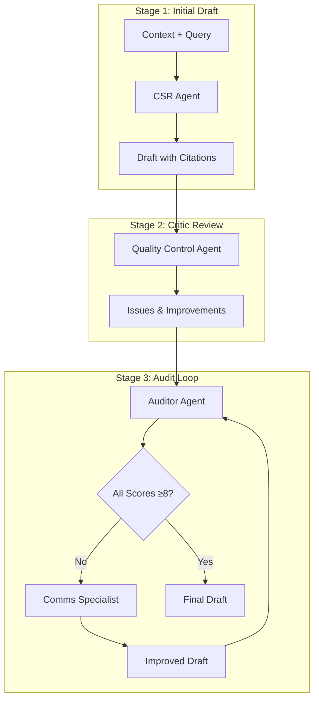

# `search_and_draft.py` - Advanced Email Search & Draft Engine

## 1. Overview

This module is the central processing engine for EmailOps, orchestrating the entire email workflow from search to draft generation. It implements advanced retrieval-augmented generation (RAG) with multi-stage drafting, conversational chat, and sophisticated email composition capabilities.

**Key Features:**
- **Multi-mode operation**: Reply drafting, fresh email composition, chat, and search-only
- **Advanced RAG pipeline**: Vector similarity search with time-decay recency boosting
- **Multi-stage drafting**: Initial draft → Critic review → Audit loop (up to 5 iterations)
- **Chat sessions**: Persistent conversation history with context-aware responses
- **Email composition**: Standards-compliant `.eml` file generation with attachments
- **Large context windows**: Support for up to 100k+ character contexts

---

## 2. Core Workflows

### 2.1 Email Reply Workflow (`draft_email_reply_eml`)



**Key Components:**
- **Context Gathering**: Uses `_gather_context_for_conv` to retrieve relevant documents within the conversation
- **Smart Recipients**: Derives To/CC from last inbound message, applies reply policies
- **Threading Support**: Preserves `In-Reply-To` and `References` headers

### 2.2 Fresh Email Workflow (`draft_fresh_email_eml`)



**Differences from Reply:**
- **Global Search**: Searches entire index, not limited to conversation
- **Manual Recipients**: To/CC provided by user
- **No Threading**: Creates new email thread

### 2.3 Chat Workflow



**Session Management:**
- Persistent sessions stored in `_chat_sessions/*.json`
- Maximum history of 5 messages (configurable)
- Context-aware search query building from history

---

## 3. Context Gathering Engine (RAG)

### 3.1 Vector Search Pipeline



### 3.2 Recency Boosting Algorithm

```python
# Time-decay function for document scoring
decay = 0.5 ** (days_old / HALF_LIFE_DAYS)
boosted_score = base_score * (1.0 + RECENCY_BOOST_STRENGTH * decay)
```

**Configuration:**
- `HALF_LIFE_DAYS`: Default 30 days
- `RECENCY_BOOST_STRENGTH`: Default 1.0
- `BOOSTED_SCORE_CUTOFF`: Minimum score threshold (0.30)

### 3.3 Context Window Management

```python
# Character budget calculation
char_budget = max_tokens * CHARS_PER_TOKEN  # Default: 3.8 chars/token

# Per-document limits
REPLY_MODE: min(500k, max(100k, budget // 5))
FRESH_MODE: min(250k, max(50k, budget // 10))
CHAT_MODE: 100k chars per snippet
```

---

## 4. Multi-Stage Drafting Process

### 4.1 The Three-Agent System



### 4.2 Audit Scoring Criteria

The Auditor evaluates drafts on five dimensions (1-10 scale):
1. **Balanced-Communication**: Professional tone and balance
2. **Displays-Excellence**: Quality of writing and clarity
3. **Factuality-Rating**: Accuracy and proper citations
4. **Utility-Maximizing-Communication**: Usefulness and completeness
5. **Citation-Quality**: Proper attribution and references

### 4.3 Structured Output Parsing

The module uses bullet-point parsing for robust LLM output handling:

```python
# Parser functions for different response types
_parse_bullet_response_draft()    # Email drafts
_parse_bullet_response_critic()   # Critic feedback
_parse_bullet_response_chat()     # Chat responses
_parse_bullet_response_needs()    # Attachment needs
```

**Benefits:**
- More reliable than pure JSON parsing
- Handles partial responses gracefully
- Supports fallback extraction strategies

---

## 5. Email Composition (`_build_eml`)

### 5.1 Standards Compliance

```python
# RFC-compliant email construction
msg = EmailMessage()
msg["From"] = sender
msg["To"] = ", ".join(recipients)
msg["Message-ID"] = make_msgid(domain=MESSAGE_ID_DOMAIN)
msg["Date"] = formatdate(localtime=True)
```

### 5.2 Multipart Structure

```
multipart/alternative
├── text/plain (primary body)
└── text/html (auto-generated alternative)

+ attachments (via MIME types)
```

### 5.3 Attachment Handling

```python
# Smart attachment selection
- Greedy selection by relevance score
- Size budget enforcement (default 15MB)
- MIME type detection
- Filename preservation
```

---

## 6. Configuration & Environment Variables

### 6.1 Core Settings

| Variable | Default | Description |
|----------|---------|-------------|
| `SENDER_LOCKED_NAME` | "Hagop Ghazarian" | Default sender name |
| `SENDER_LOCKED_EMAIL` | "Hagop.Ghazarian@chalhoub.com" | Default sender email |
| `MESSAGE_ID_DOMAIN` | "chalhoub.com" | Domain for Message-ID generation |
| `REPLY_POLICY` | "reply_all" | Default reply policy |
| `PERSONA` | "expert insurance CSR" | LLM persona for drafting |

### 6.2 Search & Context Settings

| Variable | Default | Description |
|----------|---------|-------------|
| `CHARS_PER_TOKEN` | 3.8 | Character-to-token ratio |
| `CONTEXT_SNIPPET_CHARS` | 1600 | Default snippet size |
| `HALF_LIFE_DAYS` | 30 | Recency boost half-life |
| `RECENCY_BOOST_STRENGTH` | 1.0 | Boost multiplier |
| `CANDIDATES_MULTIPLIER` | 3 | Search candidate multiplier |
| `MIN_AVG_SCORE` | 0.2 | Minimum average score |
| `BOOSTED_SCORE_CUTOFF` | 0.30 | Score threshold after boosting |

### 6.3 Token Budgets

| Variable | Default | Description |
|----------|---------|-------------|
| `REPLY_TOKENS_TARGET_DEFAULT` | 20,000 | Tokens for reply context |
| `FRESH_TOKENS_TARGET_DEFAULT` | 10,000 | Tokens for fresh email |
| `MAX_HISTORY_HARD_CAP` | 5 | Maximum chat history messages |

---

## 7. Advanced Features

### 7.1 Chat Session Management

```python
@dataclass
class ChatSession:
    base_dir: Path
    session_id: str
    max_history: int = 5
    messages: list[ChatMessage]
    
    # Persistent storage
    def save() -> None
    def load() -> None
    def reset() -> None
```

### 7.2 Conversation Subject Filtering

```python
def _find_conv_ids_by_subject(
    mapping: list[dict], 
    subject_keyword: str
) -> set[str]:
    """Find conversations by subject keyword"""
```

### 7.3 Reply Policy Options

- **`reply_all`**: Include all original recipients
- **`smart`**: Exclude mailing lists and no-reply addresses
- **`sender_only`**: Reply only to the sender

### 7.4 Error Handling & Retries

```python
# Retry mechanism with exponential backoff
MAX_RETRIES = 3
for attempt in range(MAX_RETRIES):
    try:
        response = complete_text(...)
        break
    except Exception:
        time.sleep(2**attempt)
```

---

## 8. Command-Line Interface

### 8.1 Basic Usage

```bash
# Search only
python -m emailops.search_and_draft \
    --root ./export \
    --query "policy renewal" \
    --k 10

# Reply to conversation
python -m emailops.search_and_draft \
    --root ./export \
    --reply-conv-id "C12JXMY" \
    --query "Please provide more details"

# Fresh email
python -m emailops.search_and_draft \
    --root ./export \
    --fresh \
    --to "client@example.com" \
    --subject "Policy Update" \
    --query "Draft introduction about new coverage"

# Chat mode
python -m emailops.search_and_draft \
    --root ./export \
    --chat \
    --session "session1" \
    --query "What is the claim status?"
```

### 8.2 Advanced Options

```bash
# Override sender (must be in ALLOWED_SENDERS)
--sender "Jane Doe <jane@company.com>"

# Set reply policy
--reply-policy smart  # or: reply_all, sender_only

# Control temperature
--temperature 0.3

# Set similarity threshold
--sim-threshold 0.25

# Token budgets
--reply-tokens 30000
--fresh-tokens 15000

# Disable attachments
--no-attachments

# Reset chat session
--reset-session
```

---

## 9. Integration Points

### 9.1 Dependencies

- **[`llm_client.py`](llm_client.py)**: LLM completion and embedding functions
- **[`index_metadata.py`](index_metadata.py)**: Index metadata management
- **[`utils.py`](utils.py)**: Conversation loading and utilities
- **[`email_indexer.py`](email_indexer.py)**: (Implicit) Creates the FAISS index
- **[`text_chunker.py`](text_chunker.py)**: (Implicit) Chunk generation

### 9.2 File Structure Requirements

```
export_root/
├── _emailops_index/      # Index directory
│   ├── index.faiss       # FAISS vector index
│   ├── mapping.json      # Document metadata
│   ├── embeddings.npy    # Embedding vectors
│   └── metadata.json     # Index metadata
├── [conv_id]/            # Conversation directories
│   ├── Conversation.txt  # Thread text
│   └── manifest.json     # Conversation metadata
└── _chat_sessions/       # Chat session storage
    └── [session_id].json # Session history
```

---

## 10. Performance Considerations

### 10.1 Memory Management

- **Embeddings**: Uses memory-mapped numpy arrays (`mmap_mode='r'`)
- **Context Windows**: Configurable per-snippet limits prevent OOM
- **Deduplication**: `_deduplicate_chunks()` reduces redundant content

### 10.2 Optimization Strategies

1. **Candidate Filtering**: Pre-filter with `CANDIDATES_MULTIPLIER`
2. **Early Stopping**: Stop collecting context when budget reached
3. **Lazy Loading**: Documents loaded only when needed
4. **Batch Operations**: Vector operations use numpy broadcasting

### 10.3 Scaling Limits

- **Max search results**: 250 documents
- **Max context per snippet**: 500k chars (reply), 250k (fresh)
- **Max attachments**: 15MB total
- **Max chat history**: 5 messages

---

## 11. Security Considerations

### 11.1 Input Validation

- **Sender Allow-listing**: Only approved senders can be overridden
- **Header Sanitization**: `_sanitize_header_value()` prevents injection
- **Path Validation**: All paths resolved and validated

### 11.2 Data Protection

- **Session Isolation**: Chat sessions are user-specific
- **Atomic Writes**: Session files written atomically
- **Error Recovery**: Corrupt sessions backed up and reset

---

## 12. Troubleshooting

### Common Issues

1. **"Index not found"**
   - Ensure index is built with `email_indexer.py`
   - Check `INDEX_DIRNAME` environment variable

2. **"Embedding dimension mismatch"**
   - Index and query provider must match
   - Rebuild index with correct provider

3. **"No context gathered"**
   - Lower `sim_threshold` parameter
   - Check if conversation exists
   - Verify index contains documents

4. **"Failed to parse structured response"**
   - Module includes fallback to text parsing
   - Check LLM provider status
   - Review temperature settings

### Debug Environment Variables

```bash
# Enable debug logging
export LOG_LEVEL=DEBUG

# Force embedding renormalization
export FORCE_RENORM=1

# Allow provider override (unsafe)
export ALLOW_PROVIDER_OVERRIDE=1