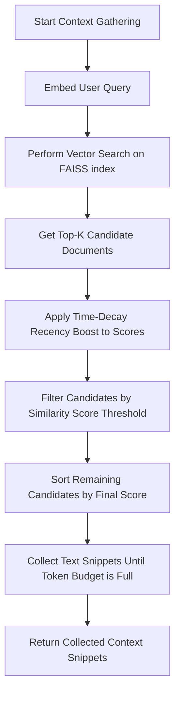
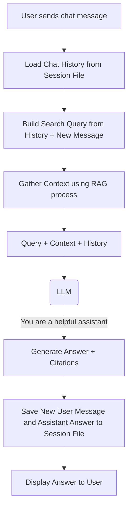

# `search_and_draft.py` - The Core Application Engine

## 1. Overview

This script is the central processing engine for the EmailOps application. It orchestrates the entire process from user query to final email draft, integrating search, retrieval-augmented generation (RAG), a sophisticated multi-step drafting process, and conversational chat capabilities. It can be controlled via a powerful command-line interface to handle different tasks.

The main functionalities are:
-   **Replying** to existing email conversations.
-   Drafting **fresh** emails on a new topic.
-   Engaging in a **conversational chat** to answer questions based on the indexed data.
-   Performing **search-only** operations.

---

## 2. The Three Main Workflows

The script's operation is divided into three primary modes, typically initiated from the command line.

```mermaid
graph TD
    A[CLI Command] --> B{Mode?};
    B -- --reply-conv-id --> C[**Workflow 1: Email Reply**];
    B -- --fresh --> D[**Workflow 2: Fresh Email**];
    B -- --chat --> E[**Workflow 3: Chat**];
```

---

## 3. Workflow 1 & 2 Core: Context Gathering (RAG)

Both email drafting workflows rely on a powerful Retrieval-Augmented Generation (RAG) process to find relevant information before calling the LLM.



The recency boost is a time-decay function that increases the score of newer documents, controlled by the `HALF_LIFE_DAYS` setting. This ensures that more recent information is prioritized.

**Key Distinction:**
-   **Email Reply (`_gather_context_for_conv`)**: The search is **filtered** to only include documents from the specific conversation (`conv_id`).
-   **Fresh Email (`_gather_context_fresh`)**: The search is performed across the **entire global index**.

---

## 4. The "Draft, Critique, Audit" Workflow

The heart of the email generation is `draft_email_structured`, a multi-step process where the LLM drafts, critiques, and refines its own work. This ensures high-quality, factual, and professional output.

```mermaid
graph TD
    subgraph "Step 1: Initial Draft"
        A[Query + Retrieved Context] --> B(LLM);
        B -- "You are a CSR" --> C[Raw Text Output];
        C --> D[Parse into Initial Draft Dict];
    end

    subgraph "Step 2: Critic Pass"
        D --> E[Initial Draft + Context];
        E --> F(LLM);
        F -- "You are a Quality Control Specialist" --> G[Critic Feedback Dict];
    end

    subgraph "Step 3: Audit & Refine Loop (up to 5 times)"
        H[Final Draft] --> I(LLM);
        I -- "You are an Auditor" --> J[Get 5 Scores (1-10)];
        J --> K{All Scores >= 8?};
        K -- No --> L[Final Draft + Scores];
        L --> M(LLM);
        M -- "You are a Comms Specialist; Improve this" --> N[New Final Draft];
        N --> H;
        K -- Yes --> O[Exit Loop];
    end
    
    O --> P[Return Final Audited Draft];
```

In the **Audit & Refine Loop**, the "Auditor" agent scores the draft on five criteria: `Balanced-Communication`, `Displays-Excellence`, `Factuality-Rating`, `Utility-Maximizing-Communication`, and `Citation-Quality`. If any score is below 8, the "Comms Specialist" agent attempts to revise the draft. This loop continues until the quality threshold is met or the attempt limit is reached.

---

## 5. Structured LLM Output Parsing

A key technique used throughout this script is prompting the LLM to return its response in a structured bullet-point format. This text output is then parsed into a Python dictionary by a family of helper functions:

-   `_parse_bullet_response_draft`
-   `_parse_bullet_response_critic`
-   `_parse_bullet_response_chat`

These functions look for section headers (e.g., `• Email Draft:`, `• Citations:`) and bullet points to reliably extract the different parts of the LLM's response (like the email body, list of citations, etc.). This is more robust than relying on pure JSON output, which can sometimes fail.

---

## 6. Workflow 3: Conversational Chat

The chat mode provides a conversational interface for asking questions about the indexed data. It maintains conversation history.



To improve search relevance in a conversation, the `_build_search_query_from_history` function automatically combines the user's latest question with the content of their previous messages before hitting the search index.

---

## 7. From Draft to `.eml` File

Once a final draft is generated by the main workflows, the `_build_eml` function assembles it into a standard email file.

1.  **Get Final Draft**: The `final_draft` dictionary is retrieved from the `draft_email_structured` output.
2.  **Determine Headers**: For replies, headers (`To`, `CC`, `Subject`, `In-Reply-To`) are derived from the original conversation data. For fresh emails, they are taken from CLI arguments.
3.  **Select Attachments**: In the `draft_email_reply_eml` and `draft_fresh_email_eml` functions, `select_relevant_attachments` is called to greedily pick the most relevant attachments from the context that fit within a size budget.
4.  **Construct `EmailMessage`**: The Python `email` library is used to build the message object, setting all headers.
5.  **Add Body**: The text body is added. A simple HTML version is also generated as an alternative part.
6.  **Add Attachments**: Each selected attachment is read from disk, its MIME type is guessed, and it's added to the message.
7.  **Serialize to Bytes**: The final `EmailMessage` object is converted into bytes, ready to be saved as a `.eml` file.

---

## 8. CLI Usage

The script is a versatile command-line tool.

**Common Arguments:**
-   `--root`: The root directory of the email export.
-   `--query`: The search query or drafting instruction.
-   `--provider`: The LLM provider to use (currently only `vertex`).

**Modes:**
-   **Search Only**:
    ```bash
    python -m emailops.search_and_draft --root ./export --query "information about policy renewal"
    ```
-   **Draft a Reply**:
    ```bash
    python -m emailops.search_and_draft --root ./export --reply-conv-id "C12JXMY" --query "Please summarize the key points"
    ```
-   **Draft a Fresh Email**:
    ```bash
    python -m emailops.search_and_draft --root ./export --fresh --to "client@example.com" --subject "Your Policy" --query "Draft an introduction..."
    ```
-   **Chat**:
    ```bash
    python -m emailops.search_and_draft --root ./export --chat --session "my_chat_1" --query "What is the status of claim #123?"
    ```
