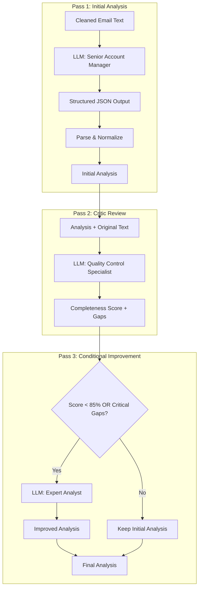

# `summarize_email_thread.py` - Advanced Email Thread Analysis Engine

## 1. Overview

This module performs deep, structured analysis of email conversations using a sophisticated multi-pass LLM workflow. It transforms raw email threads into comprehensive "facts ledgers" - structured JSON documents that capture every important aspect of the conversation including participants, requests, commitments, risks, and action items.

**Core Capabilities:**
- **Three-pass analysis**: Initial analysis → Critic review → Improvement pass
- **Facts ledger extraction**: Structured capture of all conversation elements
- **Robust JSON parsing**: Multiple fallback strategies for LLM output
- **Manifest enrichment**: Automatic metadata integration from conversation files
- **Multiple output formats**: JSON, Markdown, and CSV for action items
- **Atomic file operations**: Safe writes with retry logic

---

## 2. The Three-Pass Analysis Workflow

### 2.1 Workflow Architecture



### 2.2 Key Functions

**`analyze_email_thread_with_ledger()`**: Core analysis function
- Processes email text through three-pass workflow
- Returns normalized, validated analysis dictionary
- Handles fallback to text mode if JSON parsing fails

**`analyze_conversation_dir()`**: Higher-level directory processor
- Reads `Conversation.txt` from directory
- Runs analysis workflow
- Optionally merges manifest metadata
- Returns enriched analysis

---

## 3. The Facts Ledger Schema

### 3.1 Top-Level Structure

```python
{
    "category": str,           # From predefined catalog
    "subject": str,            # Max 100 chars
    "participants": [...],     # Detailed participant info
    "facts_ledger": {...},     # Core facts structure
    "summary": [...],          # Bullet points
    "next_actions": [...],     # Action items
    "risk_indicators": [...],  # Risk flags
    "_metadata": {...}         # Analysis metadata
}
```

### 3.2 Facts Ledger Components

#### Explicit Asks
```python
{
    "from": str,               # Who requested
    "request": str,            # What was asked
    "urgency": enum,           # immediate/high/medium/low
    "status": enum             # pending/acknowledged/in_progress/completed/blocked
}
```

#### Commitments Made
```python
{
    "by": str,                 # Who committed
    "commitment": str,         # What was promised
    "deadline": str,           # When due
    "feasibility": enum        # achievable/challenging/risky/impossible
}
```

#### Key Dates
```python
{
    "date": str,              # Date/time
    "event": str,             # What happens
    "importance": enum        # critical/important/reference
}
```

### 3.3 Participant Analysis

```python
{
    "name": str,              # Person's name
    "role": enum,             # client/broker/underwriter/internal/other
    "email": str,             # Email address
    "tone": enum,             # professional/frustrated/urgent/friendly/demanding/neutral
    "stance": str             # Position/attitude in thread
}
```

---

## 4. Robust JSON Processing

### 4.1 The `_try_load_json()` Function

```mermaid
graph TD
    A[Raw LLM Output] --> B{Is dict?}
    B -->|Yes| C[Return as-is]
    B -->|No| D{Direct JSON parse?}
    D -->|Success| E[Return parsed]
    D -->|Fail| F{Find ```json block?}
    F -->|Found| G[Extract & Parse]
    F -->|Not Found| H{Find balanced {}?}
    H -->|Found| I[Extract & Parse]
    H -->|Not Found| J[Return None]
```

### 4.2 Extraction Strategies

1. **Direct parsing**: Try `json.loads()` on raw string
2. **Fenced blocks**: Extract from ` ```json...``` ` markers
3. **Balanced braces**: Find first complete `{...}` object
4. **Fallback**: Return None, trigger text mode

### 4.3 The `_extract_first_balanced_json_object()` Function

Sophisticated parser that:
- Tracks brace balance while respecting strings
- Handles escaped characters correctly
- Finds first complete JSON object in mixed text
- Returns extractable JSON string or None

---

## 5. Data Normalization & Validation

### 5.1 The `_normalize_analysis()` Function

**Purpose**: Ensure LLM output conforms to schema requirements

**Operations:**
1. **Type enforcement**: Convert to correct types
2. **Enum validation**: Ensure values are from allowed sets
3. **Length limits**: Truncate strings to max lengths
4. **Deduplication**: Remove duplicate participants
5. **Default values**: Add missing required fields
6. **Size caps**: Limit array lengths

### 5.2 Configuration Limits

```python
MAX_THREAD_CHARS = 16000      # Input text limit
CRITIC_THREAD_CHARS = 5000    # Critic review limit
IMPROVE_THREAD_CHARS = 8000   # Improvement pass limit
MAX_PARTICIPANTS = 25          # Max people tracked
MAX_SUMMARY_POINTS = 25        # Max summary bullets
MAX_NEXT_ACTIONS = 50          # Max action items
MAX_FACT_ITEMS = 50           # Max per fact category
SUBJECT_MAX_LEN = 100         # Subject line limit
```

---

## 6. Manifest Integration

### 6.1 The `_merge_manifest_into_analysis()` Function

**Enrichment Strategy:**
- Only fills **empty** fields (never overwrites)
- Sources data from `manifest.json` 
- Extracts from raw email headers as fallback

**Data Sources Priority:**
1. LLM analysis (always preferred)
2. Manifest smart_subject/subject
3. Raw email headers
4. Defaults

### 6.2 Manifest Data Extraction

```python
def _participants_from_manifest(manifest):
    # Extract from first message
    # Convert to schema format
    # Deduplicate by email/name
    # Apply MAX_PARTICIPANTS limit

def _read_manifest(convo_dir):
    # BOM-tolerant UTF-8 reading
    # Control character sanitization
    # JSON parse with error handling
```

---

## 7. Output Generation

### 7.1 JSON Output (`summary.json`)

**Atomic Write Process:**
```python
def _atomic_write_text(path, content):
    # Create temp file
    # Write content
    # Atomic rename with retries
    # Handle OS locks gracefully
```

### 7.2 Markdown Output (`summary.md`)

**`format_analysis_as_markdown()` Function:**
- Escapes markdown-sensitive characters
- Structures content hierarchically
- Includes all ledger components
- Adds metadata footer

**Structure:**
```markdown
# Email Thread Analysis
## Summary
## Participants
## Facts Ledger
### Explicit Requests
### Commitments Made
### Unknown Information
### Forbidden Promises
### Key Dates
## Next Actions
## Risk Indicators
---
## Metadata
```

### 7.3 CSV Export (`todo.csv`)

**`_append_todos_csv()` Function:**
- Appends to root-level CSV
- Deduplicates by (who, what, thread)
- Guards against formula injection
- Uses DictWriter for safety

**CSV Schema:**
```csv
who,what,due,status,priority,thread
```

---

## 8. LLM Prompting Strategy

### 8.1 System Prompts

**Initial Analysis:**
```
You are a senior insurance account manager analyzing email 
threads with extreme attention to detail...
- Extract ONLY facts from the email text
- Identify every participant's emotional state
- Flag any promises that may be problematic
```

**Critic:**
```
You are a quality control specialist reviewing email thread analyses...
Verify:
1. All participants correctly identified
2. No explicit asks or commitments missed
3. All unknowns captured
```

**Improver:**
```
You are an expert analyst improving an email thread analysis...
Add any missed information while maintaining accuracy
```

### 8.2 Response Schemas

All three passes use detailed JSON schemas with:
- Strict type definitions
- Enum constraints for categorical fields
- Required field specifications
- Nested object structures

---

## 9. Error Handling & Resilience

### 9.1 The `_retry()` Function

```python
def _retry(callable_fn, retries=2, delay=0.5):
    # Exponential backoff: delay * 2^(attempt-1)
    # ±20% jitter to avoid thundering herd
    # Re-raises after final attempt
```

### 9.2 Fallback Strategies

1. **JSON parsing fails** → Try text mode
2. **Text mode fails** → Use raw response as summary
3. **Manifest missing** → Continue without enrichment
4. **File write fails** → Retry with backoff

---

## 10. Command-Line Interface

### 10.1 Basic Usage

```bash
# Analyze single conversation
python -m emailops.summarize_email_thread \
    --thread ./export/C12JXMY

# Generate markdown output
python -m emailops.summarize_email_thread \
    --thread ./export/C12JXMY \
    --output-format markdown

# Append to todo.csv
python -m emailops.summarize_email_thread \
    --thread ./export/C12JXMY \
    --write_todos_csv
```

### 10.2 Advanced Options

```bash
# Custom categories
--catalog claim_notification contract_review admin_internal

# Skip manifest merge
--no-manifest-merge

# Markdown only (no JSON)
--output-format markdown --no-json

# Custom temperature
--temperature 0.3

# Provider specification
--provider vertex
```

---

## 11. Configuration

### 11.1 Environment Variables

| Variable | Default | Description |
|----------|---------|-------------|
| `SUMMARIZER_VERSION` | "2.2-facts-ledger" | Analysis version |
| `SUMMARIZER_THREAD_MAX_CHARS` | 16000 | Max input chars |
| `SUMMARIZER_CRITIC_MAX_CHARS` | 5000 | Critic input limit |
| `SUMMARIZER_IMPROVE_MAX_CHARS` | 8000 | Improvement input limit |
| `SUMMARIZER_MAX_PARTICIPANTS` | 25 | Max participants |
| `SUMMARIZER_MAX_SUMMARY_POINTS` | 25 | Max summary items |
| `SUMMARIZER_MAX_NEXT_ACTIONS` | 50 | Max action items |
| `SUMMARIZER_MAX_FACT_ITEMS` | 50 | Max facts per category |
| `SUMMARIZER_SUBJECT_MAX_LEN` | 100 | Subject length limit |

### 11.2 Default Categories

```python
DEFAULT_CATALOG = [
    "insurance_coverage_query",
    "contract_review_request", 
    "certificate_request",
    "endorsement_change_request",
    "claim_notification_or_management",
    "claim_update_request",
    "admin_internal",
    "admin_external",
    "other"
]
```

---

## 12. Integration Points

### 12.1 Dependencies

**Required Modules:**
- [`llm_client.py`](llm_client.py): `complete_json()`, `complete_text()`
- [`utils.py`](utils.py): `clean_email_text()`, `extract_email_metadata()`, `read_text_file()`

**Optional (with fallbacks):**
- Can run standalone with minimal functionality
- Provides no-op implementations for missing imports

### 12.2 File Structure

```
conversation_dir/
├── Conversation.txt    # Required: Email thread text
├── manifest.json      # Optional: Metadata for enrichment
├── summary.json       # Output: Analysis results
├── summary.md         # Output: Human-readable analysis
└── [attachments]      # Ignored by this module
```

---

## 13. Performance Optimization

### 13.1 Text Truncation

- Input text capped at 16k chars for initial analysis
- Critic gets first 5k chars for review
- Improvement pass uses first 8k chars
- Prevents token limit overruns

### 13.2 Efficient Deduplication

```python
# Normalize and track seen keys
seen_keys = set()
for participant in participants:
    key = email.lower() or f"name:{normalized_name}"
    if key not in seen_keys:
        seen_keys.add(key)
        # Keep participant
```

### 13.3 Completeness Score Optimization

- Skip improvement pass if score ≥ 85%
- Skip if no critical gaps identified
- Saves one LLM call in most cases

---

## 14. Security Considerations

### 14.1 CSV Injection Prevention

```python
def _safe_csv_cell(x):
    # Prefix with ' if starts with =, +, -, @
    # Handles leading tabs
    # Prevents formula execution
```

### 14.2 Path Security

- All paths resolved to absolute
- Parent directory creation validated
- Atomic writes prevent corruption

### 14.3 Control Character Sanitization

```python
# Remove problematic control chars from manifest
text = re.sub(r"[\x00-\x08\x0B\x0C\x0E-\x1F\x7F-\x9F]", "", text)
```

---

## 15. Best Practices

### 15.1 For Accurate Analysis

1. **Clean input**: Ensure `Conversation.txt` is properly formatted
2. **Complete threads**: Include all messages in conversation
3. **Manifest accuracy**: Keep `manifest.json` synchronized
4. **Category selection**: Use appropriate categories for domain

### 15.2 For Performance

1. **Batch processing**: Process multiple threads in parallel
2. **Cache results**: Reuse `summary.json` when available
3. **Temperature tuning**: Lower temperature (0.1-0.2) for consistency
4. **Token management**: Monitor and adjust char limits if needed

### 15.3 For Integration

1. **Error handling**: Always wrap calls in try-except
2. **Output validation**: Verify required fields exist
3. **Schema compatibility**: Check `_metadata.version`
4. **Incremental updates**: Use CSV deduplication for todos

---

## 16. Troubleshooting

### Common Issues

**"Failed to parse thread properly"**
- Check for malformed JSON in LLM response
- Verify text encoding (UTF-8)
- Try increasing temperature slightly

**"Completeness score low"**
- Thread may be truncated
- Complex threads may need manual review
- Check for multi-language content

**"Manifest merge not working"**
- Verify `manifest.json` exists and is valid
- Check for BOM or encoding issues
- Ensure proper JSON structure

**"CSV not updating"**
- Check write permissions on root directory
- Verify CSV not locked by another process
- Look for duplicate detection blocking updates