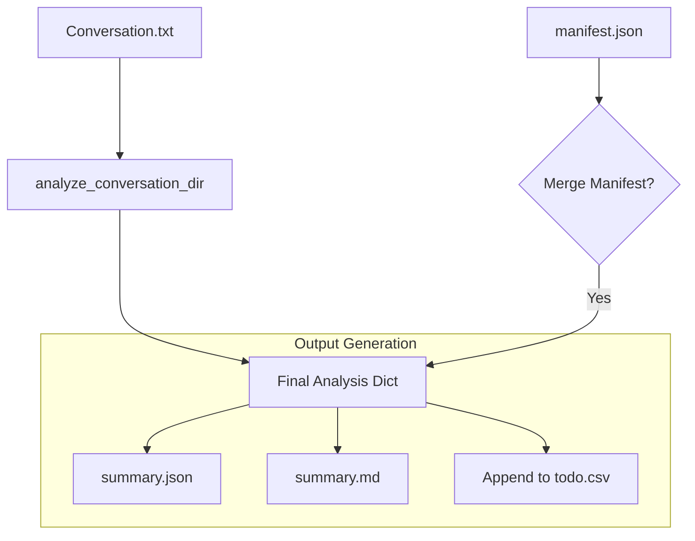

# `summarize_email_thread.py` - Deep Conversation Analysis Engine

## 1. Overview

This script is a specialized tool designed to perform a deep, structured analysis of a single email conversation. It reads the raw text of an email thread, processes it through a multi-step LLM workflow, and extracts a detailed "facts ledger." The final output is a highly structured JSON object, which can also be saved as a human-readable Markdown file and a CSV of action items.

The core of this script is the `analyze_email_thread_with_ledger` function, which uses a "critique and improve" loop to ensure the analysis is as accurate and comprehensive as possible.

---

## 2. The Three-Pass Analysis Workflow

To ensure high-quality output, the script uses a three-step process where the LLM analyzes, critiques, and then improves its own work.

```mermaid
graph TD
    subgraph "Step 1: Initial Analysis"
        A[Cleaned Conversation.txt] --> B(LLM);
        B -- "You are an Analyst; extract a facts ledger" --> C[Raw JSON Output];
        C --> D[Parse & Normalize JSON];
        D --> E[Initial Analysis Dict];
    end

    subgraph "Step 2: Critic Pass"
        E --> F[Initial Analysis + Conversation Text];
        F --> G(LLM);
        G -- "You are a Critic; find gaps and score completeness" --> H[Critic Feedback (Score, Missed Items)];
    end

    subgraph "Step 3: Improvement Pass"
        H --> I{Completeness Score < 85 OR Critical Gaps Found?};
        I -- Yes --> J[Initial Analysis + Critic Feedback];
        J --> K(LLM);
        K -- "You are an Improver; fix the analysis" --> L[Improved JSON Output];
        L --> M[Parse & Normalize JSON];
        M --> N[Final Analysis Dict];
        I -- No --> O[Initial Analysis is Final];
    end

    O --> P((End));
    N --> P;
```

After each analysis or improvement step, the raw JSON output from the LLM is passed through a `_normalize_analysis` function. This crucial step sanitizes the data, enforces schema constraints (like length limits), and deduplicates items like participants to ensure the final data structure is clean and predictable.

---

## 3. Overall Data Flow

The script orchestrates a pipeline that transforms raw text into structured data files.



1.  **Read Data**: The `Conversation.txt` file is read.
2.  **Analyze**: It's passed through the three-step LLM analysis workflow.
3.  **Enrich (Optional Fallback)**: If the LLM analysis is missing key metadata (like a subject line), the script reads the `manifest.json` file and uses its contents as a **fallback** to merge that information into the final dictionary.
4.  **Write Outputs**: The final, enriched analysis is used to generate the output files. This process is resilient, using atomic writes for `summary.json` and `summary.md` to prevent data corruption, and performing deduplication when appending new tasks to the global `todo.csv`.

---

## 4. Robust JSON Processing

LLMs can sometimes produce malformed JSON. The `_try_load_json` function makes the script resilient to these errors by attempting several parsing strategies in order.

```mermaid
graph TD
    A[Raw LLM String Output] --> B{Is it a valid JSON object?};
    B -- Yes --> C[Parse Directly];
    B -- No --> D{Does it contain a ```json ... ``` block?};
    D -- Yes --> E[Extract and Parse the block];
    D -- No --> F{Can we find a balanced '{'...'}' object?};
    F -- Yes --> G[Extract and Parse the first balanced object];
    F -- No --> H[Fail Parsing];
    
    C --> I[Success];
    E --> I;
    G --> I;
```

---

## 5. The "Facts Ledger" Schema

The goal of the analysis is to populate a detailed schema. The most important part is the `facts_ledger`.

-   **`category`**: The overall topic (e.g., `claim_notification`, `contract_review_request`).
-   **`subject`**: A concise subject line for the thread.
-   **`participants`**: A list of people involved, including their role, tone, and stance.
-   **`summary`**: A high-level bulleted summary of the conversation.
-   **`next_actions`**: A list of concrete action items, with owners, priorities, and statuses.
-   **`risk_indicators`**: A list of potential risks or red flags identified in the thread.
-   **`facts_ledger`**:
    -   **`explicit_asks`**: What did people specifically request?
    -   **`commitments_made`**: What was promised by whom?
    -   **`unknowns`**: What critical information is missing?
    -   **`forbidden_promises`**: Were any problematic guarantees made?
    -   **`key_dates`**: A list of important dates and deadlines.

---

## 6. CLI Usage

The script is designed to be run on a single conversation directory.

**Example Command:**
```bash
python -m emailops.summarize_email_thread --thread ./export/C12JXMY --output-format markdown --write_todos_csv
```

**Arguments:**
-   `--thread`: (Required) The path to the conversation directory.
-   `--output-format`: Can be `json` (default) or `markdown`.
-   `--write_todos_csv`: If set, appends any "next actions" to a `todo.csv` file in the root directory.
-   `--no-json`: Can be combined with `--output-format markdown` to skip writing the `summary.json` file.
