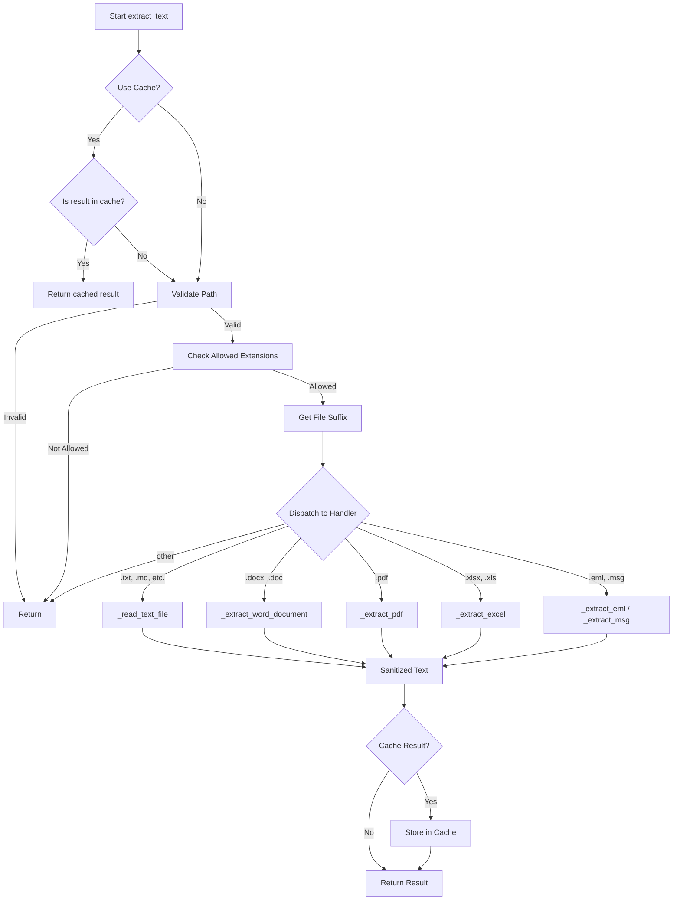

# `text_extraction.py` - Document Text Extraction Utilities

## 1. Overview

This module provides a robust and extensible system for extracting plain text from a variety of file formats. It is a key component of the data processing pipeline, enabling the content of attachments and other documents to be indexed and searched.

**Key Features:**
- **Multi-format Support**: Handles a wide range of file types including PDFs, Word documents, Excel spreadsheets, emails, and more.
- **Resilience**: Gracefully handles errors, missing dependencies, and corrupted files, ensuring that the system does not crash on problematic inputs.
- **Performance**: Caches extraction results to avoid reprocessing the same file multiple times.
- **Platform-Aware**: Includes platform-specific logic (e.g., using `win32com` on Windows for legacy `.doc` files).
- **Asynchronous API**: Provides an `async` version of the main extraction function for use in asynchronous codebases.

---

## 2. Core Function: `extract_text()`

This is the main entry point for the module.

### 2.1. Function Signature

```python
def extract_text(
    path: Path, 
    *, 
    max_chars: int | None = None, 
    use_cache: bool = True
) -> str:
```

### 2.2. Parameters

| Parameter | Type | Default | Description |
|---|---|---|---|
| `path` | `Path` | Required | The path to the file from which to extract text. |
| `max_chars` | `int` | `None` | An optional limit on the number of characters to return. |
| `use_cache` | `bool` | `True` | Whether to use the cache for this operation. |

### 2.3. Return Value

Returns the extracted and sanitized plain text as a string. If extraction fails or the file format is unsupported, it returns an empty string.

### 2.4. Workflow



---

## 3. Supported File Formats and Extraction Logic

The module uses a dispatch pattern based on file extensions to select the appropriate extraction logic.

| File Type | Extensions | Primary Library | Fallback/Notes |
|---|---|---|---|
| Plain Text | `.txt`, `.md`, `.log`, `.json`, `.yaml`, `.csv`, `.xml` | `read_text_file` | - |
| HTML | `.html`, `.htm` | `BeautifulSoup` | Regex-based tag stripping |
| PDF | `.pdf` | `pypdf` | Attempts to decrypt with an empty password. |
| Word | `.docx` | `python-docx` | Extracts text from paragraphs and tables. |
| Word (Legacy)| `.doc` | `win32com.client` (Windows) | `textract` (cross-platform) |
| Excel | `.xlsx`, `.xls` | `pandas` | Uses `openpyxl` or `xlrd` engine. |
| PowerPoint | `.pptx`, `.ppt` | `python-pptx` | Extracts text from all shapes on all slides. |
| RTF | `.rtf` | `striprtf` | - |
| Email | `.eml` | `email` (stdlib) | Extracts headers and text/plain or text/html body. |
| Outlook Msg | `.msg` | `extract-msg` | Extracts headers and body. |

---

## 4. Caching Mechanism

To improve performance, the module caches the results of text extraction.

-   **`_extraction_cache`**: A global dictionary used as the cache.
-   **Cache Key**: A tuple of the resolved file path and the `max_chars` limit: `(path, max_chars)`.
-   **Cache Value**: A tuple of the timestamp and the extracted text: `(timestamp, text)`.
-   **TTL**: A time-to-live of 1 hour (`_CACHE_TTL = 3600`) is used to invalidate stale cache entries.
-   **Thread Safety**: A `threading.Lock` (`_extraction_cache_lock`) is used to ensure that the cache is accessed in a thread-safe manner.

---

## 5. Asynchronous Support

### `extract_text_async()`

An asynchronous wrapper around the `extract_text` function. It uses `asyncio.get_event_loop().run_in_executor()` to run the synchronous `extract_text` function in a separate thread pool, preventing it from blocking the asyncio event loop.

---

## 6. Dependencies

-   **`file_utils`**: For `_strip_control_chars` and `read_text_file`.
-   **`config`**: For `ALLOWED_FILE_PATTERNS`.
-   **Optional Libraries**: `BeautifulSoup`, `docx`, `win32com.client`, `textract`, `pptx`, `striprtf`, `pypdf`, `pandas`, `openpyxl`, `xlrd`, `extract-msg`. The module will gracefully handle `ImportError` if these are not installed and simply skip the corresponding file types.
