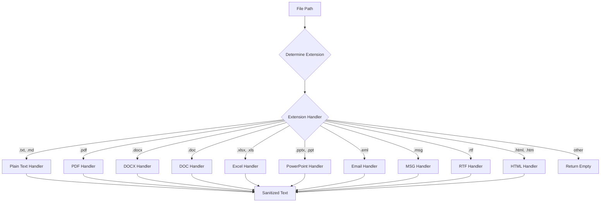
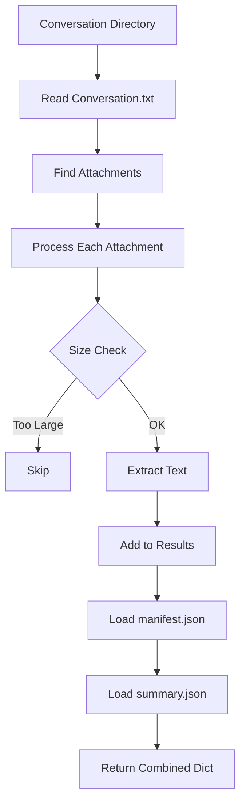

# `utils.py` - Core Text Processing and File Utilities

## 1. Overview

This module provides the foundational utility functions for EmailOps, focusing on robust text extraction, cleaning, and conversation loading. It implements defensive programming practices with graceful error handling and support for a wide variety of file formats.

**Core Capabilities:**
- **Multi-format text extraction**: PDFs, Office documents, emails, and more
- **Text sanitization**: Removes control characters and normalizes content
- **Conversation management**: Loads and parses email export structures
- **Encoding detection**: Handles various text encodings with fallbacks
- **Optional dependencies**: Graceful degradation when libraries unavailable

---

## 2. Text Extraction System

### 2.1 The `extract_text()` Dispatcher

```python
def extract_text(path: Path, *, max_chars: int | None = None) -> str
```

**Architecture:**


### 2.2 Supported File Formats

| Format | Extensions | Primary Library | Fallback Strategy |
|--------|------------|-----------------|-------------------|
| **Plain Text** | `.txt`, `.md`, `.log`, `.json`, `.yaml`, `.yml`, `.csv`, `.xml`, `.html`, `.htm` | Built-in | Multiple encoding attempts |
| **PDF** | `.pdf` | `pypdf` | Skip encrypted PDFs |
| **Word** | `.docx` | `python-docx` | - |
| **Word Legacy** | `.doc` | `win32com` (Windows) | `textract` (cross-platform) |
| **Excel** | `.xlsx`, `.xls` | `pandas` + `openpyxl`/`xlrd` | Auto-detect engine |
| **PowerPoint** | `.pptx`, `.ppt` | `python-pptx` | - |
| **Email** | `.eml` | `email` (stdlib) | - |
| **Outlook MSG** | `.msg` | `extract-msg` | - |
| **Rich Text** | `.rtf` | `striprtf` | - |
| **HTML** | `.html`, `.htm` | `BeautifulSoup` | Regex fallback |

### 2.3 Format-Specific Handlers

#### PDF Extraction (`pypdf`)
```python
# Features:
- Page-by-page extraction
- Empty password decryption attempt
- Graceful handling of corrupted PDFs
- Per-page error recovery
- Memory-efficient streaming
```

#### Word Document Extraction
```python
# .docx (python-docx):
- Paragraph text extraction
- Table cell content extraction
- Preserves document structure

# .doc (legacy):
- Windows: COM automation via Word
- Cross-platform: textract fallback
- Graceful degradation if unavailable
```

#### Excel Extraction (`pandas`)
```python
# Features:
- Sheet-by-sheet processing
- Cell limit protection (MAX_CELLS)
- String dtype for consistency
- Sheet name preservation
- Truncation for large files
```

#### Email Extraction
```python
# .eml files:
- Header extraction (From, To, Subject, Date)
- Multipart MIME handling
- Text/plain preferred over text/html
- HTML to text conversion

# .msg files:
- extract-msg library
- Header and body extraction
- HTML body conversion
```

---

## 3. Text Cleaning Pipeline

### 3.1 Control Character Removal

```python
def _strip_control_chars(s: str) -> str
```

**Removes:**
- Non-printable control characters (except TAB, LF)
- Pattern: `[\x00-\x08\x0B\x0C\x0E-\x1F\x7F-\x9F]`
- Normalizes line endings: CRLF/CR → LF

### 3.2 Email Text Cleaning

```python
def clean_email_text(text: str) -> str
```

**Cleaning Operations:**
1. **BOM Removal**: Strips UTF-8 BOM (`\ufeff`)
2. **Header Removal**: Removes email headers
3. **Signature Detection**: Strips signatures and footers
4. **Forwarding Markers**: Removes separator lines
5. **Quote Removal**: Strips `>` prefixed lines
6. **Redaction**:
   - Emails: `[email@domain.com]`
   - URLs: `[URL]`
7. **Normalization**:
   - Consecutive punctuation reduced
   - Multiple newlines → double newline
   - Multiple spaces → single space

**Pattern Examples:**
```python
# Headers removed:
r"^(From|To|Subject|Date|CC|BCC):.*$"

# Signatures detected:
r"^--\s*\n.*"  # Traditional delimiter
r"^best regards.*$"
r"^sent from my.*$"

# Forwarding markers:
r"^-{3,}\s*Original Message\s*-{3,}"
r"^_{10,}"
```

---

## 4. Conversation Loading

### 4.1 The `load_conversation()` Function

```python
def load_conversation(
    convo_dir: Path,
    include_attachment_text: bool = False,
    max_total_attachment_text: int = 10000,
    *,
    max_attachment_text_chars: int = 500000,
    skip_if_attachment_over_mb: float | None = 0
) -> dict
```

**Workflow:**


**Return Structure:**
```python
{
    "path": str,              # Directory path
    "conversation_txt": str,  # Main conversation text
    "attachments": [          # List of attachments
        {
            "path": str,      # File path
            "text": str       # Extracted text
        }
    ],
    "summary": dict,          # summary.json content
    "manifest": dict          # manifest.json content
}
```

### 4.2 Manifest Handling

**JSON Error Recovery:**
1. **UTF-8 BOM tolerance**: Uses `utf-8-sig` encoding
2. **Control character sanitization**: Removes problematic chars
3. **Backslash fixing**: Escapes stray backslashes
4. **HJSON fallback**: Attempts lenient parsing for malformed JSON

**Recovery Strategy:**
```python
# Try sequence:
1. Standard JSON parse
2. Sanitize and retry
3. HJSON parse (if available)
4. Return empty dict on failure
```

---

## 5. File Reading Utilities

### 5.1 Robust Text File Reading

```python
def read_text_file(path: Path, *, max_chars: int | None = None) -> str
```

**Encoding Detection Sequence:**
1. `utf-8-sig` (handles BOM)
2. `utf-8`
3. `utf-16`
4. `latin-1` with `errors='ignore'`

**Features:**
- Multiple encoding fallbacks
- Character limit support
- Control character sanitization
- Never raises exceptions

### 5.2 Safe Directory Operations

```python
def ensure_dir(p: Path) -> None
```

**Behavior:**
- Creates directory and all parents
- Idempotent (safe to call multiple times)
- No error if directory exists

---

## 6. Email Processing Utilities

### 6.1 Metadata Extraction

```python
def extract_email_metadata(text: str) -> dict[str, object]
```

**Extracted Fields:**
```python
{
    "sender": str | None,
    "recipients": list[str],
    "date": str | None,
    "subject": str | None,
    "cc": list[str],
    "bcc": list[str]
}
```

**Parsing Strategy:**
- Simple regex-based header extraction
- Single-line headers only
- Best-effort heuristic approach

### 6.2 Thread Splitting

```python
def split_email_thread(text: str) -> list[str]
```

**Split Markers:**
- `--- Original Message ---`
- `--- Forwarded Message ---`
- `On ... wrote:`
- Separator lines (`___...`)

**Chronological Ordering:**
- Attempts to parse Date headers
- Sorts by timestamp when available
- Preserves input order as fallback

---

## 7. Utility Functions

### 7.1 Conversation Discovery

```python
def find_conversation_dirs(root: Path) -> list[Path]
```

**Discovery Rule:**
- Directory contains `Conversation.txt`
- Returns sorted list of parent directories
- Recursive search using `rglob()`

### 7.2 HTML to Text Conversion

```python
def _html_to_text(html: str) -> str
```

**Conversion Strategy:**
1. **BeautifulSoup** (if available):
   - Removes script/style/noscript tags
   - Extracts text with space separation
   - Collapses whitespace

2. **Regex Fallback**:
   - Strips script/style blocks
   - Removes all HTML tags
   - Normalizes whitespace

---

## 8. Person Class

```python
class Person:
    def __init__(self, name: str, birthdate: str)
    
    @property
    def age(self) -> int
    
    def getAge(self) -> int  # Alias for age property
```

**Features:**
- Birthdate in ISO format (YYYY-MM-DD)
- Age calculation considers month/day
- Returns 0 on invalid birthdate
- Error-tolerant parsing

---

## 9. Configuration & Environment

### 9.1 Environment Variables

| Variable | Default | Description |
|----------|---------|-------------|
| `MAX_ATTACHMENT_TEXT_CHARS` | 500000 | Maximum chars per attachment |
| `SKIP_ATTACHMENT_OVER_MB` | 0 | Skip attachments larger than X MB |
| `EXCEL_MAX_CELLS` | 200000 | Maximum Excel cells to process |

### 9.2 File Constants

| Constant | Value | Usage |
|----------|-------|-------|
| `CONVERSATION_FILENAME` | "Conversation.txt" | Main thread file |
| `MANIFEST_FILENAME` | "manifest.json" | Conversation metadata |
| `SUMMARY_FILENAME` | "summary.json" | Analysis results |

---

## 10. Error Handling Philosophy

### 10.1 Graceful Degradation

**Principles:**
1. **Never crash**: Return empty strings/lists on errors
2. **Log warnings**: Record issues without stopping
3. **Fallback strategies**: Multiple attempts with different approaches
4. **Optional dependencies**: Features degrade gracefully

### 10.2 Common Error Patterns

```python
# Pattern 1: Try multiple encodings
for enc in encodings:
    try:
        return path.read_text(encoding=enc)
    except UnicodeDecodeError:
        continue
return fallback

# Pattern 2: Optional library with fallback
try:
    from bs4 import BeautifulSoup
    # Use BeautifulSoup
except ImportError:
    # Use regex fallback

# Pattern 3: Silent failure with logging
try:
    # Risky operation
except Exception as e:
    logger.warning("Operation failed: %s", e)
    return safe_default
```

---

## 11. Performance Considerations

### 11.1 Memory Management

**Strategies:**
- **Streaming**: Process large files in chunks
- **Truncation**: Respect `max_chars` limits
- **Lazy loading**: Load attachments only when needed
- **Cell limits**: Cap Excel processing at `EXCEL_MAX_CELLS`

### 11.2 File Size Handling

```python
# Attachment size filtering
if skip_if_attachment_over_mb > 0:
    mb = file.stat().st_size / (1024 * 1024)
    if mb > skip_if_attachment_over_mb:
        continue  # Skip large file
```

---

## 12. Integration Points

### 12.1 Used By

- **[`email_indexer.py`](email_indexer.py)**: Conversation loading, text cleaning
- **[`search_and_draft.py`](search_and_draft.py)**: Conversation loading, logger
- **[`summarize_email_thread.py`](summarize_email_thread.py)**: Text cleaning, file reading
- **[`doctor.py`](doctor.py)**: General utilities

### 12.2 Dependencies

**Required:**
- Python 3.8+ (type hints, walrus operator)
- `pathlib` (standard library)
- `logging` (standard library)

**Optional (with graceful degradation):**
- `python-dotenv`: Environment loading
- `pypdf`: PDF extraction
- `python-docx`: Word document processing
- `pandas`: Excel handling
- `BeautifulSoup`: HTML parsing
- `extract-msg`: Outlook MSG files
- `striprtf`: RTF processing
- `python-pptx`: PowerPoint extraction
- `win32com`: Windows COM automation
- `textract`: Cross-platform document extraction
- `hjson`: Lenient JSON parsing

---

## 13. Testing Considerations

### 13.1 Test Scenarios

1. **Encoding Tests**:
   - UTF-8 with/without BOM
   - UTF-16, Latin-1
   - Mixed encodings
   - Invalid bytes

2. **File Format Tests**:
   - Each supported format
   - Corrupted files
   - Empty files
   - Large files

3. **Error Recovery Tests**:
   - Missing dependencies
   - Malformed JSON
   - Invalid paths
   - Permission errors

### 13.2 Edge Cases

- Files with null bytes
- Extremely long lines
- Circular symlinks
- Network drives
- Case-sensitive filesystems
- Unicode filenames
- Files being written to

---

## 14. Best Practices

### 14.1 When Using This Module

1. **Always expect empty returns**: Check for empty strings/lists
2. **Set size limits**: Use `max_chars` parameters
3. **Log at appropriate levels**: Don't suppress important warnings
4. **Test without optional deps**: Ensure graceful degradation

### 14.2 When Extending This Module

1. **Maintain error tolerance**: Never raise in utility functions
2. **Add fallbacks**: Provide alternatives for optional dependencies
3. **Document format support**: Update supported formats table
4. **Test encoding handling**: Ensure robust text reading
5. **Consider memory usage**: Stream large files when possible