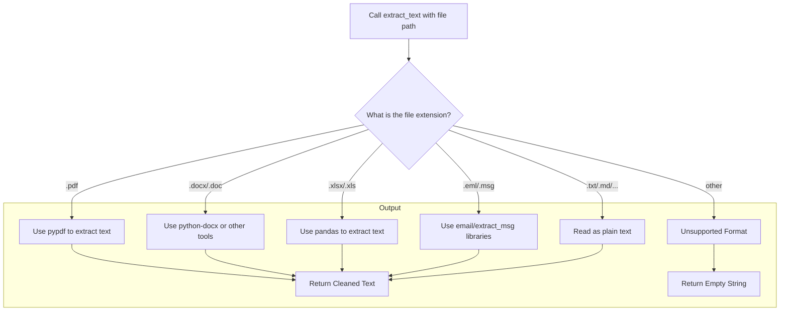
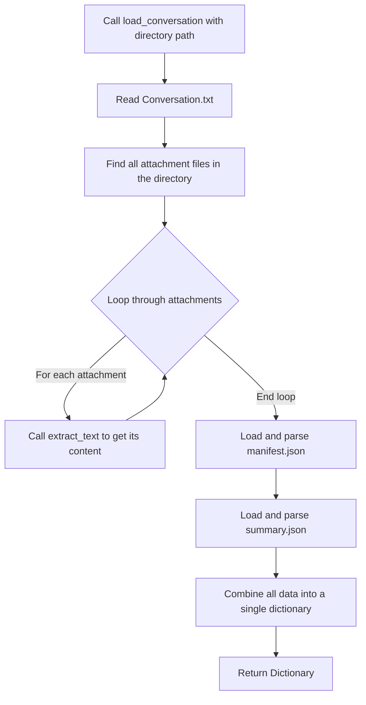

# `utils.py` - Core Text and File Utilities

## 1. Overview

This script is the foundational utility library for the EmailOps project. It provides a collection of robust, error-tolerant functions for low-level tasks, primarily focused on:

-   **Extracting text** from a wide variety of file formats (PDFs, Word documents, emails, etc.).
-   **Cleaning and sanitizing** raw text to make it suitable for processing by LLMs.
-   **Loading and parsing** the conversation export format, including `Conversation.txt`, `manifest.json`, and attachments.

The functions in this module are designed to be reusable and are used extensively by the higher-level application scripts like `search_and_draft.py` and `summarize_email_thread.py`.

---

## 2. The `extract_text` Workflow

The cornerstone of this module is the `extract_text` function. It acts as a dispatcher, inspecting a file's extension and routing it to the appropriate specialized extraction function. This process is designed with graceful error handling and lazy-loading of dependencies.

### Supported Formats

The extraction process uses a "best tool for the job" approach with fallbacks.

| File Type | Extensions | Primary Library Used |
|---|---|---|
| PDF | `.pdf` | `pypdf` |
| Word | `.docx`, `.doc` | `python-docx`. For legacy `.doc` files, it uses `win32com` on Windows or falls back to `textract` on other platforms. |
| Excel | `.xlsx`, `.xls` | `pandas` |
| PowerPoint | `.pptx`, `.ppt` | `python-pptx` |
| Email | `.eml`, `.msg` | `email` (stdlib), `extract-msg` |
| Rich Text | `.rtf` | `striprtf` |
| HTML | `.html`, `.htm` | `BeautifulSoup` (preferred), with a regex-based fallback. |
| Plain Text | `.txt`, `.md`, `.json`, ... | (built-in) |

---

## 3. Conversation Loading Workflow

The `load_conversation` function is a high-level utility that aggregates all data from a single conversation directory into one dictionary. It is built to be resilient to common data corruption issues.

For example, when parsing `manifest.json`, if the standard JSON parser fails, the function will automatically make a second attempt using the more lenient `hjson` library to recover from syntax errors like trailing commas.

---

## 4. Data Cleaning Pipeline

To ensure reliability, all extracted text is passed through a cleaning pipeline before being used. This is critical for preventing errors in downstream LLM calls and JSON parsing.

`Raw Text from File` --> **`clean_email_text`** (Removes headers, signatures, `>` quotes) --> **`_strip_control_chars`** (Removes invisible characters like `NUL`) --> `Clean, LLM-ready Text`

---

## 5. Other Key Utilities

-   **`read_text_file(path)`**: A robust file reader that automatically handles different text encodings (UTF-8, UTF-16, etc.) to prevent errors.
-   **`split_email_thread(text)`**: Uses heuristics to split a single `Conversation.txt` file back into a list of individual messages.
-   **`find_conversation_dirs(root_path)`**: A discovery function that scans a root directory and finds all the subdirectories that appear to be conversations (i.e., they contain a `Conversation.txt` file).
-   **`extract_email_metadata(text)`**: A fast, regex-based function to quickly pull key-value pairs like `From:`, `To:`, and `Subject:` from raw email header text.
