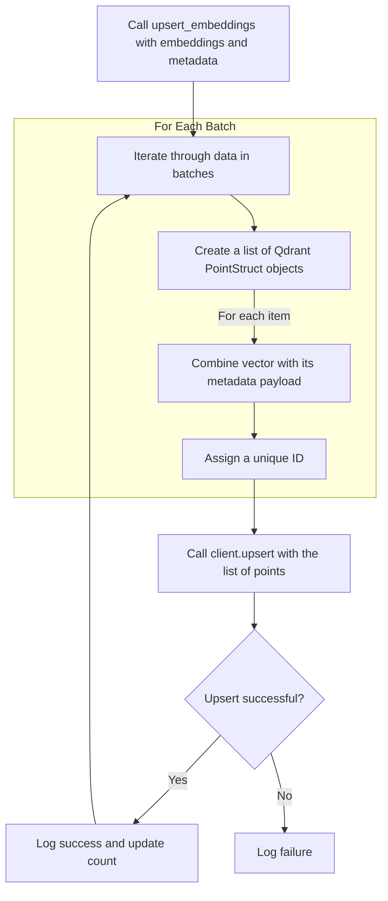

# `qdrant_client.py` - Qdrant Vector Database Integration

## 1. Overview

This module provides a dedicated client for interacting with a [Qdrant](https://qdrant.tech/) vector database. It encapsulates all the necessary logic for managing vector embeddings, including creating and managing collections, upserting data, and performing similarity searches.

The core of the module is the `QdrantVectorStore` class, which acts as the primary interface to Qdrant.

Notably, the module is designed for **graceful degradation**. If the `qdrant-client` library is not installed, the script will not crash. Instead, it creates mock versions of the Qdrant classes and prints a warning, allowing the rest of the application to run without error if Qdrant functionality is not actively being used.

---

## 2. `QdrantVectorStore` Workflows

### 2.1. Initialization and Configuration

When a `QdrantVectorStore` object is created, it follows a flexible configuration process.

```mermaid
graph TD
    A[Instantiate QdrantVectorStore] --> B{Is a config_path provided?};
    B -- Yes --> C[Load config from specified YAML file];
    B -- No --> D[Search for qdrant_config.yaml in standard locations];
    D --> E{Found a YAML file?};
    E -- Yes --> F[Load config from found file];
    E -- No --> G[Fall back to environment variables (QDRANT_HOST, etc.)];
    
    subgraph "Final Steps"
      C --> H[Initialize QdrantClient with config];
      F --> H;
      G --> H;
    end
```

### 2.2. Upserting Embeddings

The `upsert_embeddings` method is used to add or update vectors in the database. It processes data in batches for efficiency.



### 2.3. Searching for Vectors

The `search` method finds vectors similar to a query vector, with optional filtering.

```mermaid
graph TD
    A[Call search with a query_vector] --> B{Is a filter_dict provided?};
    B -- Yes --> C[Build a Qdrant Filter object from the dictionary];
    B -- No --> D[Set filter to None];
    
    subgraph "Qdrant Search Request"
      C --> E[client.search];
      D --> E;
    end
    
    E --> F[Send query vector, limit, and filter to Qdrant];
    F --> G[Receive search results];
    G --> H[Format results into a list of (id, score, payload) tuples];
    H --> I[Return list];
```

---

## 3. FAISS to Qdrant Migration

A key utility of this module is the `migrate_from_faiss` method. It provides a straightforward path to upgrade from a local FAISS index to a more robust, server-based Qdrant setup.

```mermaid
graph TD
    A[Call migrate_from_faiss with FAISS index directory] --> B[Load embeddings.npy from the directory];
    B --> C[Load mapping.json from the directory];
    C --> D[Recreate the Qdrant collection (deletes old data)];
    D --> E[Call self.upsert_embeddings with the loaded embeddings and mapping];
    E --> F[Return the total count of migrated vectors];
```

---

## 4. Key Methods

| Method | Description |
|---|---|
| `create_collection` | Creates a new vector collection in Qdrant. Can optionally delete an existing one. |
| `upsert_embeddings` | Inserts or updates a batch of embeddings and their associated metadata. |
| `search` | Performs a similarity search for a given query vector, with optional metadata filters. |
| `get_collection_info`| Fetches statistics and configuration details about the current collection. |
| `delete_collection` | Permanently deletes the collection from Qdrant. |
| `migrate_from_faiss`| A utility to migrate data from a local FAISS index to Qdrant. |

---

## 5. Diagnostics

The script can be run directly to test the connection to the Qdrant server.

**How to Run:**
```bash
python -m setup.qdrant_client
```

This will execute the `test_qdrant_connection` function, which attempts to connect to the Qdrant instance defined in your configuration and prints the status.

**Example Success Output:**
```
✓ Connected to Qdrant
  Collection: emailops_embeddings
  Vectors: 12345
  Status: green
```

**Example Failure Output:**
```
✗ Failed to connect to Qdrant: <error details>
```
